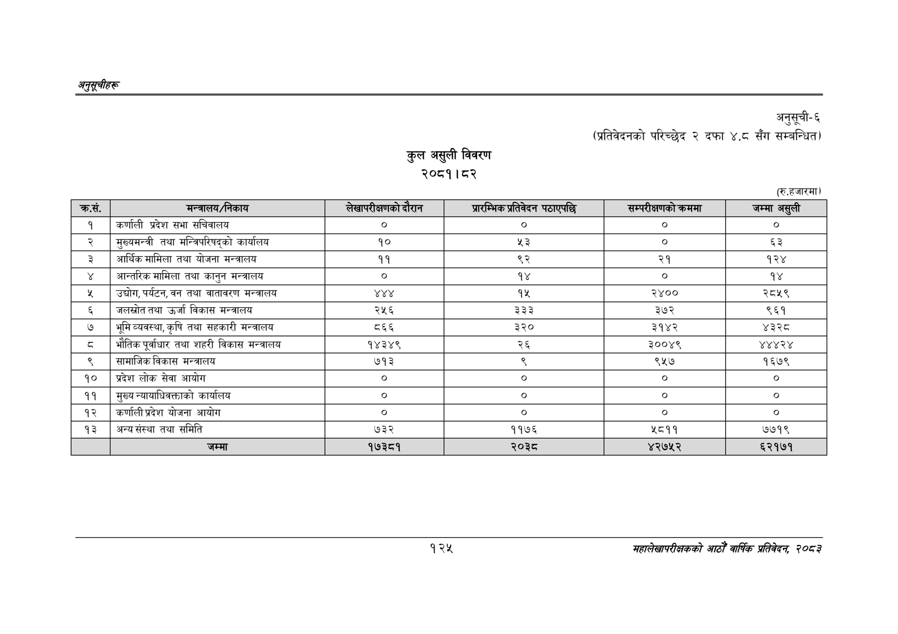

# Page 155 QA

## Rendered page


## Extracted text

```text
अनुतूचीहरू
कुल असुली विवरण २०८१।८२
अनुसूची६
(प्रतिवेदनको परिच्छेद २ दफा ४.८ सँग सम्बन्धित)
(रु.हजारमा)
१२५
सहालेखापरीक्षकको आठौँ वा्िकै प्रतिवेदन २०८२

| क्रस. | मन्त्रालय/नेकाय | लेखापरीक्षणको दै सन | त्रतिवदन पठाएपछि | सम्परीक्षणको कममा | जम्मा असुली |
| --- | --- | --- | --- | --- | --- |
| १ | कर्णाली प्रदेश सभा सचिवालय | ० | ७ | ० | ० |
| २ | मुख्यमन्त्री तथा मन्तिपरिषद्को कार्यालय | १० | %३ | ० | ३ |
| ३ | अआर्थिकमामिला तथा योजना मन्त्रालय | ११ | ९२ | २१ | १२४ |
| ४ | अन्तरिक मामिला तथा कानुन मन्त्रालय | ० | १४ | ० | १४ |
| ५ | उद्योग, पर्यटन, वन तथा वातावरण मन्त्रालय | ४४४ | १५ | २४०० | २८५९ |
| ६ | जलस्रोततथा उर्जा विकास मन्त्रालय | २५६ | ३३३ | ३७२ | ९६१ |
| ७ | भूमिव्यवस्था,कृषि तथा सहकारी मन्त्रालय | ८६६ | ३२० | ३१४२ | ४३२८ |
| ८ | भौतिकपूर्वाधार तथा शहरी विकास मन्त्रालय | १४३४९ | २६ | ३००४९ | ४४४२४ |
| ९ | सामाजिक विकास मन्त्रालय | ७१३ |  | ९५७ | १६७९ |
| १० | प्रदेश लोक सेवा आयोग | ० | ० | ० | ० |
| ११ | मुख्य न्याथाविवक्ताको कार्यालय | ० | ० | ० | ० |
| १२ | कर्णाली प्रदेश योजना आयोग | ० | ० | ० | ० |
| १३ | अन्यसंस्था तथा समिति | ७३२ | ११७६ | ५८११ | ७७१९ |
```

## Flags
- table_page
- medium_quality_table
