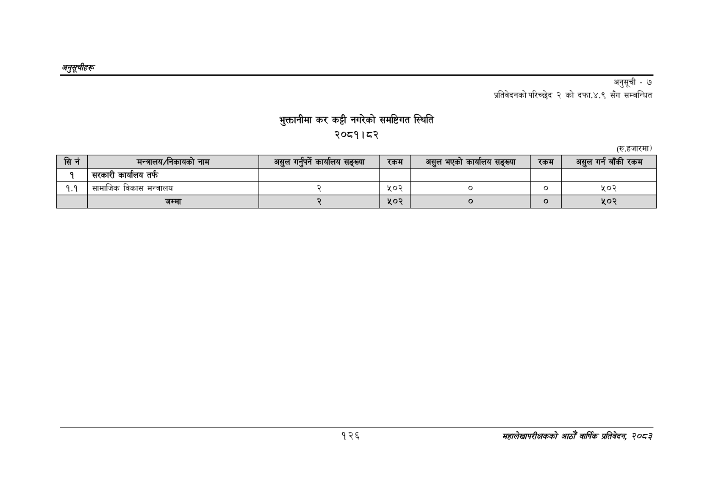

# Page 156 QA

## Rendered page


## Extracted text

```text
अनुतूचीहरू
भुक्तानीमा कर कट्टी नगरेको समष्टिगत स्थिति २०८१।८२
अनुसूची -७
प्रतिवेदनको परिच्छेद २ को दफा.४.९ सँग सम्बन्धित
(रु.हजारमा)
१२६
महालेखापरीक्षकको आठौँ वाषिक प्रतिवेदन २०८२

| सिने | मन्त्रालय/नेकायको नाम | असुल गर्नपर्ने काय'लय सङ्ख्या | रकम | अर्ल भएको कार्यालय सङ्ख्या | रकम | असुल गर्न बाँकी रकम |
| --- | --- | --- | --- | --- | --- | --- |
| १ | सरकारी कार्यालय तर्फ |  |  |  |  |  |
| १.१ | सामाजिक विकास मन्त्रालय |  | २०२ | ० |  | %०३ |
|  | जम्मा |  | ४५०२ | ० |  | ४५०२ |
```

## Flags
- table_page
- medium_quality_table
