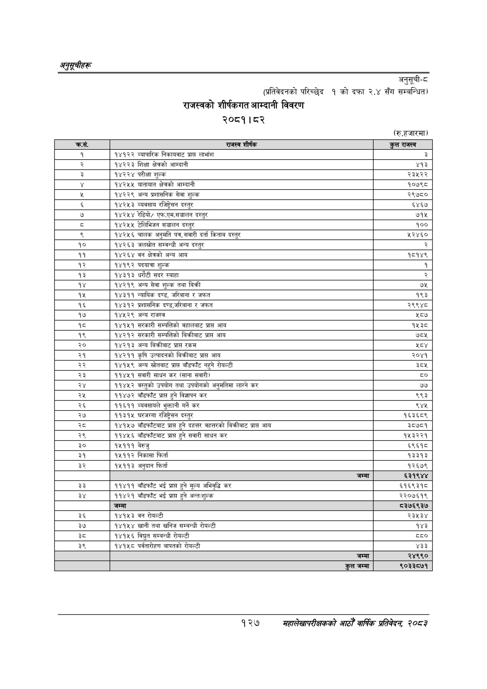

# Page 157 QA

## Rendered page


## Extracted text

```text
अनुतूचीहरु
अनुसूची-ट
(प्रतिवेदनको परिच्छेद १ को दफा २.४ सँग सम्बन्धित)
राजस्वको शीर्षकगत आम्दानी विवरण
२०८१।८२
(रु.हजारमा)
१२७
महालेखापरीक्षकको आठौँ वार्षिक प्रतिवेदन २०८२

| कस. | राजस्व शीर्षक | कुल राजस्व |
| --- | --- | --- |
| १ | १४१२२ व्यापारिक निकायवाट प्राप्त लाभांश | ३ |
|  | १४२२३ शिक्षा क्षेत्रको आम्दानी | ४१३ |
| ३ | १४२२४ परीक्षा शुल्क | २३५२२ |
|  | १४२५४५ यातायात क्षेत्रको आम्दानी | १०७९८ |
|  | १४२२९ अन्य प्रशासनिक सेवा शुल्क | २९७८० |
|  | १४२५३ व्यवसाय रजिष्ट्रेसत दस्तुर | ६४६७ |
| ७ | १४२५४ रेडियो/ एफ.एम.सञ्चालन दस्तुर | ७१५ |
|  | १४२५५ टेलिभिजन सञ्चालन दस्तुर | १०० |
| ९ | १४२५६ चालक अनुमति पत्र, सवारी दर्ता किताव दस्तुर | ५२४६० |
| १० | १४२६३ जलस्रोत सम्वन्धी अन्य दस्तुर | २ |
| ११ | १४२६४ वन क्षेत्रको अन्य आय | १८१४९ |
| १२ | १४१९२ पदयात्रा शुल्क | १ |
| १३ | १४३१३ घरौटी सदर स्याहा | २ |
| १४ | १४२१९ अन्य सेवा शुल्क तथा विक्री | ७५ |
| १५ | १४३११ न्यायिक दण्ड, जरिबाना र जफत | १९३ |
| १६ | १४३१२ प्रशासनिक दण्ड,जरिवाना र जफत | २९९४८ |
| १७ | १४५२९ अन्य राजस्व | श्य्ङ |
| १८ | १४१५१ सरकारी सम्पत्तिको बहालबाट प्राप्त आय | १५३८ |
| १९ | १४२१२ सरकारी सम्पत्तिको बिक्रीबाट प्राप्त आय | ७८५ |
| २० | १४२१३ अन्य बिक्रीबाट प्राप्त रकम | ४५ |
| २९ | १४२११ उत्पादनको बिक्रीबाट प्राप्त आय | २०४१ |
| २२ | १४१५९ अन्य स्रोतबाट प्राप्त बाँडफाँट नहुने रोयल्टी | ३, |
| २३ | ११४५१ सवारी साधन कर (साना सवारी) | ५३ |
|  | ११४५२ वस्तुको उपयोग तथा उपयोगको अनुमतिमा लाग्ने कर | ७७ |
| २५ | ११४७२ बाँडफाँट प्राप्त हुने विज्ञापन कर | ९९३ |
| २६ | ११६११ व्यवसायले भुक्तानी गर्ने कर | ९४४५ |
| २७ | ११३१५ घरजग्गा रजिष्ट्रेसन दस्तुर | १६३६८९ |
| स्व | १४१५७ बाँडफाँटबाट प्राप्त हुने दहत्तर वहत्तरको बिक्रीबाट प्राप्त आय | ३८७८१ |
| २९ | ११४५६ बाडफाँटना८ प्राप्त हुने सवारी साधन कर | १५३२२१ |
| ३० | १५१११ बेरुजु | ६९६१८ |
| ३१ | १५११२ निकासा फिर्ता | १३३१३ |
| ३२ | १५११३ अनुदान फिर्ता | १२६७९ |
|  | जम्मा | ६३१९४४ |
| ३३ | ११४११ बाँडफाँट भई प्राप्त हुने मूल्य अभिवृद्धि कर | ६१६९३१८ |
| ३४ | ११४२१ बाँडफाँट भई प्राप्त हुने अन्तःशुल्क | २२०७६१९ |
|  | जम्मा | ८३७६९३७ |
| ३६ | १४१५३ वन रोयल्टी | २३३ |
| ३७ | १४१५४ खानी तथा खनिज सम्बन्धी रोयल्टी | १४३ |
|  | १४१५६ विद्युत सम्बन्धी रोयल्टी | द्द० |
| ३९ | १४१५८ पर्वतारोहण बापतको रोयल्टी | ४३३ |
|  | जम्मा | २४९९० |
|  | हल जम्मा | ९०३३८७१ |
```

## Flags
- table_page
- medium_quality_table
