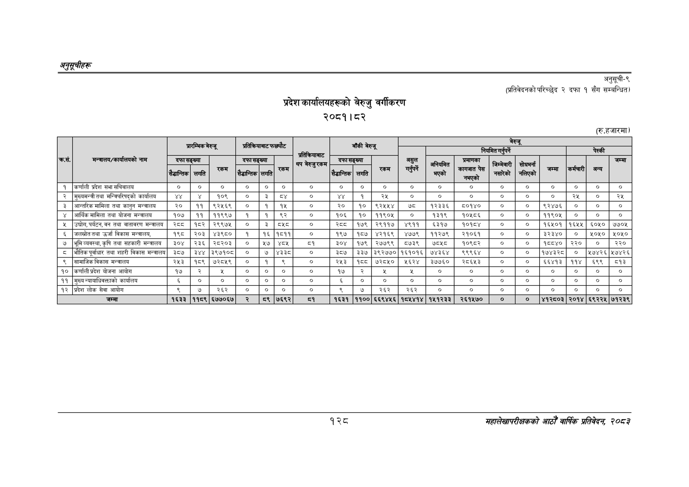

# Page 158 QA

## Rendered page


## Extracted text

```text
अनुतूचीहरु
प्रदेश कार्यालयहरूको बेरुजु वर्गीकरण २०८१।८२
अनुसूची-९ २ दफा १ सँग सम्बन्धित)
(प्रतिवेदनको परिच्छेद
(रु.हजारमा)
१२८
महालेखापरीक्षकको आठौँ वार्षिक प्रतिवेकक २०८२

|  |  |  |  |  | त्य |  |  |  |  | बाँकी |  |  |  |  |  | बेरुजू |  |  |  |  |
| --- | --- | --- | --- | --- | --- | --- | --- | --- | --- | --- | --- | --- | --- | --- | --- | --- | --- | --- | --- | --- |
|  |  |  | प्रारम्भिक | बेरुजू |  |  |  |  |  | बेरुजू |  |  |  |  | निमित |  |  |  | चेस्की |  |
| कस. | मन्त्रालय/कार्यालयको नाम | दफा सैडान्तिक | सङ्ख्या लगति | 'रकम | दफा सैडान्तिक | सङ्ख्या लगति | 'रकम | बप चेरखुरकम | फो सैडान्तिक | सङ्ख्या लगति | 'रकम | असुल 'गर्नुपर्ने | अनियमित भएको | प्रमाणका नो | जिम्मेवारी सारेको ' | सोधम्ना \| भरिएको | जम्मा | कर्मचारी | अन्य | जम्मा |
| १ | कर्णाली प्रदेश सभा सचिवालय | ० |  | ० | ० | ० | ० |  |  | ० | ० |  |  | ० | ० | ० | ० | ० | ० | ० |
| २ | मुख्यमन्त्री तथा मन्त्रिपरिषद्को कार्यालय | १ |  | १०९ | ० | ३ | ८४ | ० |  | १ |  | ० | ० | ० | ० | ० | ० | २५ | ० | शर |
| ३ | अन्तरिक मामिला तथा कानुन मन्त्रालय | २० | ११ | ९२५६९ | ० | १ | १४५ | ० | २० | १० | ९२५४५४ | ७८ | १२३३६ | ५८०१४० | ० | ० | ९२४७६ | ० | ० | ० |
| ४ | आर्थिक मामिला तथा योजना मन्त्रालय | १०७ | ११ | ११९९७ | १ | १ | ९२ | ० | १०६ | १० | ११९०५ | ० | १३१९ | १०५८६ | ० | ० | ११९०५ | ० | ० | ० |
| ५ | उच्चोग,पर्यटन,वन तथा वातावरण मन्त्रालय | २८८ | १८२ | २९९७५ | ० | ३ | ८४८ | ० | रड | १७९ | २९११७ | ४९११ | ६३१७ | १०१८४ | ० | ० | १६४५०१ | १६५५ | ६०५० | ७७०५ |
| ६ | जलस्रोततथा उर्जा विकास मन्त्रालय, | १९८ | २०३ | ४३९८० | १ | १६ | १८११ | ० | १९७ | १८७ | ४२१६९ | ४७७९ | ११२७९ | २१०६१ | ० | ० | ३२३४० | ० | ४०५० | १०५० |
| ७ | भूमिव्यवस्था,कृषि तथा सहकारी मन्त्रालय | ३०४ | २३६ | २८२०३ | ० | २७ |  | ८१ | ३०४ | १७९ | २७७९९ | ८७३९ | ७८५८ | १०९८२ | ० | ० | १५५४० | २२० | ० | २२० |
| ८ | भौतिक पूर्वाधार तथा शहरी विकास मन्त्रालय | ३८७ | ३४४ | ३९७१०८ | ० | ७ | ४३३ | ० | ३८७ | ३३७ | ३९२७७० | १६१०१६ | ७४३६४ | १९९९६४ | ० | ० | १७४३२८ | ० | २७४२६ | ५७४२६ |
| ९ | सामाजिक विकास मन्त्रालय | २५३ | १८९ | ७२८५१९ | ० | १ | ४९ | ० | २५३ | पेड | ७२८५० | १६२४ | ३७७६० | २८६४३ | ० | ० | ६६४१३ | ११४ | ६९९ | ८१३ |
| १० | कर्णाली प्रदेश योजना आयोग | १७ | २ |  | ० | ० | ० | ० | १४ | र |  |  | ० | ० | ० |  | ० | ० | ० | ० |
| ११ | मुख्य न्यायाधिवक्ताको कार्यालय |  | ० | ० | ० | ० | ० | ० | ६ | ० | ० | ० | ० | ० | ० | ० | ० | ० | ० | ० |
| १२ | प्रदेश लोक सेवा आयोग | ९ | ७ | २६२ | ० | ० | ० | ० |  | ७ | २६२ | २६२ | ० | ० | ० | ० | ० | ० | ० | ३ |
|  | जम्मा | १६३३ | ११८९ | ६७७०६७ | २ | ८९ | ७६९२ | व्१ | १६३१ | ११०० | ६६९४५६ | १८५४१४ | १५१२३३ | २६१५७० | ० | ० | ४१२८०३ | २०१४ | ६९२२५ | ७१२३९ |
```

## Flags
- table_page
- medium_quality_table
