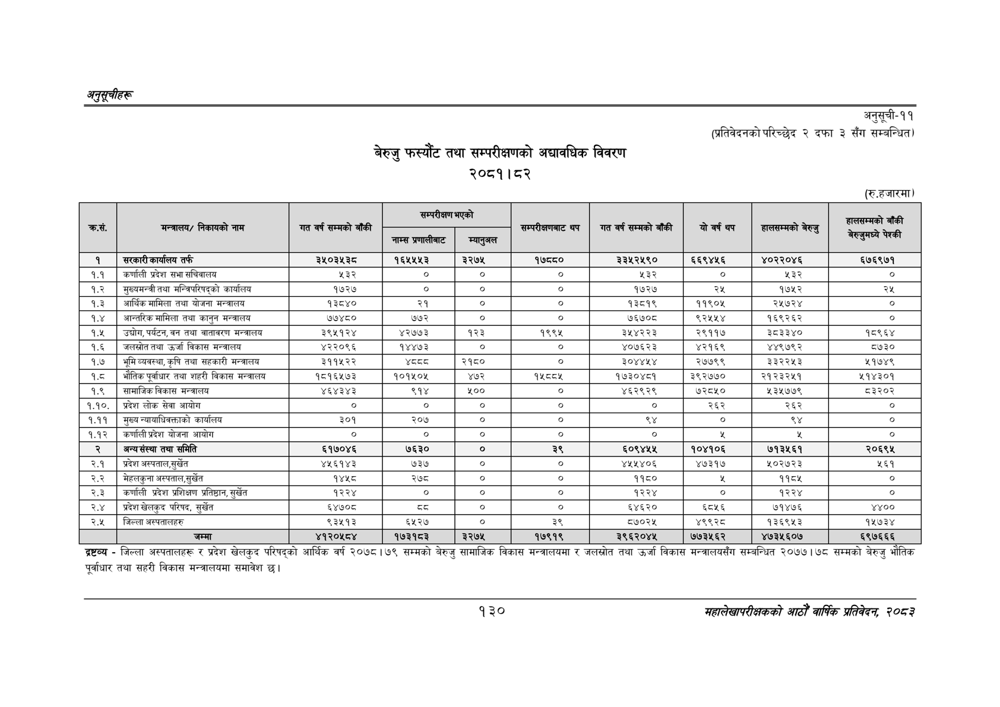

# Page 160 QA

## Rendered page


## Extracted text

```text
अनुतूचीहरु
बेरुजु फस्यौट तथा सम्परीक्षणको अद्यावधिक विवरण २०८१। ८२
अनुसूची-११
(प्रतिवेदनको परिच्छेद २ दफा ३ सँग सम्बन्धित)
(रु.हजारमा)
द्रष्टव्य -जिल्ला अस्पतालहरू र प्रदेश खेलकुद परिषद्को आर्थिक वर्ष २०७८।७९ सम्मको बेरुजु सामाजिक विकास मन्त्रालयमा र जलस्रोत तथा उर्जा विकास मन्त्रालयसँग सम्बन्धित २०७७।७८ सम्मको बेरुजु भौतिक पूर्वाधार तथा सहरी विकास मन्त्रालयमा समावेश |
१३०
महालेखापरीक्षकको आठौँ वार्षिक प्रतिवेदन २०८२

| कस. | 'मन्त्रालय/ निकायको नाम | गत वर्ष सम्मको बाँकी | ५) नाम्स प्रणालीबाट | म्यानुअल | सम्परीक्षबाट थप | गत वर्ष सम्मको बाँकी | यो वर्ष थप | हालसम्मको बेरुजु | हालसम्मको बाँकी पेश्की जुम |
| --- | --- | --- | --- | --- | --- | --- | --- | --- | --- |
| १ | सरकारी कार्यालय तर्फ | ३५०३५३८ | १६५५५३ | ३२७५ | १७८८० | ३३५२५९० | ६६९४५६ | ४०२२०४६ | ६७६९७१ |
| १.१ | कर्णाली प्रदेश सभा सचिवालय | ३३ | ० | ० | ० | ५३२ | ० | ४३३ | ० |
| १.२ | मुख्यमन्त्री तथा मन्त्रिपरिषद्को कार्यालय | १७२७ | ० | ० | ० | १७२७ | २५ | १७५२ | २५ |
| १.३ | अआर्थिकमामिला तथा योजना मन्त्रालय | १३८४० | २१ | ० | ० | १३८१९ | ११९०५ | २५७२४ | ० |
| १.४ | अन्तरिक मामिला तथा कानुन मन्त्रालय | ७७४८० | ७७२ | ० | ० | ७६७०८ | ९६२४५४५४ | १६९२६२ | ० |
| १.५ | , पर्यटन, वन तथा वातावरण मन्त्रालय | ३९५१२४ | ४२७७३ | १२३ | १९९५ | ३५४२२३ | २९११७ | ३८३३४० | १८९६४ |
| १.६ | जलस्रोत तथा उर्जा विकास मन्त्रालय | ४२२०९६ | १४४७३ | ० | ० | ४०७६२३ | ४२१६९ | ४४९७९२ | ५७३० |
| १.७ | भूमिव्यवस्था,कृषि तथा सहकारी मन्त्रालय | ३११५२२ | श्द्व्व | २१८० | ० | ३०४४५४ | २७७९९ | ३३२२५३ | ५१७४९ |
| १.८ | भौतिक पूर्वाधार तथा शहरी विकास मन्त्रालय | १८१६१५७३ | १०१५०४५ | ४७२ | १५८५ | १७३०४८१ | ३९२७७० | २१२३२५१ | ५१४३०१ |
| १.९ | सामाजिक विकास मन्त्रालय | ४६४३४३ | ६९१४ | ५०० | ० | ४६२९२९ | ७२८५० | ५३५७७९ | ५३२०२ |
| ९.९०. | प्रदेश लोक सेवा आयोग | ० | ० | ० | ० | ० | २६२ | २६२ | ० |
| १.११ | मुख्य न्यायाधिवक्ताको कार्यालय | ३०१ | २०७ | ० | ० | ९४ | ० | ९४ | ० |
| १.१२ | कर्णाली प्रदेश योजना आयोग | ० | ० | ० | ० | ० |  |  | ० |
| २ | अन्यसंस्था तथा समिति | ६१७०४६ | ७६३० | ० | ३९ | ६०९४५५ | १०४१०६ | ७१३५६१ | २०६९४५ |
| २.१ | प्रदेश अस्पताल,सुर्खेत | ४५६१४३ | ७३७ | ० | ० | ४५५४०६ | ४७३१७ | ५०२७२३ | ५६१ |
| २.२ | मेहलकुना अस्पताल,सुर्खेत | १४५८ | २७८ | ० | ० | ९९५० |  | ११८५ | ० |
| २.३ | कर्णाली प्रदेश प्रशिक्षण प्रतिष्ठान, सुर्खेत | १२२४ |  | ० | ० | १२२४ | ० | १२२४ | ० |
| २.४ | प्रदेश खेलकुद परिषद, सुर्खेत | ६४७०८ | ५३ | ० | ० | ६४६२० | ६८५६ | ७१४७६ | ४४०० |
| २.५ | जिल्ला अस्पतालहरु | ९३५१३ | ६५२७ | ० | ३९ | ५७०२५ | ४९९२८ | १३६९५३ | १५७३४ |
|  | जम्मा | ४१२०५८४ | १७३१८३ | ३२७५ | १७९१९ | ३९६२०४५ | ७७३५६२ | ४७३५६०७ | ६९७६६६ |
```

## Flags
- table_page
- medium_quality_table
