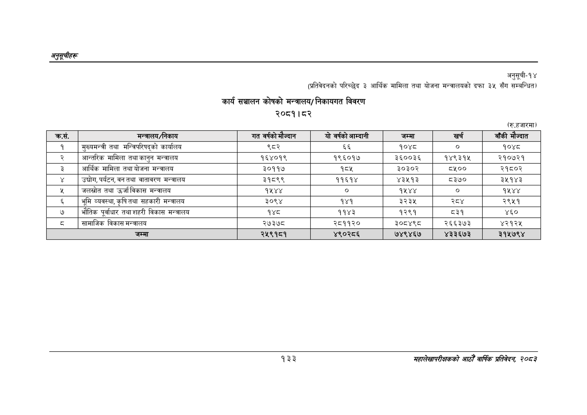

# Page 163 QA

## Rendered page


## Extracted text

```text
अनुतूचीहरु
अनुसूची-१४
(प्रतिवेदनको परिच्छेद ३ आर्थिक मामिला तथा योजना मन्त्रालयको दफा ३५ सँग सम्बन्धित)
कार्य सञ्चालन कोषको निकायगत विवरण
मन्त्रालय/ २०८१।८२
(रु.हजारमा)
१३३
महालेखापरीक्षकको आठौँ वार्षिक प्रतिवेदन २०८२

| कस. | मन्त्रालय/निकाय | गत वर्षको मँज्दान | यो वर्षको आम्दानी | जम्मा | खरी | बाँकी मे ज्दात |
| --- | --- | --- | --- | --- | --- | --- |
| १ | मुख्यमन्त्री तथा सन्तरिपरिषद्‌्को कार्यालय | ९८२ | ६६ | १०४८ | ० | १०४८ |
| २ | आन्तरिक मामिला तथा कानुन मन्त्रालय | १६४०१९ | १९६०१७ | ३६००३६ | १४९३१५ | २१०७२१ |
| ३ | आर्थिक मामिला तथा योजना मन्त्रालय | ३०११७ | १८५ | ३०३०२ | ८१०० | २१८०२ |
| ४ | उद्योग,पर्यटन, वन तथा वातावरण मन्त्रालय | ३१८९९ | ११६१४ | ४३५१३ | ८३७० | ३५१४३ |
| ५ | जलस्रोत तथा उर्जा विकास मन्त्रालय | १५४४ |  | १५४४ |  | १५४४ |
| ६ | भूमि व्यवस्था, कृषि तथा सहकारी मन्त्रालय | ३०९४ | १४१ | ३२३५ | र | २९५१ |
| ७ | भौतिक पूर्वाधार तथा शहरी विकास मन्त्रालय | १४८ | ११४३ | १२९१ | ८३१ | ४६० |
| ८ | सामाजिक विकास मन्त्रालय | २७३७८ | २८११२० | ३०८४९८ | २६६३७३ | ४२१२५ |
| ९ | जम्मा | २५९१८१ | ४९०२८६ | ७४९४६७ | ४३३६७३ | ३१५७९४ |
```

## Flags
- table_page
- medium_quality_table
