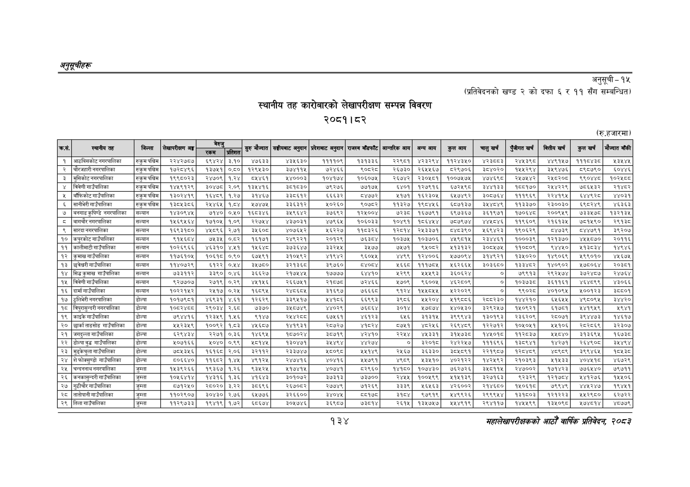

# Page 164 QA

## Rendered page


## Extracted text

```text
अनुतूचीहरु
स्थानीय तह कारोबारको लेखापरीक्षण सम्पन्न विवरण २०८१।८२
अनुसूची -१५
(प्रतिवेदनको खण्ड २ को दफा ६ र ११ सँग सम्बन्धित)
(रु.हजारमा)
१३४
महालेखापरीक्षकको आठौँ वाषिक प्रतिवेदन २०८२

| कार, | स्थानीय तह | जिल्ला | लेखापरीक्षण अङ्ग | निता |  | सुरु मौज्दात | सङ्घीयबाट अनुदान | प्रदेशबाट अनुदान | राजस्व बाँडफाँट | आन्तरिक आय | अन्य आय | कुल आय | चालुखर्च | पुँजीगत खर्च | कित्तीय खर्ब | कुल खर्च | मौज्दात बाँकी |
| --- | --- | --- | --- | --- | --- | --- | --- | --- | --- | --- | --- | --- | --- | --- | --- | --- | --- |
| १ | आठबिसकोटनगरपालिका | रुकुमपश्चिम | २२४२७८७ | ६९४२४ | ३.१० | ४७६३३ | ४३५६३० | ११११०९ | ब३१३३६ | २२९८१ | ४२३२९४ | ११२४३४० | २३८३ | र२४४३९८ | ४४९१५७ | १११८४३८ | १३४४५ |
| २ | चोरजहारी नगरपालिका | रुकुमपश्चिम | १७२८४९६ | १३७५१ | ०.८० | १२९५३० | ३७४११५ | ७२४६६ | २०५३८ | २६७३० | २६५५६७ | ८२९७०६ | ३८४०२० | १४५५२९४ | ३५९४७६ | ८९८७९० | ०४४६ |
| ३ | मुसिकोट नगरपालिका | रुकुमपश्चिस | १९९८०२३ | २४७०९ | १.२४ | ८५४६१ | २४०००३ | १०४१७४ | १०६०७५ | २६७४२ | २३०५८१ | १००७५७५ | ४७४६९८ | २४५७५२४२ | २५८२०८ | ९९०४४८ | १०२५८८ |
| ४ | बिवेणी गाउँपालिका | रुकुमपश्चिम | १४५९१२९ | ३०४७८ | २.०९ | १३४४१६ | ३८१८३० | ७९२७६ | ७७१७८ | ६४०१ | १२७९१६ | ६७२५९८ | ३४४१३३ | ८५१७० | २४४२२९ | ७८६४३२ | २१४८२ |
| ५ | बौंफिकोट गाउँपालिका | रुकुमपश्चिम | १३०२४१९ | १६४८९ | १.२७ | ३१४६७ | ३३८६१२ | ६६६३२ | ८४७७२ | २१७१ | १६२३०५ | ६५७४९२ | इ३०८७६४ | १११९६९ | २२४१९५ | इ४४९२८ट | ४४०३१ |
| ६ | सानीभेरी गाउँपालिका | रुकुमपश्चिम | १३८५३८६ | २४५४६४५ | १.८४ | १७४७५ | ३३६३१२ | ०२६० | ९०७८२ | १३२७ | १९८०४४६ | ६८७१३७ | ३५४८४९ | ११३३७० | २३००३० | ६९८२४९ | ४६३६३ |
| ७ | बनगाडकुपिण्डै नगरपालिका | सन्यान | १४३०९४५ | ७१४० | ०,४५० | १६८३४६ | ३५९६४२ | ३७६६९२ | १२४१००४ | ७छर्‌इङड | १६७७९१ | ६९७३६७ | ३६१९७१ | १७०६४८ | २००९५९ | ७३३५७८ | १३२१३४ |
| ८ | बागचौर नगरपालिका | सल्यान | १५६९४६४ | १७१०५ | १०९ | २२७५४ | ४३७०३१ | ४७९६५ | १०६०३३ | ०४९१ | १८६४५४ | ७५७९७४ | ४४४८४६ | ११९६०९ | २१६१३५ | ७०११९० | २९३८ |
| ९ | सारदा नगरपालिका | सल्यान | १६९३१८० | ४५८९६ | २.७१ | ३५६०८ | ४०७६५२ | ५६२२७ | ११८३२६ | २८१४ | २५३३७१ | ८४८३९० | २६९४२३ | १९०६२९ | ८४७३९ | ८४४७९१ | ३९२०४७ |
| १० | कपुरकोट गाउँपालिका | सल्यान | ९क५६ड४ | ७५३५ | ०.२ | १६१७१ | २४९२२१ | २०१२९ | छइइड४्ट | १०३७५ | १०३७०६ | ४५९८१५ | र२इ३४४६१ | १०००३९ | १२१३७० | ४५५८७० | र२०११६ |
| ११ | कालीमाटी गाउँपालिका | सल्यान | १०२६९६६६ | ४६३१० | ४.५२१ | ११६४८ | ३७३६४७ | ३३२४५५ | ३५७७ | ७५७१ | ९५०८२ | २१३१३२ | ३०८५७५ | ११०८०९ | ९४४५० | १३८३४ | १४९४६ |
| १२ | कुमाख गाउँपालिका | सल्यान | ११७६१०५ | ०६१८ | ०.० | ७५९१ | ३१०४५९२ | ४१९४२ | ९६०५५ | ४४९९ | १२४००६ | २७७०९४ | ३१४९२१ | १३५०२० | १४९०६९ | १९९०१० | ४५६७५ |
| १३ | छन्रेचरी गाउँपालिका | सल्यान | ११४०७२९ | ६१२२ | ०.१४ | ३४७८० | ३२१३६८ | ३९७६० |  | ४६६८ | १११७८४५ | ५६२६६५ | ३०३६८० | ९ | १४०९०२ | ४७८०६४ | र२०३६१ |
| १४ | सिङकुमाख गाउँपालिका | सल्यान | ७३३११२ | ३३९० | ०४६ | ३६६२७ | र२१७५४५ | १७७७७ | ६४४१० | २२९९ | १५५९३ | ३६०६२४ | ० | ७९९१३ | २९२५७४ | इ३७२४८७ | र२४७६४ |
| १५ | बिवेणी गाउँपालिका | सल्यान | ९२७७०७ | २७१९ | ०.२९ | ४५१५६ | २६६७५१ | २१८७८ | २२४६६ | ५७०९ | ९६००५ | ४६२८०९ | ० | १०३७३८० | ३६११६१ | ४६४८६९९ | ४३०६६ |
| १६ | दार्मा गाउँपालिका | सल्यान | १०२२१५२ | २४१७ | ०२५ | ६८९४ | र४८६८५ | ३१६९७ | ७६६६८ | ९३ | १५५०५५ | श२२०२९ | ० | बृड्कर्ङ | ४०१०९५ | ५००१२३ | अइ५८०१ |
| १७ | ठुलिभेरी नगरपालिका | डोल्पा | १०१७९८१ | ४६९३१ | ४.६१ | १२६२९ | ३३९५१७ | २४१८६ | ६६९९३ | ३९८६ | ५२०४ | २१९०७६ | र२०८२३० | १४४२१० | ५६५५ | ४९८०९५ | इ४४२० |
| १८ | बिपुरासुन्दरी नगरपालिका | डोल्पा |  | २९०३४ | र.६ड | ७३७० | ३५८७४९ | ४४०२९ | ७६८६४ | इ०१४ | ७८७४ | २४०४५३० | इ२९२४५७ | १५०९२१ | ६१७८१ | १४१९५९ | १९४१ |
| १९ | काइकै गाउँपालिका | डोल्पा | ७९४४१६ | १२३५९ | १५६ | ९१४७ |  | ६७५६१ | ४६१२३ | ६५६ | ३१३१५ | ३९९९४३ | १३०१९३ | २३६२०९ | र२८०७१ | इ३९४४७३ | १४६१७ |
| २० | छार्काताङसोङ गाउँपालिका | डोल्पा | २५२३५९ | १००९२ | १.८३ | ४५६८७ | १४१९३१ | २८७२७ | अर | ५७५१ | ८२५६ | २६९४८९ | १२२७१२ | १०४५०५१ | २४५१०६ | २८२८६९ | ३२३०७ |
| २१ | जगहुल्ला गाउँपालिका | डोल्पा | इर९४इ४ | २२७१ | ०,३३६ | ४६९५ | १८७०२४ | ८७१९ | ४२४१० | २२५४ | ४५३३१ | इ१५७३८ | १४५०१८ | ११२८३७ | ४८४० | इ१३६९४५ | १६७३८ |
| २२ | डोल्पा वुद्ध गाउँपालिका | डोल
```

## Flags
- table_page
- medium_quality_table
