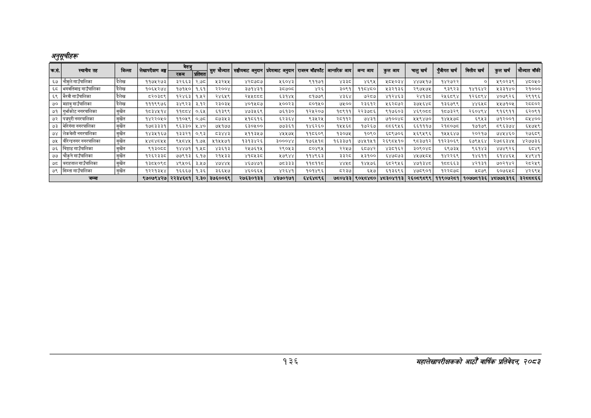

# Page 166 QA

## Rendered page


## Extracted text

```text
अनुतूचीहरु
१३६
महालेखापरीक्षकको आठौँ वार्षिक प्रतिवेकक २०८२

| कस, | स्थानीय तह | जिल्ला | लेखापरीक्षण अङ्ग | निल |  | सुरु मौज्दात | सङ्घीयबाट अनुदान | प्रदेशबाट अनुदान | राजस्व बाँडफाँट | आन्तरिक आय | अन्य आय | कुल आय | चालुखर्च | पुँजीगत खर्च | कित्तीय खर्ब | कुल खर्च | मौज्दात बाँकी |
| --- | --- | --- | --- | --- | --- | --- | --- | --- | --- | --- | --- | --- | --- | --- | --- | --- | --- |
| ६७ | नोमुले गाउँपालिका |  | ११७५२७३ | ३२६६३ |  | ४३२४५ | ४२८७८७ | ६०४३ | १११७१ | ४इइड | ४६९५ | २८४१०३४ | ४४७४१७ | १४२७२२ | ० | ५९०२३९ | ४६०५० |
| ६८ | भगवतिमाइ गाउँपालिका | दैलेख | १०६५२७४ | १७१५० | १.६१ | २२००४ | ३७१४३१ | ३८७०८ | ४२६ | ३०६१ | ११८४८० | २३२१३६ | २९७५७४५ | ९३९२३ | १४१६४२ | ५३३१४० | २१००० |
| ६९ | अरवी गाउँपालिका | दैलेख | ८२०३८९ | १२४६३ | १.५२ | २४६५९ | २५४५००८ | ६३१४५ | ५१७७९ | ४३६४ | ७२८७ | ४१२४६३ | २४१३८ | र२१६८९४ | १२६८९४ | ४०७९२६ | २९१९६ |
| ७० | महावु गाउँपालिका | दैलेख | १११९९७६ | इ३४९२३ | ३.१२ | २३०३५ | ४०१४५८७ | ४००३३ | ५०१४५० | ७५०० | २३६१२ | ६२८७२ | ३७४६४८ | १३६७९९ | ४४६८ | १४७१०५ | र२८८०२ |
| ७१ | गुर्भाकोट नगरपालिका | सुर्खेत | १८३४५१४ | ११८६८४ | ०६५ | ५१३९९ | ४७३५६९ | ७६१३० | १२५२०७ | १८९११ | २२३७८६ | ९१७६०३ | ४६९०८८ | १८७३२९ | २६०४९४ | ९१६९११ | ६२०९१ |
| ७२ | प्पुरी नगरपालिका | सुर्खेत | १४२२०४५० | ११०५९ | ०.७ | ८७३४३ | ११८६१६ | ६२३४ | ३४२५ | र२८११२ | ७४३१ | ७१००४ड | २४९४७० | १४५४७८ | ६९४३ | ७१२००१ | ८४५४०० |
| ७३ | भेरिगंगा नगरपालिका | सुर्खेत | १७८३३३१ | ९६३३० | २.४० | ७५१७४ | ६५३०५०० | ७७३६१ | १४६२६० | १५५६८० | १७२६७ | ८५८६९५६ | ६६१११७ | २१८०७८ | १७१७९ | ८९६३७४ | ६५७५९ |
| ७४ | लेकवेशी नगरपालिका | सुर्खेत | १४३४१६७ | १३३२१ | ०.९३ |  | १११३४७ | ४५४७५ | ११८६०९ | १३०७४ | १०९० | इ९७०६ | ५६९५९६ | १५४६४७ | र२०२१७ | ७४४४६० | र२७६८९ |
| ७५ | बीरेन्द्रनगर नगरपालिका | सुर्खेत |  | ९४०४५ | १७५ | २१५५७१ | १३१३४२६ | ३०००४४ | १७६४५१८० | १६३३७१ | ७४५१५१ | २६९८५१० | ९८३७१२ | ११२३०६९ | इ६७९५६४ | २७८६३४५ | ४२७७३६ |
| ७६ | चिङ्गाड गाउँपालिका | सुर्खेत | ९१३०८८ | १४४७१ | १.५८ | ४३६१३ | २५७६१५ | २९०५३ | ५०४९५ | २२५७ | ६८७४२ | ४३८१६२ | ३०९०४८ | ६५९७३५ | ९६१४३ | ४७४९२६ | ६८४९ |
| ७७ | चौकुने गाउँपालिका | सुरखेत | १२६२३३८ | ७७९१३ | ६.१७ | २१५३३ | ४१८४३८ | १७९४४ | ११४९६३ | ३ | ५३१०० | ६४७८७३ | ४५७५८५ | १४२२६९ | ४६११ | ६१४४६५ | १४९४१ |
| ७८ | बराहताल गाउँपालिका | सुर्खेत | पइ८४०९८ | ४९४५०६ | ३५७ | ४७४४५ | ४६७४७१ | ७८३३३ | ११६११८ | ४ | १४५७६ | २९५६ | ४७१३ | १८८६६३ | ४२१३१ | ७०२१४२ | २८२४५९ |
| ७९ | सिम्ता गाउँपालिका | सुर्खेत | १२२१३४४ | १६६६७ | १.३६ | ३६६४७ | ४६०६६४५ | ४२६४१ | १०१४९६ | ८२३७ | ६४७ | इ१३६९६ | ४७८९०१ | १२२८७८ | ५८७९ | इ०७६५८ | ४२६९५ |
|  | जम्मा |  | ९७०७९४२७ | २२३४६८१ | २.३० | ३७६००६९ | २७६३०१३३ | ४३७०१७१ | ६४६४८९६ | ७८०४३३ | ९०५८४८० | ४८३०४११३ | २६०८९८९९ | ११९०७२८१ | १०७७८१३६ | ४८७७५३१६ | ३२८८८६६ |
```

## Flags
- table_page
- medium_quality_table
