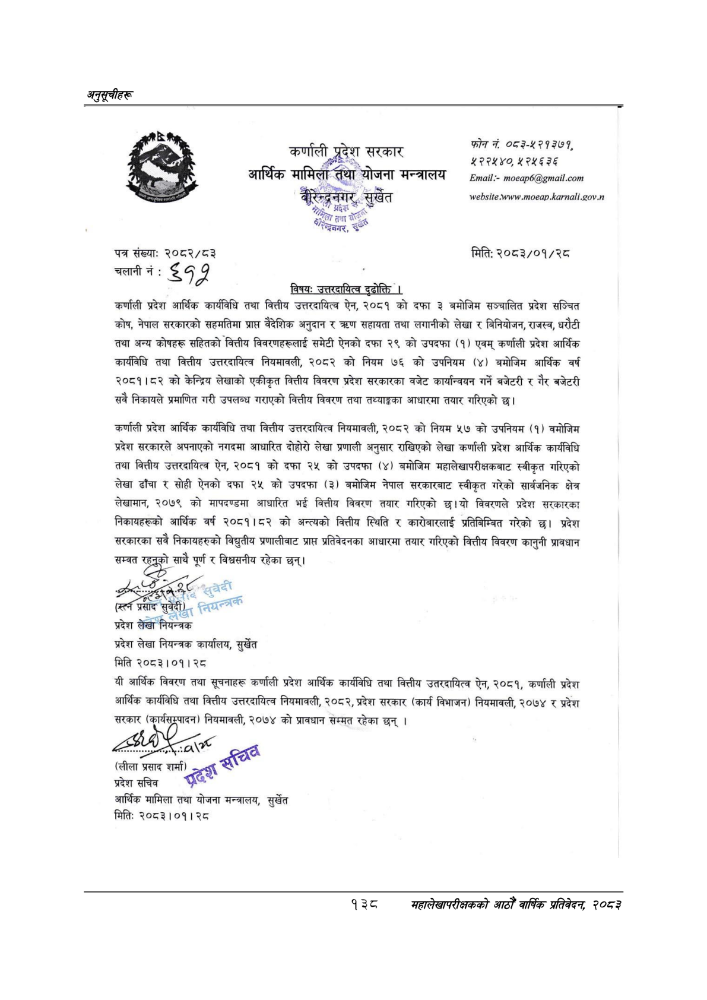

# Page 168 QA

## Rendered page


## Extracted text

```text
अनुसूचीहरू
पत्र संख्याः
२०८२/८३
चलानी नं:
ड ४१
फोन नं ०८३-१२१२७१ २२२४०० ४२४५ २४५
मिति: २०८३/०१/२८
कर्णाली प्रदेश आर्थिक कार्यविधि तथा वित्तीय उत्तरदायित्व ऐन, २०८१ को दफा ३ बमोजिम सञ्चालित प्रदेश सञ्चित कोष, नेपाल सरकारको सहमतिमा प्राप्त वैदेशिक अनुदान सहायता तथा लगानीको लेखा र बिनियोजन, राजस्व, धरौटी तथा अन्य कोषहरू सहितको वित्तीय विवरणहरूलाई समेटी ऐनको दफा २९ को उपदफा (१) एवम्‌ कर्णाली प्रदेश आर्थिक कार्यविधि तथा वित्तीय उत्तरदायित्व नियमावली, २०८२ को नियम ७६ को उपनियम (४) बमोजिम आर्थिक वर्ष २०८१।८२ को केन्द्रिय लेखाको एकीकृत वित्तीय विवरण प्रदेश सरकारका वजेट कार्यान्वयन गर्ने बजेटरी र गैर बजेटरी सवै निकायले प्रमाणित गरी उपलब्ध गराएको वित्तीय विवरण तथा तथ्याङ्गका आधारमा तयार गरिएको
कर्णाली प्रदेश आर्थिक कार्यविधि तथा वित्तीय उत्तरदायित्व नियमावली, २०८२ को नियम ५७ को उपनियम (१) वमोजिम प्रदेश सरकारले अपनाएको नगदमा आधारित दोहोरो लेखा प्रणाली अनुसार राखिएको लेखा कर्णाली प्रदेश आर्थिक कार्यविधि तथा वित्तीय उत्तरदायित्व ऐन, २०८१ को दफा २५ को उपदफा (४) बमोजिम महालेखापरीक्षकबाट स्वीकृत गरिएको लेखा ढाँचा र सोही ऐनको दफा २५ को उपदफा (३) बमोजिम नेपाल सरकारबाट स्वीकृत गरेको सार्वजनिक क्षेत्र लेखामान, २०७९ को मापदण्डमा आधारित भई वित्तीय विवरण तयार गरिएको छ।यो विवरणले प्रदेश सरकारका निकायहरूको आर्थिक वर्ष २०८१।८२ को अन्त्यको वित्तीय स्थिति र कारोबारलाई प्रतिबिम्बित गरेको छ। प्रदेश सरकारका सबै निकायहरुको विद्युतीय प्रणालीवाट प्राप्त प्रतिवेदनका आधारमा तयार गरिएको वित्तीय विवरण कानुनी प्रावधान सम्वत छ साथै पूर्ण र विश्वसनीय रहेका छन्‌।
टि
छेद
प्रसाद
सुवेदी);
लर
प्रदेश लेखा नियन्त्रक प्रदेश लेखा नियन्त्रक कार्यालय, सुर्खेत मिति २०८३।०१। २८
यी आर्थिक विवरण तथा सूचनाहरू कर्णाली प्रदेश आर्थिक कार्यविधि तथा वित्तीय उतरदायित्व ऐन, २०८१, कर्णाली प्रदेश आर्थिक कार्यविधि तथा वित्तीय उत्तरदायित्व नियमावली, २०८२, प्रदेश सरकार (कार्य विभाजन) नियमावली, २०७४ र प्रदेश सरकार (कार्यसुम्पादन) नियमावली, २०७४ को प्रावधान सम्मत रहेका छन्‌।
(लीला प्रसाद शर्मा प्रदेश सचिव स्ह्
आर्थिक मामिला तथा योजना मन्त्रालय, सुर्खेत मितिः २०८३।०१। २८
कर्णाली कूललद्रनँगर, सुर्खेत प्रदेश बाण
ली, परदेश आर्थिक मामिला-तथा योजना मन्त्रालय
१३८
सहालेखापरीक्षकको आठौँ वार्षिक प्रतिवेदन २०८२
```

## Flags
- None
