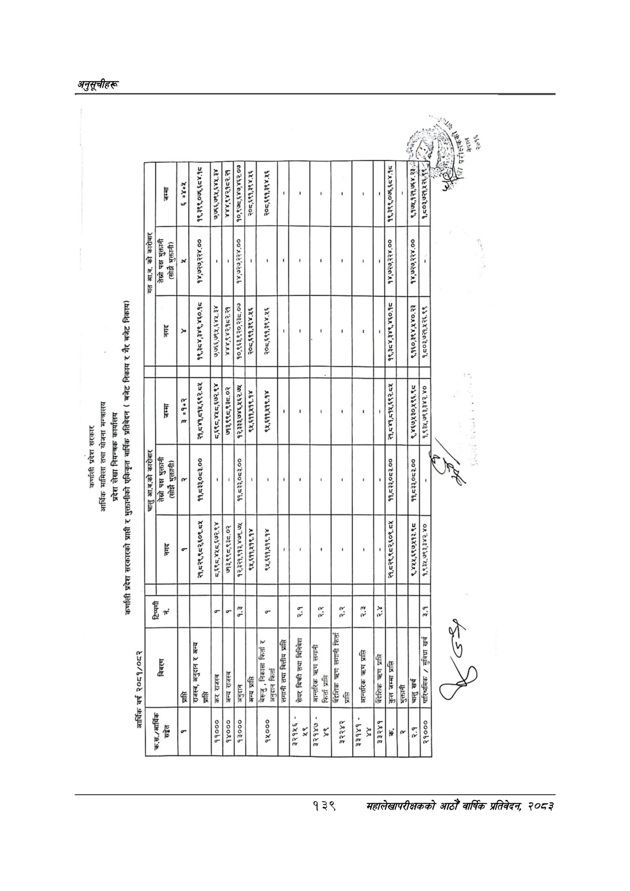

# Page 169 QA

## Rendered page


## Extracted text

```text
००२१६२८. १२:०० १०८ १२०] ®
(२ २० २ १%६| २६० ) २ एक बुदे ए७नकर २ एक ६२|७%
२०/२०%
$९
४]२०१%
१३९
महालेखापरीक्षकको आठौँ वार्षिक प्रतिवेदन २०८२

|  | हुई |  | छ |  | हद २६६; | ६८ |  | छ २ धी |  |  |  |  |  |  | - [ छ |  |  | दै ५ |
| --- | --- | --- | --- | --- | --- | --- | --- | --- | --- | --- | --- | --- | --- | --- | --- | --- | --- | --- |
|  | हु |  |  |  |  | ३ |  |  |  |  |  |  |  |  | टर |  |  |  |
|  |  |  | ५ २१२ |  | छ मि |  |  |  |  |  |  |  |  |  | हु! |  |  | हट ५५ |
|  |  |  |  |  |  |  |  |  |  |  |  |  |  |  |  |  |  |  |
|  |  |  | छु | २ | ११ ईन |  |  |  |  |  |  |  |  |  |  |  |  | ४२ ५२ २५ |
| % ३ | है |  | -४ |  |  | % १ |  |  |  |  |  |  |  |  |  | जि |  |  |
|  |  |  |  | २११) | २८५ नट] | ६२ |  |  |  |  |  |  | । | छ | $ हं |  |  | टु दुर नङ |
|  |  |  |  |  |  |  |  |  |  |  |  |  |  |  |  |  |  |  |
|  |  |  |  |  | बन्छ |  |  | न |  | छ |  | छापे |  |  |  |  |  | ५ |
|  |  |  | ३ क |  | बहु | हुई |  | हु हु हट |  | हु भु | र जा ३ | र। |  |  | छ] |  | हु | % रि |
| हुँ | - ३ |  |  |  | ८८८ हट २८२८ |  |  | २ टै \| |  | टे |  | .८. % टु | कट | ५. |  |  |  | \|८ |
```

## Flags
- table_page
- medium_quality_table
