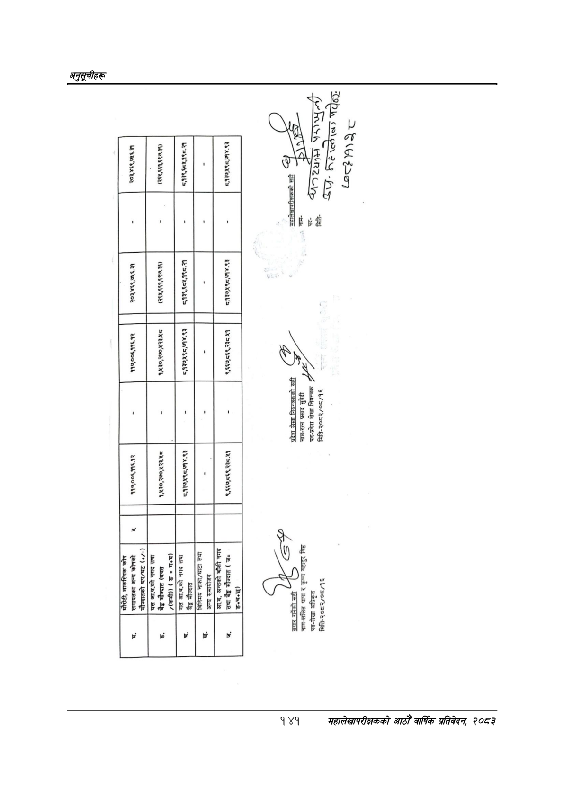

# Page 171 QA

## Rendered page


## Extracted text

```text
नी
नाम-
र
लो
रिहरुलेदड
प-
पा
पद-
मिति-
कु
सही
परी
सुवेदी
नियन्त्रकको
नियन्त्रक
लेखा
प्रसाद
प्रदेश
नाम-रत्न
बहादुः
कृष्ण
"ललित
लेखा
पद-प्रदेश
अधिकृत
'पद-लेखा
मिति-२०८२/०८/१६
मिति-२०८२/००/१६
२
२०८ टर (

| हुई है | २ है | ९ है |  | ई न |
| --- | --- | --- | --- | --- |
|  |  |  |  |  |
| हर | डु हि) | टु ८: |  | रू [ला |
|  |  |  |  |  |
| हट हु | डु \| ६ | उ हु, |  | है |
|  |  |  |  |  |
|  | डु टु हठ | टर \| |  | ४ |
|  |  |  |  |  |
| ४ १ १ १ १६ ० ३० ८७७ २१३ ३३ -१ ५ १ १ १ १६ १ ३० ८७८ ३३ २४ १८.९७७३५६ ३ ५ १ १ १ १६ २ १०७ ८८२ १४ २८ ४.७५५९७४ ] ५ १ १ १ १६ ३ १७३ ८८५ ९ २० ८४.८०२३५३ ५ १ १ १ १६ ४ २१४ ८७७ २९ ३० ४४.५७१८८४ रछ ४ १ १ १ १७ ० १२ ८८७ २३१ ५३ -१ ५ १ १ १ १७ १ १२ ८९२ २९ २८ १८.४०७६०२ (क ५ १ १ १ १७ २ १०८ ८८७ ३४ ३६ ४२.८०८११७ हरि ५ १ १ १ १७ ३ १७३ ९१० १० ३० १.२३१०१२ [ ५ १ १ १ १७ ४ २११ ९०५ ३२ २७ ४१.५४९२७१ §° ४ १ १ १ १८ ० १८ ९१४ २२५ ३३ -१ ५ १ १ १ १८ १ १८ ९१४ २२५ ३३ ४१.२६७१३६ १०१४ ४ १ १ १ १९ ० १२ ९३१ २५१ ३५ -१ ५ १ १ १ १९ १ १२ ९३१ ५० २२ ३६.९३७०१२ १४२ ५ १ १ १ १९ २ १५७ ९३६ १०६ ३० ३६.९३७०१२ ११ ४ १ १ १ २० ० १८ ९४४ २४७ ३८ -१ ५ १ १ १ २० १ १८ ९४४ १४४ २९ ०.०००००० ५ १ १ १ २० २ १९६ ९६० ६ ९ ०.०००००० ५ १ १ १ २० ३ २१७ ९६३ ४८ १९ ५६.२६९४१३ २४१ ४ १ १ १ २१ ० १८ ९६१ २४५ ४६ -१ ५ १ १ १ २१ १ १८ ९६१ ५ ८ ७०.२०२५३८ छ ५ १ १ १ २१ २ ५७ ९६३ ११७ ३७ ०.०००००० ४११४ ५ १ १ १ २१ ३ १८१ ९७१ ८२ ३६ ०.०००००० १४१४) ४ १ १ १ २२ ० १२ ९७५ २५१ ३४ -१ ५ १ १ १ २२ १ १२ ९७५ २५१ ३४ ५२.३१८४३६ ११ ४ १ १ १ २३ ० ३४ १०५४ २१० १५ -१ ५ १ १ १ २३ १ ३४ १०५६ १० १३ ४५.२७००२३ छ ५ १ १ १ २३ २ ९४ १०५६ ९ १२ ६६.००५८५९ » ५ १ १ १ २३ ३ १४४ १०५५ १० १३ ७४.६४१५७९ हो ५ १ १ १ २३ ४ १८४ १०५४ ११ १४ ७९.५५०९४९ छ ५ १ १ १ २३ ५ २३५ १०५४ ९ १३ ७२.१७०३६४ » |  |  |  |  |
|  |  |  |  |  |
|  |  |  |  |  |
```

## Flags
- table_page
- medium_quality_table
