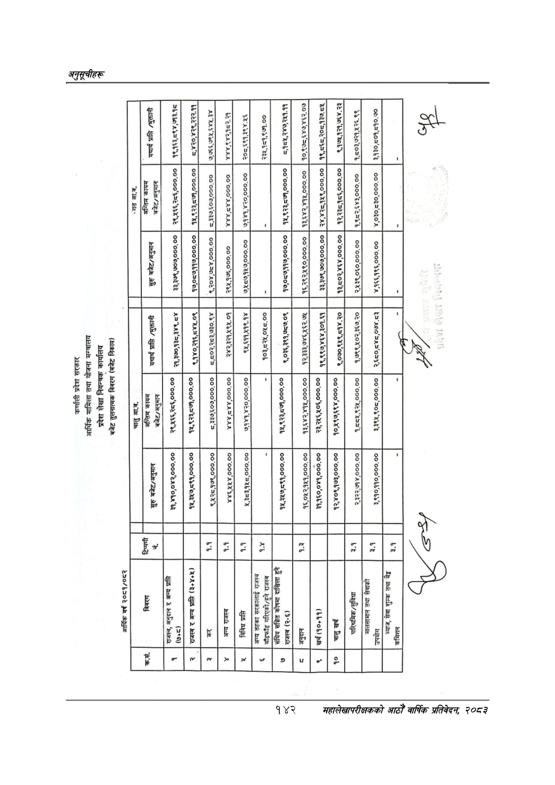

# Page 172 QA

## Rendered page


## Extracted text

```text
कर्णाली प्रदेश सरकार आर्थिक मामिला तथा योजना मन्त्रालय प्रदेश लेखा नियन्त्रक कार्यालय बजेट तुलनात्मक विवरण (बजेट निकाय)
२०८१/०८२
वर्ष
आर्थिक
२०४ ४४ टर (

| यदार्य /धुक्तानी   | , ८९४, - 2 - o n ~ (] - n              | &#124; ८,४२०,४२९,२२२.११   |              | २०८,६९१,३९४-४६   | २३४,१८१,९७.००                                        | &#124; ८,१०५,२४७,२५१.११                  | १०,९७८,४४७/४६२.०७         | &#124; १९,८६८/२०८,१३७:८४५         | ९,१७५.१२१,७६४. २३        | &#124; १,८०३,७२१,४५२६.९९          | 10,509,590.%0             | छ&#124;                        |
|--------------------|----------------------------------------|---------------------------|--------------|------------------|------------------------------------------------------|------------------------------------------|---------------------------|-----------------------------------|--------------------------|-----------------------------------|---------------------------|--------------------------------|
| अन्तिम कायम        | २९,५६६,२८६०००.००                       | क५,९२३,८७१,०००.००         |              |                  |                                                      | &#124; १५,९२३,८७१,०००.००                 | १३,६४२,४१४५,०००.०० &#124; | &#124; २४,४२८,१४९,०००.००          | &#124; १२,२३८,१८६,०००.०० | &#124; १,९८२,३४३,०००.००           | ¥,030,530,000,00          |                                |
| बजेट/अनुमान        | ३३,३७९,७०७,०००.०० &#124;               |                           |              |                  |                                                      | १७,०८७११७,०००.००                         | १६,२९२,४९०,०००.०० &#124;  | &#124; ३३,३७९,७०७०००.००           | १३,८०२,४६४,०००.००        | । २,४१३९,०६३०,०००.००              | ४,१६६१९६,०००.००           |                                |
|                    | &#124; दु 30050v8.0¥                   | &#124; ¢qvomyevion        | 0०95         | ९५,६११/५१९ १४ ]  | 903,53%,045.00                                       | ९,०३६,३९१,७८७.०९                         | _ १२,३३३,७४६४५६२.७४       | १९१९७४६४,३०१.६ &#124;             | ९,०७०,९५९,८१४. २०        | &#124; _ १/७९९/५०२,३६७. २० &#124; | &#124; २,६८०,८४८,०७४.८३   |                                |
| अन्तिम कायम        | २०९६ ०००,०० il                         | &#124;.  WINAN00000       |              |                  |                                                      | AT नर                                    | १३,६४२,४१५,०००.०० &#124;  | : of , र२२४६५०६०००.०० &#124;      | ०,५९७,६९४,०००.०० 1oAY    | १,८८१,९२५,०००.००                  | ३,३९५,९०८,०००.००          |                                |
|                    | NNOIR00.00 &#124;                      | WHOEN00000                | २,२:0०९००००० | %,352,445,000.00 |                                                      | निकाला हरि रि                            | 9%,043,34,000.00          | ०,०४१,०००. बत१६०,०४%०००.०० &#124; | ¥0%,9193,000,00 52,      |                                   | ३,९१०,११०,०००.००          |                                |
| टिप्पणी - नं       |                                        | । ]]                      | मि N         | ml               | ”                                                    |                                          |                           | ] &#124;                          |                          |                                   |                           |                                |
|                    | राजस्व, अनुदान र अन्य प्राप्ति ] (७०८) | नल सम्बत (३४३)            | &#124;न्     |                  | अन्य तहका सरकालाई राजस्व बाँडफाँड गरिएको/हुने राजस्व | संघिय सित कोषमा दाखिला हुने राजस्व (२-६) |                           |                                   |                          | पारिश्रमिक/सुविधा                 | मालसामान तथा सेवाको उपयोग | ब्याज, सेवा शुल्क तथा वै कमिशन |
|                    | &#124; »                               | [२                        | [२           |                  |             
```

## Flags
- table_page
- low_quality_table
