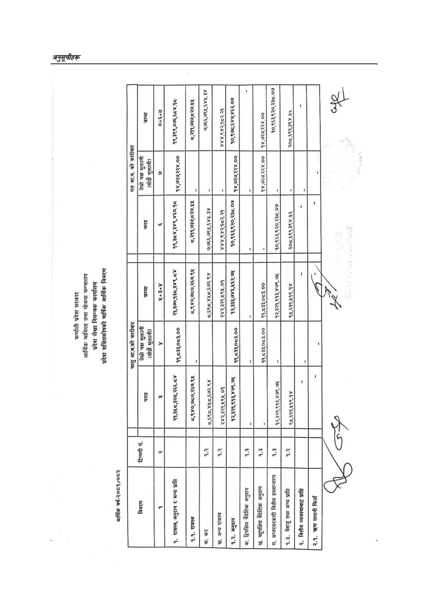

# Page 175 QA

## Rendered page


## Extracted text

```text
कर्णाली प्रदेश सरकार आर्थिक मामिला तथा योजना मन्त्रालय प्रदेश लेखा नियन्त्रक कार्यालय प्रदेश सञ्चितकोषको वार्षिक आर्थिक विवरण
आर्थिक वर्ष-२०८१/०८२

| हट |  | २ हुई णए | ८ ३ - | ४. छ | टर > \| है ७२ है | छ २ > | छ ८ ५ % ४ ८ |  | > हर » - | ३\| ८८ $% % | ई ४: १:. ९ |  |  |
| --- | --- | --- | --- | --- | --- | --- | --- | --- | --- | --- | --- | --- | --- |
| रछ | ’ पट |  | ८ ३ » |  |  |  | ५ > |  | ८ ५ » |  |  | लि |  |
|  |  |  | ५ |  | . छ छ | ९) | ३ | \|\| ॥ |  | ३२ ] २ | २५ |  |  |
|  |  |  |  |  |  |  |  |  |  |  |  |  |  |
|  | हट |  | » ३८ छ ८ ® | रे ४ § | » ९ ४ ७ | ५८८ है | टु ९ हटे ड्ड |  | % ५ | ८: ३ ९ |  |  | \ [रि |
| । \| % ५ १ १ १ ३७ २ १४० ७३२ ११ १४ ४९.८०५२२५ ४ ५ १ १ १ ३७ ३ २९७ ७२९ १५ २५ ३०.९८८०२९ १४ ५ १ १ १ ३७ ४ ३७७ ७३३ ११ १३ ३९.७१०८२३ १४ ४ १ १ १ ३८ ० १३ ७२९ ३७७ ४१ -१ ५ १ १ १ ३८ १ १३ ७४७ १० १४ ६०.८८२६६० १ ५ १ १ १ ३८ २ ३६ ७४६ १४ २४ ५२.०७०८८५ ५ १ १ १ ३८ ३ ५६ ७२९ १९ ४० ५७.४६६६९४ टू ५ १ १ १ ३८ ४ १४२ ७४७ ११ १३ ३३.५७८४९९ ५ १ १ १ ३८ ५ २९९ ७४४ १५ २४ ४२.२०२९९१ ४ ५ १ १ १ ३८ ६ ३७९ ७४९ ११ १२ ४२.४४७९३७ ४ १ १ १ ३९ ० १३ ७६२ ४८६ ३१ -१ ५ १ १ १ ३९ १ १३ ७६८ १५ २५ ६०.६३६५६६ ५ १ १ १ ३९ २ १४० ७६२ १२ १४ ५४.०५७४७२ ५ १ १ १ ३९ ३ १९४ ७६८ ३ ७ ३९.७५८९३४ ' ५ १ १ १ ३९ ४ ३०१ ७६२ ११ १४ ३४.५२८९६५ ५ १ १ १ ३९ ५ ३४५ ७६९ २ ७ ७८.२९८००४। ५ १ १ १ ३९ ६ ३७७ ७६३ ११ १३ ६३.६२०६४७ छ ५ १ १ १ ३९ ७ ४२१ ७६९ २ ७ ९१.६०७७१९। ५ १ १ १ ३९ ८ ४९७ ७६९ २ ७ ७७.१४२३४२ ' ४ १ १ १ ४० ० १३१ ८१० ३९७ २५ -१ ५ १ १ १ ४० १ १३१ ८१० ११ २५ ४८.१५७७३० $ ५ १ १ १ ४० २ १८० ८१२ ५५ २२ २१.०७७८१४ टु; ५ १ १ १ ४० ३ २९२ ८१५ १२ १७ ६५.९१७१२२ डे ५ १ १ १ ४० ४ ४८८ ८२५ २ ८ २५.९३९०६८ \| ४ १ १ १ ४१ ० १३१ ८२७ २९६ २७ -१ ५ १ १ १ ४१ १ १३१ ८३६ १२ ७ ४३.९८१७१२ ५ १ १ १ ४१ २ १८० ८३४ ९ ९ ४८.७९६०८२ २ ५ १ १ १ ४१ ३ २२६ ८३३ ११ १३ ३९.८१९९६२ ५ १ १ १ ४१ ४ २९२ ८३३ १२ २१ ८६.४६९८०३ ५ १ १ १ ४१ ५ ४१६ ८२७ ११ २१ ४३.७०५४५२ छ ४ १ १ १ ४२ ० १३१ ८४४ ३३२ २२ -१ ५ १ १ १ ४२ १ १३१ ८४४ १३ १८ ७०.३७२२९९ ५ १ १ १ ४२ २ १८० ८४४ १३ १८ २७.१९४३२८ % ५ १ १ १ ४२ ३ २२६ ८४७ ११ १६ ७२.४२५२६२ ३ ५ १ १ १ ४२ ४ २६३ ८४४ ३८ २१ ४०.६८९२४७ ८३ ५ १ १ १ ४२ ५ ४१६ ८४९ ११ १७ ४९.५१७११३ ५ १ १ १ ४२ ६ ४५४ ८५४ ९ ९ ६८.२६७४१० ४ १ १ १ ४३ ० ५० ८५७ ४१५ २८ -१ ५ १ १ १ ४३ १ ५० ८५७ ५२ २८ ६९.५८९७५२ हन ५ १ १ १ ४३ २ १३१ ८६३ १२ १७ ३८.०७३४२९ हुँ ५ १ १ १ ४३ ३ १८१ ८६३ ८ ९ १८.०४८५४४ ५ १ १ १ ४३ ४ २२६ ८६४ १३ १० ८३.१५६३७२ % ५ १ १ १ ४३ ५ २६४ ८६५ ४२ १७ ३८.३८२११४ ३ ५ १ १ १ ४३ ६ ४१६ ८६७ १२ १२ ४१.७०६५८५ = ५ १ १ १ ४३ ७ ४५३ ८६५ १२ ११ १९.८६४४५४ = ४ १ १ १ ४४ ० १३१ ८७३ ३३४ २९ -१ ५ १ १ १ ४४ १ १३१ ८८१ १४ २१ ५४.७६१८१० छ ५ १ १ १ ४४ २ २२७ ८७५ ७९ २१ ३०.७७९७०५ ५ १ १ १ ४४ ३ ४१६ ८७७ ४९ २४ ४०.६८४५४७ हि ४ १ १ १ ४५ ० १३१ ८९५ ३३५ २७ -१ ५ १ १ १ ४५ १ १३१ ९०३ १२ १५ ६०.२७४८६८ हं ५ १ १ १ ४५ २ १८० ८९५ ५९ २२ ७.७७४६३९ ५ १ १ १ ४५ ३ २६४ ८९६ ४० २२ ३६.०१३५१९ ५ १ १ १ ४५ ४ ४१६ ८९५ ५० २७ ०.०००००० ४ १ १ १ ४६ ० १३१ ९१५ ३३५ २२ -१ ५ १ १ १ ४६ १ १३१ ९१८ १३ १९ ८७.६८३३५० € ५ १ १ १ ४६ २ १८० ९१५ १३ २२ ३१.३०३१०४ ५ १ १ १ ४६ ३ २२६ ९१९ १२ १६ २३.११०४३२ ५ १ १ १ ४६ ४ २६४ ९१८ ४२ १२ ७.०१३३४० ५ १ १ १ ४६ ५ ४१६ ९२१ ५० १२ १७.८०३७६४ ४ १ १ १ ४७ ० २२९ ९३१ २३६ १९ -१ ५ १ १ १ ४७ १ २२९ ९३५ १० १३ ६७.८८०८२९ ४ ५ १ १ १ ४७ २ २९३ ९३२ ११ ७ २२.०८५९७६ ५ १ १ १ ४७ ३ ३४६ ९४२ २ ७ ७३.६३८९०८ ॥ ५ १ १ १ ४७ ४ ३८४ ९४२ २ ७ ७६.९८२५२९। ५ १ १ १ ४७ ५ ४१६ ९३४ ११ १६ ३२.८९८६५५ है ५ १ १ १ ४७ ६ ४५४ ९३२ ११ १७ ४५.२५२०२९ ४ ४ १ १ १ ४८ ० ५६७ ९१९ ५२ १०४ -१ ५ १ १ १ ४८ १ ५६७ ९१९ ५२ १०४ ३४.४६०४८० [पो ४ १ १ १ ४९ ० २१७ १०१४ २४० ८ -१ ५ १ १ १ ४९ १ २१७ १०१४ १२ ८ ३९.०३०१९० \| ५ १ १ १ ४९ २ २५५ १०१४ ११ ८ ४०.५७२१४४ ५ १ १ १ ४९ ३ ३३० १०१४ १२७ ८ २१.०६४९३० ना ४ १ १ १ ५० ० २८ १००९ ४२९ ४८ -१ ५ १ १ १ ५० १ २८ १००९ १८ ४८ १०.१०६०४९ [त ५ १ १ १ ५० २ ९० १०२१ ११ ८ ५४.२१८०४८ ४ ५ १ १ १ ५० ३ २१७ १०२३ ५० १३ ०.०००००० ८ ५ १ १ १ ५० ४ ३३० १०२३ ८९ १३ ०.०००००० ८ ५ १ १ १ ५० ५ ४४५ १०२४ १२ १२ ०.०००००० ४ १ १ १ ५१ ० १२८ १०९७ २९० २७ -१ ५ १ १ १ ५१ १ १२८ १०९९ १५ २५ ४५.७१५८२८ ५ १ १ १ ५१ २ ४१० १०९७ ८ २४ ८१.६२२७६५ ४ १ १ १ ५२ ० ४१० ११२३ ७ १३ -१ ५ १ १ १ ५२ १ ४१० ११२३ ७ १३ ७८.५६६४६० ४ १ १ १ ५३ ० १३२ १११९ ३९९ ५६ -१ ५ १ १ १ ५३ १ १३२ ११२८ १० २५ ५९.२०८०९२ ५ १ १ १ ५३ २ ३३१ १११९ १६३ ४२ ४८.९८१७३९ उ. ५ १ १ १ ५३ ३ ५१७ ११४५ १४ ३० ६३.२५७९६१ ३ ४ १ १ १ ५४ ० ४८७ ११५६ ७ ८ -१ ५ १ १ १ ५४ १ ४८७ ११५६ ७ ८ ३२.००६९२० त ४ १ १ १ ५५ ० ९० ११५१ ४०४ ३४ -१ ५ १ १ १ ५५ १ ९० ११७
```

## Flags
- table_page
- medium_quality_table
