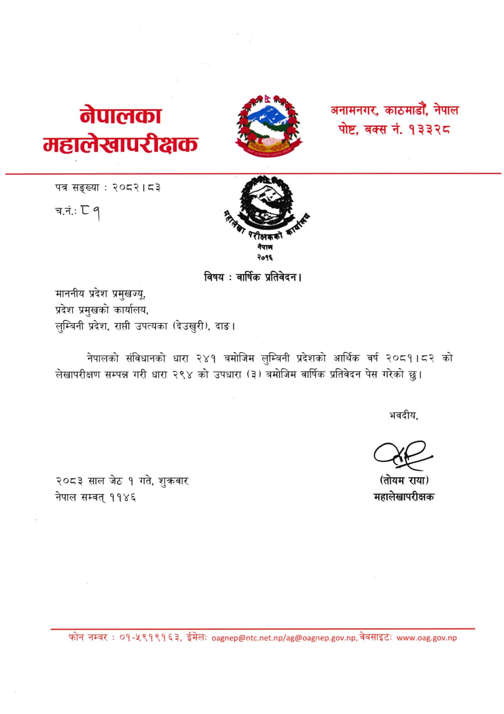

# Page 5 QA

## Rendered page


## Extracted text

```text
नेपालका महालेखापरीक्षक
पत्र सङ्ख्या
२०८२। ८३
च.नं.: १
नेपाल
२०१६
विषय:
वार्षिक प्रतिवेदन।
माननीय प्रदेश प्रमुखज्यु, प्रदेश प्रमुखको कार्यालय, लुम्बिनी प्रदेश, राप्ती उपत्यका (देउखुरी), दाङ।
नेपालको संविधानको धारा २४१ बमोजिम लुम्बिनी प्रदेशको आर्थिक वर्ष २०८१।८२ को लेखापरीक्षण सम्पन्न गरी धारा २९४ को उपधारा (३) बमोजिम वार्षिक प्रतिवेदन पेस गरेको छु।
भवदीय,
२०८३ साल जेठ १ गते, शुक्रवार नेपाल सम्वत्‌ ११४६
(तोयम राया) महालेखापरीक्षक
फोन नम्बर: ०१-५९१९१६३, ईमेल: ../.., वेबसाइट:
.०..
अनामनगर, काठमाडौं, नेपाल पोष्ट, बक्स नं. १३३२८
```

## Flags
- None
