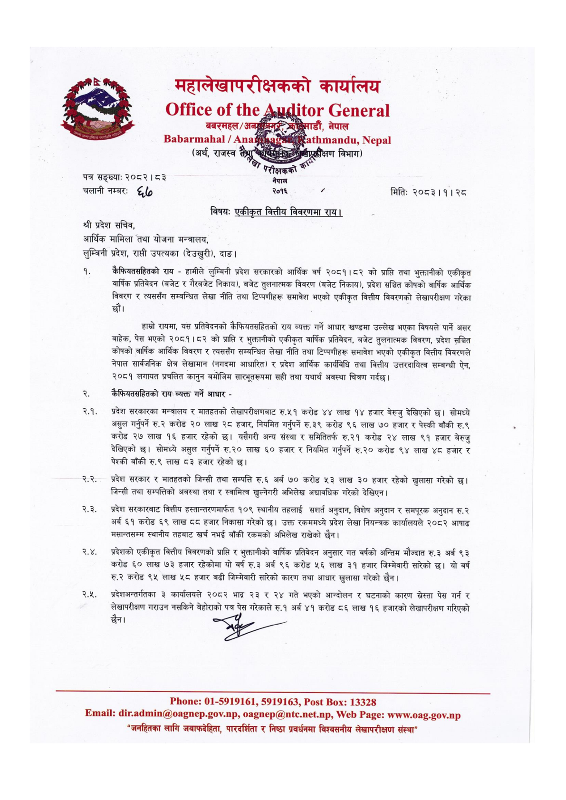

# Page 13 QA

## Rendered page


## Extracted text

```text
महालेखापरीक्षकको कार्यालय
२०४] -०४)
बबरमहल/
२११९
(अर्थ,
राजस्व
सँग
पत्र सङ्ख्या:
२०८२। ८३
चलानी नम्बरः
". ०३
बा
नेपाल
विभाग)
ले २०१६
४
विषय:
एकीकृत वित्तीय विवरणमा राय।
श्री प्रदेश सचिव, आर्थिक मामिला तथा योजना मन्त्रालय, लुम्बिनी प्रदेश, राप्ती उपत्यका (देउखुरी), दाङ।
९% कैफियतसहितको राय -हामीले लुम्बिनी प्रदेश सरकारको आर्थिक वर्ष २०८१।८२ को प्राप्ति तथा भुक्तानीको एकीकृत वार्षिक प्रतिवेदन (बजेट र गैरबजेट निकाय), बजेट तुलनात्मक विवरण (बजेट निकाय), प्रदेश सञ्चित कोषको वार्षिक आर्थिक विवरण र त्यससँग सम्बन्धित लेखा नीति तथा टिप्पणीहरू समावेश भएको एकीकृत वित्तीय विवरणको लेखापरीक्षण गरेका
हाम्रो रायमा, यस प्रतिवेदनको कैफियतसहितको राय व्यक्त गर्ने आधार खण्डमा उल्लेख भएका विषयले पार्ने असर बाहेक, पेस भएको २०८१।८२ को प्राप्ति र भुक्तानीको एकीकृत वार्षिक प्रतिवेदन, बजेट तुलनात्मक विवरण, प्रदेश सञ्चित 'कोषको वार्षिक आर्थिक विवरण र त्यससँग सम्बन्धित लेखा नीति तथा टिप्पणीहरू समावेश भएको एकीकृत वित्तीय विवरणले नेपाल सार्वजनिक क्षेत्र लेखामान (नगदमा आधारित) र प्रदेश आर्थिक कार्यविधि तथा वित्तीय उत्तरदायित्व सम्बन्धी ऐन, २०८१ लगायत प्रचलित कानुन बमोजिम सारभूतरूपमा सही तथा यथार्थ अवस्था चित्रण गर्दछ।
कैफियतसहितको राय व्यक्त गर्ने आधार -
प्रदेश सरकारका मन्त्रालय र मातहतको लेखापरीक्षणबाट रु.५१ करोड ४४ लाख १४ हजार बेरुजु देखिएको छ। सोमध्ये असुल गर्नुपर्ने करोड ० लाख २८ हजार, नियमित गर्नुपर्ने रु.३९ करोड ९६ लाख ७० हजार र पेस्की बाँकी रु.९ करोड २७ लाख १६ हजार रहेको छ। यसैगरी अन्य संस्था र समितितर्फ रु.२१ करोड २४ लाख ९१ हजार बेरुजु देखिएको छ। सोमध्ये असुल गर्नुपर्ने र.२० लाख ६० हजार र नियमित गर्नुपर्ने रु.२० करोड ९४ लाख ४८ हजार र पेश्की बाँकी रु.९ लाख ८३ हजार रहेको
प्रदेश सरकार र मातहतको जिन्सी तथा सम्पत्ति रु.६ अर्ब ७० करोड ५३ लाख ३० हजार रहेको खुलासा गरेको छ। जिन्सी तथा सम्पत्तिको अबस्था तथा र स्वामित्व खुल्नेगरी अभिलेख अद्यावधिक गरेको देखिएन।
२.३. प्रदेश सरकारबाट वित्तीय हस्तान्तरणमार्फत १०९ स्थानीय तहलाई सर्त अनुदान, विशेष अनुदान र समपूरक अनुदान रु.२ अर्ब ६१ करोड ६९ लाख ८८ हजार निकासा गरेको छ। उक्त रकममध्ये प्रदेश लेखा नियन्त्रक कार्यालयले २०८२ आषाढ मसान्तसम्म स्थानीय तहबाट खर्च नभई बाँकी रकमको अभिलेख राखेको छैन।
.. प्रदेशको एकीकृत वित्तीय विवरणको प्राप्ति र भुक्तानीको वार्षिक प्रतिवेदन अनुसार गत वर्षको अन्तिम मौज्दात रु.३ अर्ब ९३ करोड ६० लाख ७३ हजार रहेकोमा यो वर्ष रु.३ अर्ब ९६ करोड ५६ लाख ३१ हजार जिम्मेवारी सारेको छ। यो वर्ष करोड ९५ लाख ५८ हजार बढी जिम्मेवारी सारेको कारण तथा आधार खुलासा गरेको छैन |
२५, प्रदेशअन्तर्गतका ३ कार्यालयले २०८२ भाद्र २३ र २४ गते भएको आन्दोलन र घटनाको कारण स्रेस्ता पेस गर्न र लेखापरीक्षण गराउन नसकिने बेहोराको पत्र पेस गरेकाले रु.१ अर्ब ४१ करोड ८६ लाख १६ हजारको लेखापरीक्षण गरिएको छैन।
०१-५९१९१६१, ५९१९१६३, : १३३२८
२०
अनल
क
मितिः
२०८३।१। २८
: .., .., :.०.. जनहितका लागि जवाफदेहिता, पारदर्शिता र निष्ठा प्रवर्धनमा विश्वसनीय लेखापरीक्षण संस्था'
```

## Flags
- None
