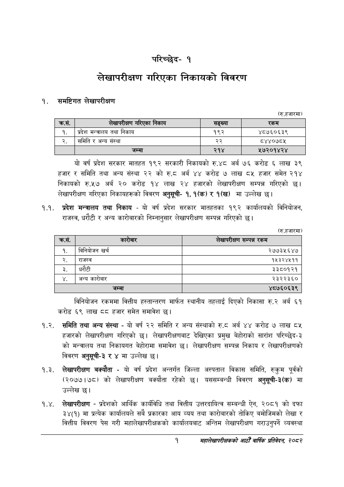

# Page 17 QA

## Rendered page


## Extracted text

```text
परिच्छेद१
लेखापरीक्षण गरिएका निकायको विवरण
समष्टिगत लेखापरीक्षण
(रु.हजारमा)
यो वर्ष प्रदेश सरकार मातहत १९२ सरकारी निकायको रु.४८ अर्ब ७६ करोड ६ लाख ३९ हजार र समिति तथा अन्य संस्था २२ को ६.६ अर्ब ४४ करोड ७ लाख ८४५ हजार समेत २१४ निकायको रु.५७ अर्ब ० करोड १४ लाख २४ हजारको लेखापरीक्षण सम्पन्न गरिएको छ। लेखापरीक्षण गरिएका निकायहरूको विवरण अनुसूची१, १(क) र १(ख) मा उल्लेख छ।
१.१. प्रदेश मन्त्रालय तथा निकाय -यो वर्ष प्रदेश सरकार मातहतका १९२ कार्यालयको विनियोजन, राजस्व, धरौटी र अन्य कारोबारको निम्नानुसार लेखापरीक्षण सम्पन्न गरिएको छ।
(रु.हजारमा)
विनियोजन रकममा वित्तीय हस्तान्तरण मार्फत स्थानीय तहलाई दिएको निकासा रु.२ अर्ब ६१ करोड ६९ लाख ८८ हजार समेत समावेश छ।
१.२. समिति तथा अन्य संस्था -यो वर्ष २२ समिति र अन्य संस्थाको रु.८ अर्ब ४४ करोड ७ लाख ८५ हजारको लेखापरीक्षण गरिएको छ। लेखापरीक्षणबाट देखिएका प्रमुख बेहोराको सारांश परिच्छेद-३ को मन्त्रालय तथा निकायगत बेहोरामा समावेश छ। लेखापरीक्षण सम्पन्न निकाय र लेखापरीक्षणको विवरण अनुसूची-३ र ४ मा उल्लेख छ।
१.३. लेखापरीक्षण बक्यौता -यो वर्ष प्रदेश अन्तर्गत जिल्ला अस्पताल विकास समिति, रुकुम पूर्वको (२०७७।७८) को लेखापरीक्षण बक्यौता रहेको छ। यससम्बन्धी विवरण अनुसूची-३(क) मा उल्लेख
१.४. लेखापरीक्षण -प्रदेशको आर्थिक कार्यविधि तथा वित्तीय उत्तरदायित्व सम्बन्धी ऐन, २०८१ को दफा ३४(१) मा प्रत्येक कार्यालयले सबै प्रकारका आय व्यय तथा कारोबारको तोकिए बमोजिमको लेखा र वित्तीय विवरण पेस गरी महालेखापरीक्षकको कार्यालयबाट अन्तिम लेखापरीक्षण गराउनुपर्ने व्यवस्था
१
महालेखापरीक्षकको आठौं वाषिकि प्रतिवेदन २०८२

| क्रस. | लेखापरीक्षन गरिएका निकाय | सङ्ख्या | रकम |
| --- | --- | --- | --- |
| १. | प्रदेश भन्त्रालय तथा निकाय | १९२ | ४८७६०६३९ |
| २. | समिति र अन्य संस्था | २२ | ८४४०७८५ |
|  | जम्मा | २१४ | ५७२०१४२४ |

| क्रस. | कारेबार | लेखापरीक्षण सम्पन्न रकम |
| --- | --- | --- |
| १ | बिनिबोजन खर्च | २७७३५६४७ |
| २ | राजस्व | १५३२४५११ |
| ३ | धरौटी | ३३८०१२१ |
| ४ | अन्य कारोबार | २३२२३६० |
| ५ | जम्मा | ४८७६०६३९ |
```

## Flags
- table_page
- medium_quality_table
