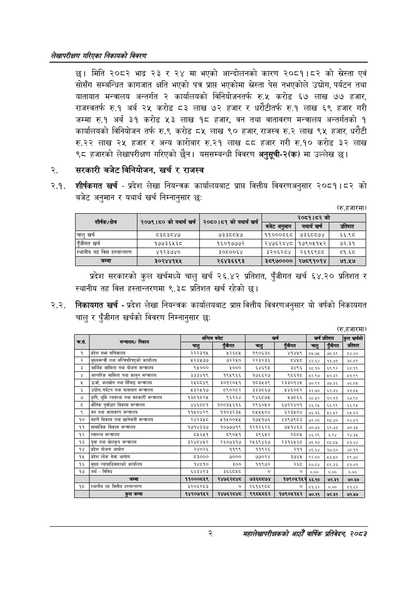

# Page 18 QA

## Rendered page


## Extracted text

```text
लेखापरीक्षण गरिएका निकायको विवरण
छ। मिति २०८२ भाद्र २३ र २४ मा भएको आन्दोलनको कारण २०८१।८२ को सस्ता एवं सोसँग सम्बन्धित कागजात क्षति भएको पत्र प्रापत भएकोमा स्रेस्ता पेस नभएकोले उद्योग, पर्यटन तथा यातायात मन्त्रालय अन्तर्गत २ कार्यालयको विनियोजनतर्फ रु.५ करोड ६७ लाख ७७ हजार, राजस्वतर्फ रु.१ अर्ब २५ करोड ८३ लाख ७२ हजार र धरौटीतर्फ रु.१ लाख ६९ हजार गरी जम्मा रु.१ अर्ब ३१ करोड ३ लाख १८ हजार, वन तथा वातावरण मन्त्रालय अन्तर्गतको १ कार्यालयको विनियोजन तर्फ रु.९ करोड ८५ लाख ९० हजार, राजस्व रु.२ लाख ९५ हजार, धरौटी रु.२२ लाख २४५ हजार र अन्य कारोबार रु.२१ लाख ८० हजार गरी रु.१० करोड ३२ लाख ९८ हजारको लेखापरीक्षण गरिएको | यससम्बन्धी विवरण अनुसूची-२(क) मा उल्लेख छ।
सरकारी बजेट विनियोजन, खर्च र राजस्व
शीर्षकगत खर्च -प्रदेश लेखा नियन्त्रक कार्यालयबाट प्राप्त वित्तीय विवरणअनुसार २०८१।८२ को बजेट अनुमान र यथार्थ खर्च निम्नानुसार छः
(रु.हजारमा)
प्रदेश सरकारको कुल खर्चमध्ये चालु खर्च २६.४२ प्रतिशत, पुँजीगत खर्च ६४.२० प्रतिशत र स्थानीय तह वित्त हस्तान्तरणमा ९.३८ प्रतिशत खर्च रहेको छ।
२.२. निकायगत खर्च -प्रदेश लेखा नियन्त्रक कार्यालयबाट प्राप्त वित्तीय विवरणअनुसार यो वर्षको निकायगत चालु र पुँजीगत खर्चको विवरण निम्नानुसार छः
(रु.हजारमा)
२
महालेखापरीक्षकको आठौ वाषिकि प्रतिवेदन २०८२

|  | को यथार्थ खर्च | को यथार्थ खर्च |  | २०८१।८२ को |  |
| --- | --- | --- | --- | --- | --- |
| 'शीर्षक/क्षेत्र | २०७९।८० | २०८०।८१ | बजेट अनुमान | यथार्थ खर्च | प्रतिशत |
| चालु खर्च | द३८३८४७ | ७३३८८५७ | ११०००८६८ | ७३६८८७४ | ६६.९८ |
| पुँजीगत खर्च | १७७३६५६८ | १६०१७७७२ | २४७६२८४८ | १७९०११५२ | ७२.३१ |
| स्थानीय तह वित्त हल्तान्तरण | ४१२३७४० | ३०६८००६४ | ३२०६२८४ | २६१६९८८ | ८१.६८ |
| जम्मा | ३०२४४१५५ | २६४३६६९३ | ३८९७०००० | २७८९१०१४ | ७१.५७ |

| छ | निकाय | अन्तिम | बजेट |  | खर्च | खर्च | प्रतिशत | कुल खर्चको |
| --- | --- | --- | --- | --- | --- | --- | --- | --- |
|  |  | चालु | चुँजीगत | चालु | इजीगत |  | एजीगत | प्रतिशत |
| १ | प्रदेश सभा सचिवालय | २२२३१५ | २२६०५ | १९०६३८ | ४१४५९ | ०५७५ | ७८६९ | ५८४,४० |
| २ | मुख्यमन्त्री तथा भन्जिषरिषद्को कार्यालय | ४२३४७७ | ७२२५० | २२३२३६ | दश | ४२६४ | ११७१ |  |
| ३ | आर्थिक मामिला तथा योजना मन्त्रालय | ९५००० | ४००० | ६४६९४५ | ३४९६ | ६८१० | ६९९२ | ६८१९ |
| ४ | अन्तरिक मामिला तथा कानुन मन्चालय | ३३३४१९ | १९४५९६६ | \| १७६६२७ | ८६१८ | २२:९७ | ४०३२ | २१:६९ |
| ५ | कर्जा, जलस्रोत तथा सिँचाइ मन्चालय | २४८०४९ | ३०१२०५१ | १८३४३९ | र२३३०१४५ | ७०९१ | ७७३६ | ७६०५ |
| ६ | उद्योग, पर्यटन तथा यातायात | २३२४५१७ | ब८९०२८२ | \| इ३३८६७ | २४६०६२ | ६२७० | ६१३४ | ६१०४ |
| ७ | कृषि, भुमि व्यवस्था तथा सहकारी मन्चालय | १३८१८२५ | ९६२६४ | ९४६८७४५ | ७८६६ | ६८५२ | ६०११ | ब०९८ |
| ८ | भौतिक पूर्वाधार विकास मन्त्रालय | ४१ | १००३५६१६ | २९६०५० | ६७२२४०१ | ६६:२५ | ६६९९ | इइब४ |
| ९ | बन तथा वातावरण मन्त्रालय | ११४०४२९ | ११०३२३५ | १५०४ |  | ७४३६ | ४६५२ | ६५६३ |
| १० | सहरी विकास तथा खानेपानी मन्त्रालय | २४२३ | ४१४००५५ | \| १७५१७६ | ४३९७९८३ | ७२२८ | ५४४० | ०४०१ |
| ११ | सामाजिक विकास मन्त्रालय | १७१४३३७ | १०७७७१९ | १२१२६२६ | ७५१४६३ | ७०.७३ | ६९७३ | ७०३५ |
| १२ | स्वास्थ्य मन्चालय | ८५६५१ | ८९०५१ | ३९६५२ | २८०५ | ४६२९ | इ२४ | २४,३४५ |
| १३ | युवा तथा खेलकुद मन्त्रालय | ३२४८४५२ | २६०७३१७ | २४५६९४६७ | र२३१६४१६८ | ७९१० | ५५०५ |  |
| १४ | प्रदेश योजना आयोग | २४०२६ | ११९९ | १९२६ | २११ | ९६४ | १७:६० | ११ |
| १५ | प्रदेश लोक सेवा आयोग | ८३००० | ७००० | ७७०२४ | ३७४५ | ९२६० | २३५० | ५९७४ |
| १६ | मुख्य कार्यालय | १४८१० | ३००। | ११९७२ | रड | ८००४ | ८९३३ | ५१०१ |
| १७ | अर्थ - विविध | ६४३४२३ | ३६६०४५८ |  | ० | ००० | ००० | ००० |
|  | जम्मा | ११०००६६९ | २४७६२८४८ | ७३७४ | १७९०५१४५२ | ६६९८ | ७२३१ | ७०.६७ |
| १८ | स्थानीय तह वित्तीय हस्तान्तरण | ३२०६२८३ | ० | २६१६९८८ | ० | ८१.६२ | ००० | ८१६२ |
|  | कुल जम्मा | १४२०७१५२ | २४७६२८४८ | ९९८४५८६२ | १७९०५१५२ | ७०.२९ | ७२.३१ | ७१५७ |
```

## Flags
- table_page
- medium_quality_table
