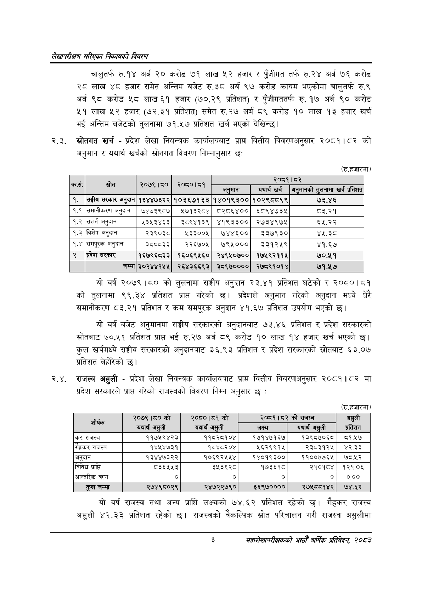

# Page 19 QA

## Rendered page


## Extracted text

```text
लेखापरीक्षण गरिएका निकायको विवरण
चालुतर्फ रु.१४ अर्ब २० करोड ७१ लाख ५२ हजार र पुँजीगत तर्फ रु.२४ अर्ब ७६ करोड २८ लाख ४८ हजार समेत अन्तिम बजेट रु.३८ अर्ब ९७ करोड कायम भएकोमा चालुतर्फ रु.९ अर्ब ९८ करोड ५८ लाख ६१ हजार (७००.२९ प्रतिशत) र पुँजीगततर्फ रु. १७ अर्ब ० करोड ५१ लाख ५२ हजार (७२.३१ प्रतिशत) समेत रु.२७ अर्ब ८९ करोड १० लाख १३ हजार खर्च भई अन्तिम बजेटको तुलनामा ७१.५७ प्रतिशत खर्च भएको देखिन्छ।
२.३. खर्च -प्रदेश लेखा नियन्त्रक कार्यालयबाट प्राप्त वित्तीय विवरणअनुसार २०८१।८२ को अनुमान र यथार्थ खर्चको विवरण निम्नानुसार छः:
(रु.हजारमा)
यो वर्ष २०७९।८० को तुलनामा सङ्घीय अनुदान २३.४१ प्रतिशत घटेको र २०८०।८१ को तुलनामा ९९.३४ प्रतिशत प्राप्त गरेको छ। प्रदेशले अनुमान गरेको अनुदान मध्ये धेरै समानीकरण ८३.२१ प्रतिशत र कम समपूरक अनुदान ४१.६७ प्रतिशत उपयोग भएको छ।
यो वर्ष बजेट अनुमानमा सङ्घीय सरकारको अनुदानबाट ७३.४६ प्रतिशत र प्रदेश सरकारको स्रोतबाट ७०.५१ प्रतिशत प्राप्त भई रु.२७ अर्ब ८९ करोड १० लाख १४ हजार खर्च भएको छ। कुल खर्चमध्ये सङ्घीय सरकारको अनुदानबाट ३६.९३ प्रतिशत र प्रदेश सरकारको स्रोतबाट ६३.०७ प्रतिशत बेहोरेको |
२.४. राजस्व असुली -प्रदेश लेखा नियन्त्रक कार्यालयबाट प्राप्त वित्तीय विवरणअनुसार २०८१।८२ मा प्रदेश सरकारले प्राप्त गरेको राजस्वको विवरण निम्न अनुसार छ:
(रु.हजारमा)
यो वर्ष राजस्व तथा अन्य प्राप्ति लक्ष्यको ७४.६२ प्रतिशत रहेको छ। गैह्रकर राजस्व असुली ४२.३३ प्रतिशत रहेको छ। राजस्वको वैकल्पिक स्रोत परिचालन गरी राजस्व असुलीमा
३
महालेखापरीक्षकको आठौ वाषिकि प्रतिवेदन २०८२

|  |  |  |  |  | २०८१।८२ |  |
| --- | --- | --- | --- | --- | --- | --- |
|  |  |  | ०६ | अरमान | यथार्थ खर्च | ११ ५॥१%)। ठ्लनामा खर्च प्रतिशत |
| १. | सङ्घीय सरकार अनुदान | १३४४७३२२ | १०३६७१३३ | १४०१९३०० | १०२९८८९९ | ७३.४६ |
| १.१ | समानीकरण अनुदान | ७४७३९८७ | ५७१३२८४ | ८२८६४०० | ६८९४७३५ | ८३.२१ |
| १.२ | अनुदान | २३२५३४६३ | २८९४१३९ | ४१९३३०० | २७३४९७४५ | ६५५.२२ |
| १.३ | विशेष अनुदान | २३९०३८० | ३३००५ | ७४४६०० | ३३७९३० | ४५.३८ |
| १.४ | समपूरक अनुदान | ३८०८३३ | २२६७०५ | ७९५००० | ३३१२५९ | ४१.६७ |
| २ | प्रदेश सरकार | १६७९६८३३ | १६०६९५६० | २४९५०७०० | १७५९२११४५ | ७०.५१ |
|  | जम्मा | ३०२४४१५५ | २६४३६६९३ | ३८९७०००० | २७८९१०१४ | ७१.५७ |

| शीर्षक | २०७९।८० को यथार्थ असुली | २०८०।८१ को यथार्थ असुली | २०८१।८२ लक्ष्य | को राजस्व यथार्थ असुली | असुली प्रतिशत |
| --- | --- | --- | --- | --- | --- |
| 'कर राजस्व | ११७५९४२३ | ११८२८१०४ | १७१४७१६७ | १३९८७०६८ |  |
| राजस्व | १४५४७३१ | १८४८२०४ | ५६२९९१५ | २३८३१२५ | ४२.३३ |
| अनुदान | १३४४७३२२ | १०६९२४५४५४ | १४०१९३०० | ११००७७६५ | ७८.५२ |
| विविध प्राप्ति | ८३६५५३ | ३५३९२८ | १७३६१८ | २१०१८४ | १२१.०६ |
| आन्तरिक |  | ० | ० |  | ०.०० |
| कुल जम्मा | २७४९८०२९ | २४७२२७९० | ३६९७०००० | २७५८०१४२ | ७४.६२ |
```

## Flags
- table_page
- medium_quality_table
