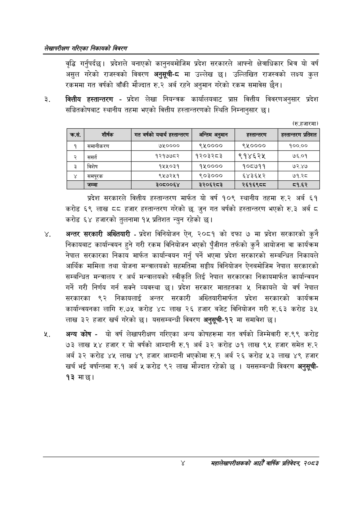

# Page 20 QA

## Rendered page


## Extracted text

```text
लेखापरीक्षण गरिएका निकायको विवरण
वृद्धि गर्नुपर्दछ। प्रदेशले बनाएको कानुनबमोजिम प्रदेश सरकारले आफ्नो क्षेत्राधिकार भित्र यो वर्ष असुल गरेको राजस्वको विवरण अनुसूची-द मा उल्लेख छ। उल्लिखित राजस्वको लक्ष्य कुल रकममा गत वर्षको बाँकी मौज्दात रु.२ अर्ब रहने अनुमान गरेको रकम समावेस |
वित्तीय हस्तान्तरण -प्रदेश लेखा नियन्त्रक कार्यालयबाट प्राप्त वित्तीय विवरणअनुसार प्रदेश सञ्चितकोषबाट स्थानीय तहमा भएको वित्तीय हस्तान्तरणको स्थिति निम्नानुसार छ।
(रु.हजारमा)
प्रदेश सरकारले वित्तीय हस्तान्तरण मार्फत यो वर्ष १०९ स्थानीय तहमा रु.२ अर्ब ६१ करोड ६९ लाख ८ हजार हस्तान्तरण गरेको छ, जुन गत बर्षको हस्तान्तरण भएको रु.३ अर्ब ८ करोड ६४ हजारको तुलनामा १५ प्रतिशत न्युन रहेको छ।
अन्तर सरकारी अख्तियारी -प्रदेश विनियोजन ऐन, २०८१ को दफा ७ मा प्रदेश सरकारको कुनै निकायबाट कार्यान्वयन हुने गरी रकम विनियोजन भएको पुँजीगत तर्फको कुनै आयोजना वा कार्यक्रम नेपाल सरकारका निकाय मार्फत कार्यान्वयन गर्नु पर्ने भएमा प्रदेश सरकारको सम्बन्धित निकायले आर्थिक मामिला तथा योजना मन्त्रालयको सहमतिमा सङ्घीय विनियोजन ऐनबमोजिम नेपाल सरकारको सम्बन्धित मन्त्रालय र अर्थ मन्त्रालयको स्वीकृति लिई नेपाल सरकारका निकायमार्फत कार्यान्वयन गर्ने गरी निर्णय गर्न सक्ने व्यवस्था छ। प्रदेश सरकार मातहतका ५ निकायले यो वर्ष नेपाल सरकारका ९२ निकायलाई अन्तर सरकारी अख्तियारीमार्फत प्रदेश सरकारको कार्यक्रम कार्यान्वयनका लागि रु.७५ करोड ४८ लाख २६ हजार बजेट विनियोजन गरी रु.६३ करोड ३५ लाख ३२ हजार खर्च गरेको छ। यससम्बन्धी विवरण अनुसूची-१२ मा समावेश छ।
अन्य कोष -यो वर्ष लेखापरीक्षण गरिएका अन्य कोषहरूमा गत वर्षको जिम्मेवारी रु.९९ करोड ७३ लाख ५४ हजार र यो वर्षको आम्दानी रु.१ अर्ब ३२ करोड ७१ लाख ९५ हजार समेत रु.२ अर्ब ३२ करोड ४४५ लाख ४९ हजार आम्दानी भएकोमा रु.१ अर्ब २६ करोड ५३ लाख ४९ हजार खर्च भई वर्षान्तमा रु.१ अर्ब ५ करोड ९२ लाख मौज्दात रहेको छ। यससम्बन्धी विवरण अनुसूची९३ मार्छ।
महालेखापरीक्षकको वाषिकि प्रतिवेदन २०८२

| कस. | शीर्षक | 'गत वर्षको यथार्थ हरत॥"०९५० | अन्तिम अनुमान | हस्तान्तरण | हस्तान्तरण प्रतिशत |
| --- | --- | --- | --- | --- | --- |
| १ | समानीकरण | ७५०००० | ९५०००० | ९५०००० | १००.०० |
| २ | ससर्त | १२१७७८२ | १२०३२८३ | ९१४६२५ | ७६.०१ |
| ३ | विशेष | १५५०३१ | १५०००० | १०८७११ | ७२.४७ |
| ४ | समपूरक | ९५७२५१ | ९६०३००० | ५४३६५२ | ७१.२८ |
| ५ | जम्मा | ३०८००६४ | ३२०६२८३ | २६१६९८८ | ८१.६२ |
```

## Flags
- table_page
- medium_quality_table
