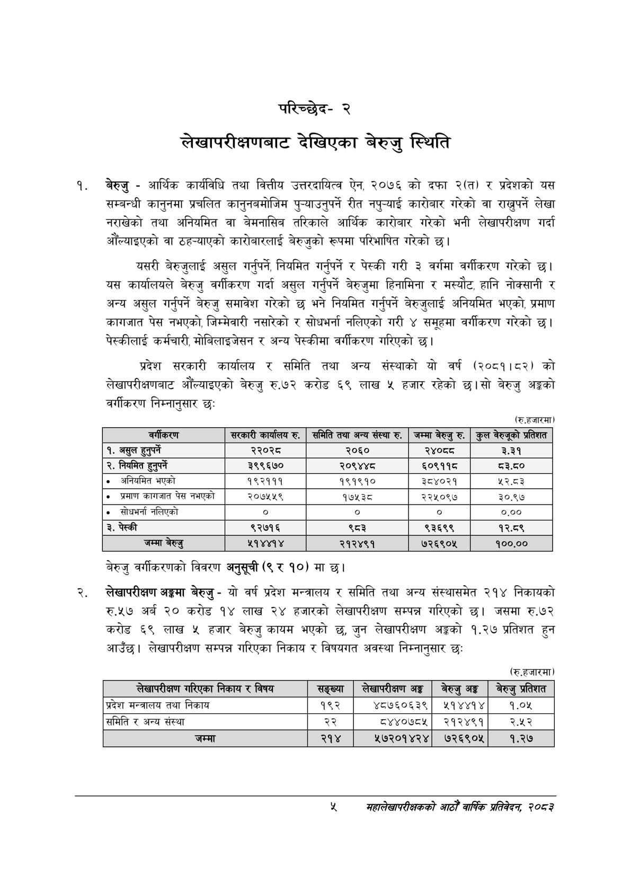

# Page 23 QA

## Rendered page


## Extracted text

```text
परिच्छेद२
लेखापरीक्षणबाट देखिएका बेरुजु स्थिति
बेरुजु -आर्थिक कार्यविधि तथा वित्तीय उत्तरदायित्व ऐन, २०७६ को दफा २(त) र प्रदेशको यस सम्बन्धी कानुनमा प्रचलित कानुनबमोजिम ( रीत नपुन्याई कारोबार गरेको वा राख्नुपर्ने लेखा नराखेको तथा अनियमित वा बेमनासिब तरिकाले आर्थिक कारोबार गरेको भनी लेखापरीक्षण गर्दा औंँल्याइएको वा ठह-्याएको कारोबारलाई बेरुजुको रूपमा परिभाषित गरेको छ।
यसरी बेरुजुलाई असुल गर्नुपर्ने, नियमित गर्नुपर्ने र पेस्की गरी ३ वर्गमा वर्गीकरण गरेको छ। यस कार्यालयले बेरुजु वर्गीकरण गर्दा असुल गर्नुपर्ने बेरुजुमा हिनामिना र मस्यौट, हानि नोक्सानी र अन्य असुल गर्नुपर्ने बेरुजु समावेश गरेको छ भने नियमित गर्नुपर्ने बेरुजुलाई अनियमित भएको, प्रमाण कागजात पेस नभएको, जिम्मेवारी नसारेको र सोधभर्ना नलिएको गरी ४ समूहमा वर्गीकरण गरेको | पेस्कीलाई कर्मचारी, मोबिलाइजेसन र अन्य पेस्कीमा वर्गीकरण गरिएको छ।
प्रदेश सरकारी कार्यालय र समिति तथा अन्य संस्थाको यो वर्ष (२०८१।०२) को लेखापरीक्षणबाट औंँल्याइएको बेरुजु रु.७२ करोड ६९ लाख ५ हजार रहेको छ। सो बेरुजु अङ्गको वर्गीकरण निम्नानुसार छः
(रु.हजारमा)
बेरुजु वर्गीकरणको विवरण अनुसूची (९ र १०) मा छ।
लेखापरीक्षण अङ्गमा बेरुजु -यो वर्ष प्रदेश मन्त्रालय र समिति तथा अन्य संस्थासमेत २१४ निकायको रु.५७ अर्ब २० करोड १४ लाख २४ हजारको लेखापरीक्षण सम्पन्न गरिएको छ। जसमा रु.७२ करोड ६९ लाख ५ हजार बेरुजु कायम भएको छ, जुन लेखापरीक्षण अङ्गको १.२७ प्रतिशत हुन आउँछ। लेखापरीक्षण सम्पन्न गरिएका निकाय र विषयगत अवस्था निम्नानुसार छः
(रु.हजारमा)
सहालेखापरीक्षकको आठौँ वाषिकि प्रतिवेदन २०८२

| बर्षाकएण | सरकारी कार्कालष रु. | समिति तथा अन्य संस्था रु. | जम्मा बेरुजु रु. | कुल वेरुजूको प्रतिशत |
| --- | --- | --- | --- | --- |
| १. असुल हुनुपर्ने | २२०२८ | २०६० | २४०८ | ३.३१ |
| २. नियमित हुनुपर्ने | ३९९६७० | २०९४४८ | ६०९११८ | ८३.८० |
| ० अनियमित भएको | १९२१११ | १९१९१० | ३८४०२१ | ५२.८३ |
| ० प्रमाण कागजात पेस नभएको | २०७५५९ | १७५३८ | २२५०९७ | ३०.९७ |
| ० सोधभर्ना नलिएको | ० | ० | ० | ०.०० |
| ३. पेस्की | ९२७१६ | ९८३ | ९३६९९ | १२.८९ |
| जम्मा बेरुजु | ५१४४१४ | २१२४९१ | ७२६९०५ | १००.०० |

| लेखापरीक्षण ५ २५क। निकाय र विषय | सङ्ख्या | लेखापरीक्षण अङ्ग | बेरुउ अङ्ग | बेरुउ प्रतेशत |
| --- | --- | --- | --- | --- |
| प्रदेश अन्तराल तथा निकाय | १९२ | ४८७६०६३९ | २१४४१४ | १.०५ |
| समिति र अन्य संस्था | २२ | ८४४०७८५ | २१२४९१ | २.५२ |
| जम्मा | २१४ | ५७२०१४२४ | ७२६९०५ | १.२७ |
```

## Flags
- table_page
- medium_quality_table
