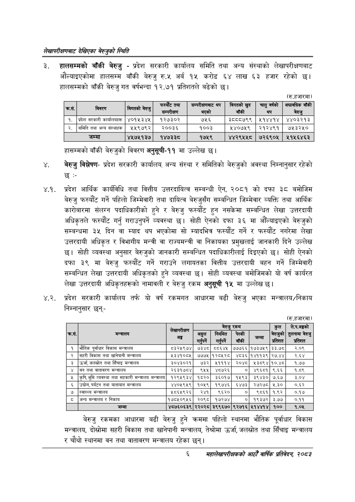

# Page 24 QA

## Rendered page


## Extracted text

```text
लेखापरीक्षणबाट देखिएका बेरुजुको स्थिति
हालसम्मको बाँकी बेरुजु -प्रदेश सरकारी कार्यालय समिति तथा अन्य संस्थाको लेखापरीक्षणबाट औंल्याइएकोमा हालसम्म बाँकी बेरुजु रु.५ अर्ब १५ करोड ६४ लाख ६३ हजार रहेको छ। हालसम्मको बाँकी बेरुजु गत वर्षभन्दा १२.७१ प्रतिशतले बढेको छ।
(रु.हजारमा)
हासम्मको बाँकी बेरुजुको विवरण अनुसूची-११ मा उल्लेख छ।
बेरुजु विश्लेषणप्रदेश सरकारी कार्यालय, अन्य संस्था र समितिको बेरुजुको अवस्था निम्नानुसार रहेको
४.१. प्रदेश आर्थिक कार्यविधि तथा वित्तीय उत्तरदायित्व सम्बन्धी ऐन, २०८१ को दफा ३८ बमोजिम बेरुजु फस्यौट गर्ने पहिलो जिम्मेवारी तथा दायित्व बेरुजुसँग सम्बन्धित जिम्मेवार व्यक्ति तथा आर्थिक कारोबारमा संलग्न पदाधिकारीको हुने र बेरुजु फस्यौट हुन नसकेमा सम्बन्धित लेखा उत्तरदायी अधिकृतले फस्यौंट गर्नु गराउनुपर्ने व्यवस्था छ। सोही ऐनको दफा ३६ मा औंल्याइएको बेरुजुको सम्बन्धमा ३५ दिन वा म्याद थप भएकोमा सो म्यादभित्र फस्यौट गर्ने र फस्यौट नगरेमा लेखा उत्तरदायी अधिकृत र विभागीय मन्त्री वा राज्यमन्त्री वा निकायका प्रमुखलाई जानकारी दिने उल्लेख छ। सोही व्यवस्था अनुसार बेरुजुको जानकारी सम्बन्धित पदाधिकारीलाई दिइएको छ। सोही ऐनको दफा ३९ मा बेरुजु फस्यौट गर्ने गराउने लगायतका वित्तीय उत्तरदायी बहन गर्ने जिम्मेवारी सम्बन्धित लेखा उत्तरदायी अधिकृतको हुने व्यवस्था छ। सोही व्यवस्था बमोजिमको यो वर्ष कार्यरत लेखा उत्तरदायी अधिकृतहरूको नामावली र बेरुजु रकम अनुसूची १५ मा उल्लेख छ।
४.२. प्रदेश सरकारी कार्यालय तर्फ यो वर्ष रकमगत आधारमा बढी बेरुजु भएका मन्त्रालय/निकाय निम्नानुसार छन्‌-
(रु.हजारमा)
बेरुजु रकमका आधारमा बढी बेरुजु हुने क्रममा पहिलो स्थानमा भौतिक पूर्वाधार विकास मन्त्रालय, दोस्रोमा सहरी विकास तथा खानेपानी मन्त्रालय, तेश्रोमा उर्जा, जलस्रोत तथा सिँचाइ मन्त्रालय र चौथो स्थानमा वन तथा वातावरण मन्त्रालय रहेका छन्‌।
।
६
सहालेखापरीक्षकको आठौँ वाषिकि प्रतिवेदन २०८२

| ५ |  |  | फस्येटितया सन्परीकाण | जन्पकाननाट थप भएको | विगतको खुद बाँकी | चालु वर्षको थप |
| --- | --- | --- | --- | --- | --- | --- |
| १. | प्रदेश सरकारी कार्कालबहरलू | ४०१५३४५ | १२७३०२ | ७५६ | ३८८८७९९ | २१४४१४ |
| २. | समिति तथा अन्य संस्थाहर्‌ | ५५९७९२ | २००३६ | १००३ | २४०७२९ | २१२४९१ |
|  | जम्मा | ४५७५१३७ | १४७३३८ | १७५९ | ४४२९५५८ | ७२६९०५ |

| ३ | मन्त्रालय | अङ्ग | असुल गाहपर्ने | बेरुजु नियमित गर्ुप्ने | रकम पेस्की बाँकी | मा | कुल बेरुजुको प्रतिशत | ले.प.गङ्को तुलनामा बेरुजु प्रतिशत |
| --- | --- | --- | --- | --- | --- | --- | --- | --- |
| १ | भौतिक पूर्वाधार विकास मन्त्रालय | ८३२५९७४ | ७३४८ | ८६४५ | ७७७६६ | १७३७५९ | ३३.७८ | र२.०९ |
| २ | सहरी विकास तथा खानेपानी मन्त्रालय | ५३४१०८५ | ७७७५ | १२८५२८ | ४८३६ | १४११३९ | २७.४४ | २.६४ |
| ३ | उर्जा, जलस्रोत तथा सिँचाइ मन्त्रालय | ३०४३०२१ | ७३२ | ४५१११४ | २०४८ | १५३८९४ | १०.४८ | १.७७ |
| ४ | बन तथा वातावरण मन्त्रालय | २६३१७८४ | ९१५ | ४८७२६ | ० | ४९६८१ | ९६६ | १.८९ |
| ५ | कृषि, भूमि व्यवस्था तथा सहकारी मन्त्रालय मन्त्रालय | १२९५९३४ | १८२० | ३६०१७ | १५९३ | ३९४३० | ७.६४ | ३.०४ |
| ६ | , तथा यातायात मन्त्रालय | ४४०५९५९ | १०५९ | १९७४६ | ६४७३ | २७२७८ | ५.३० | ०.६२ |
| ७ | स्वास्थ्य मन्त्रालय | २८६५९२६ | २४१ | ९६२० | ० | ९८६१ | १.९२ | ०.१७ |
| ८ | अन्य मन्त्रालय र निकाय | १७८५०९५६ | २०९८ | १७२७४ | ० | १९३७२ | ३.७४ | ०.११ |
| ९ | जम्मा | ४८७६०६३९ | २२०२८ | ३९९६७० | ९२७१६ | ५१४४१४ | १०० | १.०४५ |
```

## Flags
- table_page
- medium_quality_table
