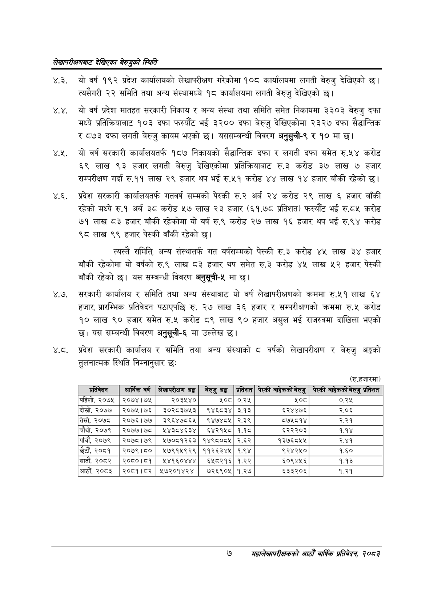

# Page 25 QA

## Rendered page


## Extracted text

```text
लेखापरीक्षणबाट देखिएका बेरुजुको स्थिति
४.३. यो वर्ष १९२ प्रदेश कार्यालयको लेखापरीक्षण गरेकोमा १०८ कार्यालयमा लगती बेरुजु देखिएको छ। त्यसैगरी २२ समिति तथा अन्य संस्थामध्ये १८ कार्यालयमा लगती बेरुजु देखिएको छ।
४.४. यो वर्ष प्रदेश मातहत सरकारी निकाय र अन्य संस्था तथा समिति समेत निकायमा ३३०३ बेरुजु दफा मध्ये प्रतिक्रियाबाट १०३ दफा फस्यौट भई ३२०० दफा बेरुजु देखिएकोमा २३२७ दफा सैद्धान्तिक र ८७३ दफा लगती बेरुजु कायम भएको छ। यससम्बन्धी विवरण अनुसुची-९ र १० मा |
४.२. यो वर्ष सरकारी कार्यालयतर्फ १८७ निकायको सैद्धान्तिक दफा र लगती दफा समेत रु.५४ करोड ६९ लाख ९३ हजार लगती बेरुजु देखिएकोमा प्रतिक्रियाबाट रु.३ करोड ३७ लाख ७ हजार सम्परीक्षण गर्दा रु.११ लाख २९ हजार थप भई रु.५१ करोड ४४ लाख १४ हजार बाँकी रहेको छ।
४.६. प्रदेश सरकारी कार्यालयतर्फ गतवर्ष सम्मको पेस्की रु.२ अर्ब २४ करोड २९ लाख ६ हजार बाँकी रहेको मध्ये रु.१ अर्ब ३८ करोड ५७ लाख २३ हजार (६१.७८ प्रतिशत) फस्यौट भई रु.८५ करोड ७१ लाख ८३ हजार बाँकी रहेकोमा यो वर्ष रु.९ करोड २७ लाख १६ हजार थप भई रु.९४ करोड ९८ लाख ९९ हजार पेस्की बाँकी रहेको |
त्यस्तै समिति, अन्य संस्थातर्फ गत वर्षसम्मको पेस्की रु.३ करोड ४५ लाख ३४ हजार बाँकी रहेकोमा यो वर्षको रु.९ लाख ८३ हजार थप समेत रु.३ करोड ४५ लाख ५२ हजार पेस्की बाँकी रहेको छ। यस सम्बन्धी विवरण अनुसूची-५ मा छ।
४.७. सरकारी कार्यालय र समिति तथा अन्य संस्थाबाट यो वर्ष लेखापरीक्षणको क्रममा रु.५१ लाख हजार, प्रारम्भिक प्रतिवेदन पठाएपछि रु. २७ लाख ३६ हजार र सम्परीक्षणको क्रममा रु.५ करोड ९० लाख ९० हजार समेत रु.५ करोड ८९ लाख ९० हजार असुल भई राजस्वमा दाखिला भएको छ। यस सम्बन्धी विवरण अनुसूची-६ मा उल्लेख छ।
४.ठ. प्रदेश सरकारी कार्यालय र समिति तथा अन्य संस्थाको ८ वर्षको लेखापरीक्षण र बेरुजु अङ्कको तुलनात्मक स्थिति निम्नानुसार छः
(रु.हजारमा)
७
सहालेखापरीक्षकको आठौँ वाषिकि प्रतिवेदन २०८२

| प्रतिविदन | अर्थिक वर्ष | लेखापरीक्षण अङ्क | बेरुजु अङ्ग | प्रतिशत | पेस्की जाहकक१ १९७ु | पेस्की ना०कको न९ु प्रतिशत |
| --- | --- | --- | --- | --- | --- | --- |
| पहिलो, २०७५ | २०७४।७४५ | २०३५४० | ५०८ | ०.२५ | ५०८ | ०.२५ |
| दोस्रो, २०७७ | २०७५।७६ | ३०२८३७५३ | ९४६८३४ | ३.१३ | ६२४४७६ | २.०६ |
| तेस्रो, २०७८ | २०७६।७७ | ३९६४७८६५ | ९४७४८५ | २.३९ | ८५७५८१४ | २.२१ |
| चौथो, २०७९ | २०७७।७८० | १२४३८४६३४ | ६४२१५८ | १.१ | ६२२२०३ | १.१४ |
| पाँचौं, २०७९ | २०७८।७९ | ५७०८१२६३ | १४९८०८५ | २.६२ | १३७६८५५ | २.४१ |
| छैटौं, २०८१ | २०७९।८० | ५७९१५९२९ | ११२६३४५ | १.९४ | ९२४२५० | १.६० |
| सातौं, २०८२ | २०८०।८१ | ४५४१६०४४४ | ६५८२१६ | १.२२ | ६०९४५६ | १.१३ |
| आठौँ, २०८३ | २०८१।८२ | ५७२०१४२४ | ७२६९०५ | १.२४ | ६३३२०६ | १.२१ |
```

## Flags
- table_page
- medium_quality_table
