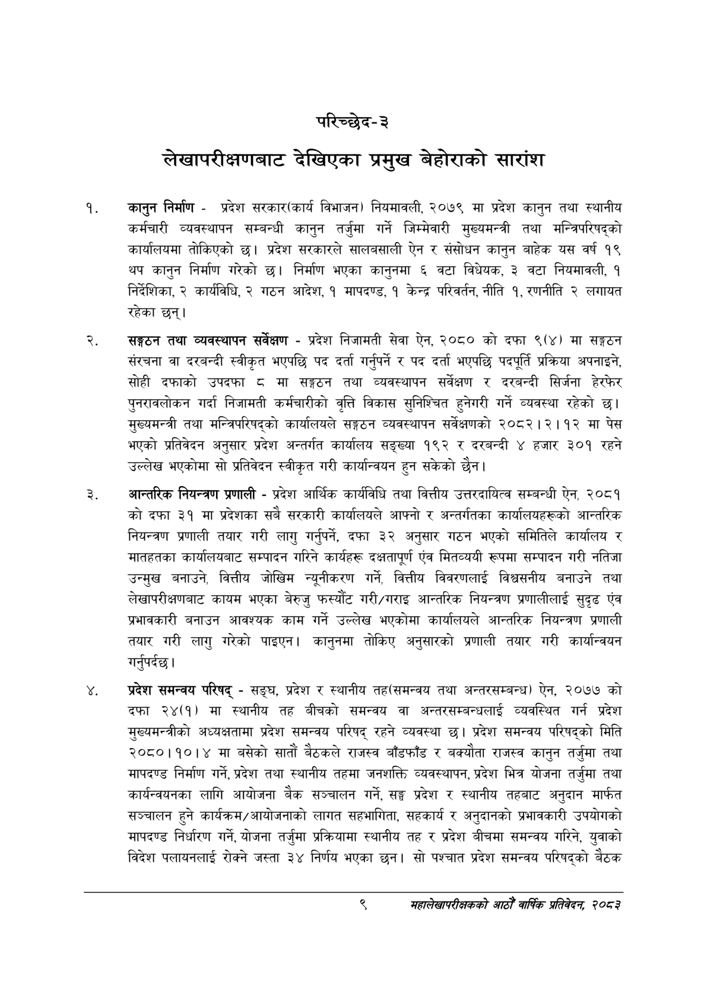

# Page 29 QA

## Rendered page


## Extracted text

```text
परिच्छेद-३
लेखापरीक्षणबाट देखिएका प्रमुख बेहोराको सारांश
कानुन निर्माण -प्रदेश सरकार(कार्य विभाजन) नियमावली, २०७९ मा प्रदेश कानुन तथा स्थानीय कर्मचारी व्यवस्थापन सम्बन्धी कानुन तर्जुमा गर्ने जिम्मेवारी मुख्यमन्त्री तथा मन्त्रिपरिषद्को कार्यालयमा तोकिएको छ। प्रदेश सरकारले सालबसाली ऐन र संसोधन कानुन बाहेक यस वर्ष १९ थप कानुन निर्माण गरेको छ। निर्माण भएका कानुनमा ६ वटा विधेयक, ३ वटा नियमावली, १ निर्देशिका, २ कार्यविधि, २ गठन आदेश, १ मापदण्ड, १ केन्द्र परिवर्तन, नीति १, रणनीति २ लगायत रहेका छन्‌।
सङ्गठन तथा व्यवस्थापन सर्वेक्षण -प्रदेश निजामती सेवा ऐन, २०८० को दफा ९(४) मा सङ्गठन संरचना वा दरबन्दी स्वीकृत भएपछि पद दर्ता गर्नुपर्ने र पद दर्ता भएपछि पदपूर्ति प्रक्रिया अपनाइने, सोही दफाको उपदफा ८ मा सङ्गठन तथा व्यवस्थापन सर्वेक्षण र दरबन्दी सिर्जना हेरफेर पुनरावलोकन गर्दा निजामती कर्मचारीको वृत्ति विकास सुनिश्चित हुनेगरी गर्ने व्यवस्था रहेको छ। मुख्यमन्त्री तथा मन्त्रिपरिषद्को कार्यालयले सङ्गठन व्यवस्थापन सर्वेक्षणको २०८२।२।१२ मा पेस भएको प्रतिवेदन अनुसार प्रदेश अन्तर्गत कार्यालय सङ्ख्या १९२ र दरबन्दी ४ हजार ३०१ रहने उल्लेख भएकोमा सो प्रतिवेदन स्वीकृत गरी कार्यान्वयन हुन सकेको छैन।
आन्तरिक नियन्त्रण प्रणाली -प्रदेश आर्थिक कार्यविधि तथा वित्तीय उत्तरदायित्व सम्बन्धी ऐन, २०८१ को दफा ३१ मा प्रदेशका सबै सरकारी कार्यालयले आफ्नो र अन्तर्गतका कार्यालयहरूको आन्तरिक नियन्त्रण प्रणाली तयार गरी लागु गर्नुपर्ने, दफा ३२ अनुसार गठन भएको समितिले कार्यालय र मातहतका कार्यालयबाट सम्पादन गरिने कार्यहरू दक्षतापूर्ण एंव मितव्ययी रूपमा सम्पादन गरी नतिजा उन्मुख बनाउने, वित्तीय जोखिम न्यूनीकरण गर्ने, वित्तीय विवरणलाई विश्वसनीय बनाउने तथा लेखापरीक्षणबाट कायम भएका बेरुजु फस्यौंट गरी/गराइ आन्तरिक नियन्त्रण प्रणालीलाई सुदृढ एंव प्रभावकारी बनाउन आवश्यक काम गर्ने उल्लेख भएकोमा कार्यालयले आन्तरिक नियन्त्रण प्रणाली तयार गरी लागु गरेको पाइएन। कानुनमा तोकिए अनुसारको प्रणाली तयार गरी कार्यान्वयन गर्नुपर्दछ |
प्रदेश समन्वय परिषद्‌ -सङ्घ, प्रदेश र स्थानीय तह(समन्वय तथा अन्तरसम्बन्ध) ऐन, २०७७ को दफा २४(१) मा स्थानीय तह बीचको समन्वय वा अन्तरसम्बन्धलाई व्यवस्थित गर्न प्रदेश मुख्यमन्त्रीको अध्यक्षतामा प्रदेश समन्वय परिषद्‌ रहने व्यवस्था छ। प्रदेश समन्वय परिषद्को मिति २०८०।१०।४ मा बसेको सातौं बैठकले राजस्व बाँडफाँड र बक्यौता राजस्व कानुन तर्जुमा तथा मापदण्ड निर्माण गर्ने, प्रदेश तथा स्थानीय तहमा जनशक्ति व्यवस्थापन, प्रदेश भित्र योजना तर्जुमा तथा कार्यन्वयनका लागि आयोजना बैक सञ्चालन गर्ने, सङ्घ प्रदेश र स्थानीय तहबाट अनुदान मार्फत सञ्चालन हुने कार्यक्रम/आयोजनाको लागत सहभागिता, सहकार्य र अनुदानको प्रभावकारी उपयोगको मापदण्ड निर्धारण गर्ने, योजना तर्जुमा प्रक्रियामा स्थानीय तह र प्रदेश बीचमा समन्वय गरिने, युवाको विदेश पलायनलाई रोक्ने जस्ता ३४ निर्णय भएका छन। सो पश्चात प्रदेश समन्वय परिषद्को बैठक
९
सहालेखापरीक्षकको आठौँ वाषिकि प्रतिवेदन २०८२
```

## Flags
- None
