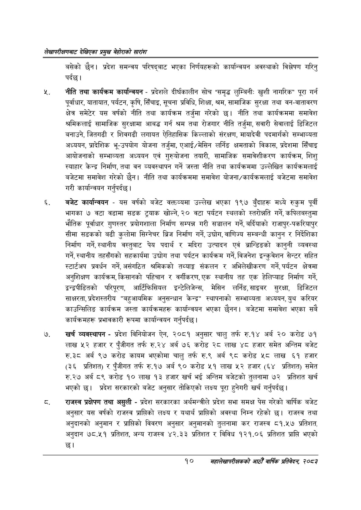

# Page 30 QA

## Rendered page


## Extracted text

```text
लेखापरीक्षणबाट देखिएका प्रमुख बेहोराको सारांश
बसेको छैन। प्रदेश समन्वय परिषद्बाट भएका निर्णयहरूको कार्यान्वयन अवस्थाको विश्लेषण गरिनु पर्दछ।
नीति तथा कार्यक्रम कार्यान्वयन -प्रदेशले दीर्घकालीन सोच "समृद्ध लुम्बिनी: खुशी नागरिक" पूरा गर्न पूर्वाधार, यातायात, पर्यटन, कृषि, सिँचाइ, सूचना प्रविधि, शिक्षा, श्रम, सामाजिक सुरक्षा तथा वन-वातावरण क्षेत्र समेटेर यस वर्षको नीति तथा कार्यक्रम तर्जुमा गरेको छ। नीति तथा कार्यक्रममा समावेश श्रमिकलाई सामाजिक सुरक्षामा आवद्ध गर्न श्रम तथा रोजगार नीति तर्जुमा, सवारी सेवालाई डिजिटल बनाउने, जितगढी र शिवगढी लगायत ऐतिहासिक किल्लाको संरक्षण, मायादेवी पदमार्गको सम्भाव्यता अध्ययन, प्रादेशिक भू-उपयोग योजना तर्जुमा, एआई/मेसिन लर्निङ क्षमताको विकास, प्रदेशमा सिँचाइ आयोजनाको सम्भाव्यता अध्ययन एवं गुरुयोजना तयारी, सामाजिक समावेशीकरण कार्यक्रम, शिशु स्याहार केन्द्र निर्माण, तथा वन व्यवस्थापन गर्ने जस्ता नीति तथा कार्यक्रममा उल्लेखित कार्यक्रमलाई बजेटमा समावेश गरेको छैन। नीति तथा कार्यक्रममा समावेश योजना/कार्यक्रमलाई बजेटमा समावेश गरी कार्यान्वयन |
गर्नुपर्दछ
बजेट कार्यान्वयन -यस वर्षको बजेट वक्तव्यमा उल्लेख भएका १९७ बुँदाहरू मध्ये रुकुम पूर्वी भागका ७ वटा वडामा सडक ट्र्याक खोल्ने, २० वटा पर्यटन स्थलको स्तरोन्नति गर्ने, कपिलबस्तुमा भौतिक पूर्वाधार गुणस्तर प्रयोगशाला निर्माण सम्पन्न गरी सञ्चालन गर्ने, बर्दियाको राजापुर-पकरियापुर सीमा सडकको बढी कुलोमा सिग्नेचर ब्रिज निर्माण गर्ने, उद्योग, वाणिज्य सम्बन्धी कानुन र निर्देशिका निर्माण गर्ने, स्थानीय वस्तुबाट पेय पदार्थ र मदिरा उत्पादन एवं ब्रान्डिङको कानुनी व्यवस्था गर्ने, स्थानीय तहसँगको सहकार्यमा उद्योग तथा पर्यटन कार्यक्रम गर्ने, विजनेश इन्कुवेशन सेन्टर सहित स्टार्टअप प्रवर्धन गर्ने, असंगठित श्रमिकको तथ्याङ्ग संकलन र अभिलेखीकरण गर्ने, पर्यटन क्षेत्रमा अनुशिक्षण कार्यक्रम, किसानको पहिचान र वर्गीकरण, एक स्थानीय तह एक हेलिप्याड निर्माण गर्ने, द्वन्द्वपीडितको परिपूरण, आर्टिफिसियल इन्टेलिजेन्स मेसिन लर्निङ,साइबर सुरक्षा डिजिटल साक्षरता, प्रदेशस्तरीय "बहुआयमिक अनुसन्धान केन्द्र" स्थापनाको सम्भाव्यता अध्ययन, युथ करियर काउन्सिलिङ कार्यक्रम जस्ता कार्यक्रमहरू कार्यान्वयन भएका छैनन। बजेटमा समावेश भएका सबै कार्यक्रमहरू प्रभावकारी रूपमा कार्यान्वयन गर्नुपर्दछ |
खर्च व्यवस्थापन -प्रदेश विनियोजन ऐन, २०८१ अनुसार चालु तर्फ रु.१४ अर्ब २० करोड ७१ लाख ५२ हजार र पुँजीगत तर्फ रु.२४ अर्ब ७६ करोड २८ लाख ४८ हजार समेत अन्तिम बजेट रु.३८ अर्ब ९७ करोड कायम भएकोमा चालु तर्फ रु.९ अर्ब ९८ करोड ५८ लाख ६१ हजार (३६ प्रतिशत) र पुँजीगत तर्फ रु.१७ अर्ब ९० करोड ५१ लाख ५२ हजार (६४ प्रतिशत) समेत रु.२७ अर्ब ८९ करोड १० लाख १३ हजार खर्च भई अन्तिम बजेटको तुलनामा ७२ प्रतिशत खर्च भएको छ। प्रदेश सरकारको बजेट अनुसार तोकिएको लक्ष्य पूरा हुनेगरी खर्च गर्नुपर्दछ |
राजस्व प्रक्षेपण तथा असुली -प्रदेश सरकारका अर्थमन्त्रीले प्रदेश सभा समक्ष पेस गरेको वार्षिक बजेट अनुसार यस वर्षको राजस्व प्राप्तिको लक्ष्य र यथार्थ प्राप्तिको अवस्था निम्न रहेको छ। राजस्व तथा अनुदानको अनुमान र प्राप्तिको विवरण अनुसार अनुमानको तुलनामा कर राजस्व ८१.५७ प्रतिशत, अनुदान ७८.५१ प्रतिशत, अन्य राजस्व ४२.३३ प्रतिशत र विविध १२१.०६ प्रतिशत प्राप्ति भएको
छ।
१०
महालेखापरीक्षकको आठौ वाषिकि प्रतिवेदन २०८२
```

## Flags
- None
