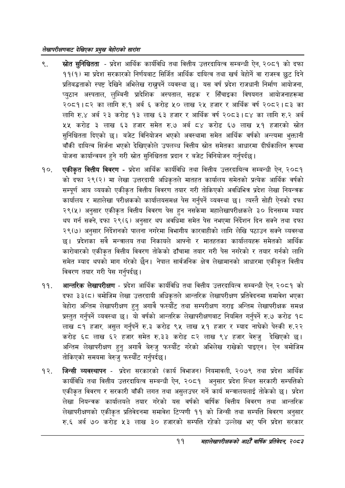

# Page 31 QA

## Rendered page


## Extracted text

```text
लेखापरीक्षणबाट देखिएका प्रमुख बेहोराको सारांश
स्रोत सुनिश्चितता -प्रदेश आर्थिक कार्यविधि तथा वित्तीय उत्तरदायित्व सम्बन्धी ऐन, २०८१ को दफा ११(१) मा प्रदेश सरकारको निर्णयबाट सिर्जित आर्थिक दायित्व तथा खर्च बेहोर्ने वा राजस्व छुट दिने प्रतिबद्धताको स्पष्ट देखिने अभिलेख राख्नुपर्ने व्यवस्था छ। यस वर्ष प्रदेश राजधानी निर्माण आयोजना, प्युठान अस्पताल, लुम्बिनी प्रादेशिक अस्पताल, सडक र सिँचाइका विषयगत आयोजनाहरूमा २०८१।८२ का लागि रु.१ अर्ब ६ करोड ५० लाख २५ हजार र आर्थिक वर्ष २०८२।८३ का लागि रु.४ अर्ब २३ करोड १३ लाख ६३ हजार र आर्थिक वर्ष २०८३।८४ का लागि रु.२ अर्ब ५५ करोड ३ लाख ६३ हजार समेत रु.७ अर्ब ८४ करोड ६७ लाख ५१ हजारको स्रोत सुनिश्चितता दिएको छ। बजेट विनियोजन भएको अवस्थामा समेत आर्थिक वर्षको अन्त्यमा भुक्तानी बाँकी दायित्व सिर्जना भएको देखिएकोले उपलब्ध वित्तीय स्रोत समेतका आधारमा दीर्घकालिन रूपमा योजना कार्यान्वयन हुने गरी स्रोत सुनिश्चितता प्रदान र बजेट विनियोजन गर्नुपर्दछ |
एकीकृत वित्तीय विवरण -प्रदेश आर्थिक कार्यविधि तथा वित्तीय उत्तरदायित्व सम्बन्धी ऐन, २०८१ को दफा २९(२) मा लेखा उत्तरदायी अधिकृतले मातहत कार्यालय समेतको प्रत्येक आर्थिक वर्षको सम्पूर्ण आय व्ययको एकीकृत वित्तीय विवरण तयार गरी तोकिएको अवधिभित्र प्रदेश लेखा नियन्त्रक कार्यालय र महालेखा परीक्षकको कार्यालयसमक्ष पेस गर्नुपर्ने व्यवस्था छ। त्यस्तै सोही ऐनको दफा २९(५) अनुसार एकीकृत वित्तीय विवरण पेस हुन नसकेमा महालेखापरीक्षकले ३० दिनसम्म म्याद थप गर्न सक्ने, दफा २९(६) अनुसार थप अवधिमा समेत पेस नभएमा निर्देशन दिन सक्ने तथा दफा २९(७) अनुसार निर्देशनको पालना नगरेमा विभागीय कारबाहीको लागि लेखि पठाउन सक्ने व्यवस्था छ। प्रदेशका सवै मन्त्रालय तथा निकायले आफ्नो र मातहतका कार्यालयहरू समेतको आर्थिक कारोबारको एकीकृत वित्तीय विवरण तोकेको ढाँचामा तयार गरी पेस नगरेको र तयार गर्नको लागि समेत म्याद थपको माग गरेको छैन। नेपाल सार्वजनिक क्षेत्र लेखामानको आधारमा एकीकृत वित्तीय विवरण तयार गरी पेस गर्नुपर्दछु।
आन्तरिक लेखापरीक्षण -प्रदेश आर्थिक कार्यविधि तथा वित्तीय उत्तरदायित्व सम्बन्धी ऐन, २०८१ को दफा ३३(८) बमोजिम लेखा उत्तरदायी अधिकृतले आन्तरिक लेखापरीक्षण प्रतिवेदनमा समावेश भएका बेहोरा अन्तिम लेखापरीक्षण हुनु अगावै फस्यौट तथा सम्परीक्षण गराइ अन्तिम लेखापरीक्षक समक्ष प्रस्तुत गर्नुपर्ने व्यवस्था | यो वर्षको आन्तरिक लेखापरीक्षणबाट नियमित गर्नुपर्ने €० करोड १८ लाख ८१ हजार, असुल गर्नुपर्ने रु.३ करोड ९५ लाख ५१ हजार र म्याद नाघेको पेस्की रु.२२ करोड ६८ लाख ६२ हजार समेत रु.३३ करोड ८२ लाख ९४ हजार बेरुजु देखिएको छ। अन्तिम लेखापरीक्षण हुनु अगावै बेरुजु फस्यौट गरेको अभिलेख राखेको पाइएन। ऐन बमोजिम तोकिएको समयमा बेरुजु फस्यौंट गर्नुपर्दछ।
जिन्सी व्यवस्थापन -प्रदेश सरकारको (कार्य विभाजन) नियमावली, २०७९ तथा प्रदेश आर्थिक कार्यविधि तथा वित्तीय उत्तरदायित्व सम्बन्धी ऐन, २०८१ अनुसार प्रदेश स्थित सरकारी सम्पत्तिको एकीकृत विवरण र सरकारी बाँकी लगत तथा असुलउपर गर्ने कार्य मन्त्रालयलाई तोकेको छ। प्रदेश लेखा नियन्त्रक कार्यालयले तयार गरेको यस वर्षको वार्षिक वित्तीय विवरण तथा आन्तरिक लेखापरीक्षणको एकीकृत प्रतिवेदनमा समावेश टिप्पणी ११ को जिन्सी तथा सम्पत्ति विवरण अनुसार रु.६ अर्ब ७० करोड ५३ लाख ३० हजारको सम्पत्ति रहेको उल्लेख भए पनि प्रदेश सरकार
११ महालेखापरीक्षकको आठौ वाषिकि प्रतिवेदन २०८२
```

## Flags
- None
