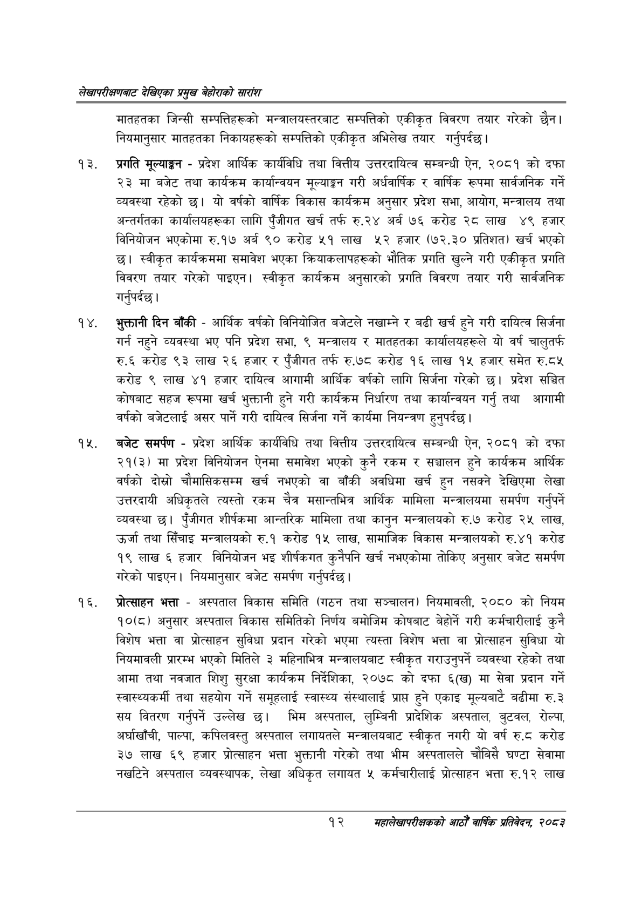

# Page 32 QA

## Rendered page


## Extracted text

```text
लेखापरीक्षणबाट देखिएका प्रमुख बेहोराको सारांश
मातहतका जिन्सी सम्पत्तिहरूको मन्त्रालयस्तरबाट सम्पत्तिको एकीकृत विवरण तयार गरेको छैन। नियमानुसार मातहतका निकायहरूको सम्पत्तिको एकीकृत अभिलेख तयार गर्नुपर्दछ।
प्रगति मूल्याङ्कन -प्रदेश आर्थिक कार्यविधि तथा वित्तीय उत्तरदायित्व सम्बन्धी ऐन, २०८१ को दफा २३ मा बजेट तथा कार्यक्रम कार्यान्वयन मूल्याङ्कन गरी अर्धवार्षिक र वार्षिक रूपमा सार्वजनिक गर्ने व्यवस्था रहेको छ। यो वर्षको वार्षिक विकास कार्यक्रम अनुसार प्रदेश सभा, आयोग, मन्त्रालय तथा अन्तर्गतका कार्यालयहरूका लागि पुँजीगत खर्च तर्फ रु.२४ अर्ब ७६ करोड २८ लाख ४९ हजार विनियोजन भएकोमा रु.१७ अर्ब ९० करोड «५१ लाख हजार (७२.३० प्रतिशत) खर्च भएको | स्वीकृत कार्यक्रममा समावेश भएका क्रियाकलापहरूको भौतिक प्रगति खुल्ने गरी एकीकृत प्रगति विवरण तयार गरेको पाइएन। स्वीकृत कार्यक्रम अनुसारको प्रगति विवरण तयार गरी सार्वजनिक गर्नुपर्दछ |
भुक्तानी दिन बाँकी -आर्थिक वर्षको विनियोजित बजेटले नखाम्ने र बढी खर्च हुने गरी दायित्व सिर्जना गर्न नहुने व्यवस्था भए पनि प्रदेश सभा, ९ मन्त्रालय र मातहतका कार्यालयहरूले यो वर्ष चालुतर्फ रु.६ करोड ९३ लाख २६ हजार र पुँजीगत तर्फ रु.७८ करोड १६ लाख १५ हजार समेत रु.८५ करोड ९ लाख ४१ हजार दायित्व आगामी आर्थिक वर्षको लागि सिर्जना गरेको छ। प्रदेश सञ्चित कोषबाट सहज रूपमा खर्च भुक्तानी हुने गरी कार्यक्रम निर्धारण तथा कार्यान्वयन गर्नु तथा आगामी वर्षको बजेटलाई असर पार्ने गरी दायित्व सिर्जना गर्ने कार्यमा नियन्त्रण हुनुपर्दछ |
बजेट समर्पण -प्रदेश आर्थिक कार्यविधि तथा वित्तीय उत्तरदायित्व सम्बन्धी ऐन, २०८१ को दफा २१(३) मा प्रदेश विनियोजन ऐनमा समावेश भएको कुनै रकम र सञ्चालन हुने कार्यक्रम आर्थिक वर्षको दोस्रो चौमासिकसम्म खर्च नभएको वा बाँकी अवधिमा खर्च हुन नसक्ने देखिएमा लेखा उत्तरदायी अधिकृतले त्यस्तो रकम चैत्र मसान्तभित्र आर्थिक मामिला मन्त्रालयमा समर्पण गर्नुपर्ने व्यवस्था छ। पुँजीगत शीर्षकमा आन्तरिक मामिला तथा कानुन मन्त्रालयको रु.७ करोड २५ लाख, उर्जा तथा सिँचाइ मन्त्रालयको रु.१ करोड १५ लाख, सामाजिक विकास मन्त्रालयको रु.४१ करोड १९ लाख ६ हजार विनियोजन भइ शीर्षकगत कुनैपनि खर्च नभएकोमा तोकिए अनुसार बजेट समर्पण गरेको पाइएन। नियमानुसार बजेट समर्पण गर्नुपर्दछ।
प्रोत्साहन भत्ता -अस्पताल विकास समिति (गठन तथा सञ्चालन) नियमावली, २०८० को नियम १०६८) अनुसार अस्पताल विकास समितिको निर्णय बमोजिम कोषबाट बेहोर्ने गरी कर्मचारीलाई कुनै विशेष भत्ता वा प्रोत्साहन सुविधा प्रदान गरेको भएमा त्यस्ता विशेष भत्ता वा प्रोत्साहन सुविधा यो नियमावली प्रारम्भ भएको मितिले ३ महिनाभित्र मन्त्रालयबाट स्वीकृत गराउनुपर्ने व्यवस्था रहेको तथा आमा तथा नवजात शिशु सुरक्षा कार्यक्रम निर्देशिका, २०७८ को दफा ६(ख) मा सेवा प्रदान गर्ने स्वास्थ्यकर्मी तथा सहयोग गर्ने समूहलाई स्वास्थ्य संस्थालाई प्राप्त हुने एकाइ मूल्यबाटै बढीमा रु.३ सय वितरण गर्नुपर्ने उल्लेख छ। भिम अस्पताल, लुम्बिनी प्रादेशिक अस्पताल, बुटवल, रोल्पा, अर्घाखाँची, पाल्पा, कपिलवस्तु अस्पताल लगायतले मन्त्रालयबाट स्वीकृत नगरी यो वर्ष रु.८ करोड ३७ लाख ६९ हजार प्रोत्साहन भत्ता भुक्तानी गरेको तथा भीम अस्पतालले चौबिसै घण्टा सेवामा नखटिने अस्पताल व्यवस्थापक, लेखा अधिकृत लगायत ५ कर्मचारीलाई प्रोत्साहन भत्ता रु.१२ लाख
१२
महालेखापरीक्षकको आठौ वाषिकि प्रतिवेदन २०८२
```

## Flags
- None
