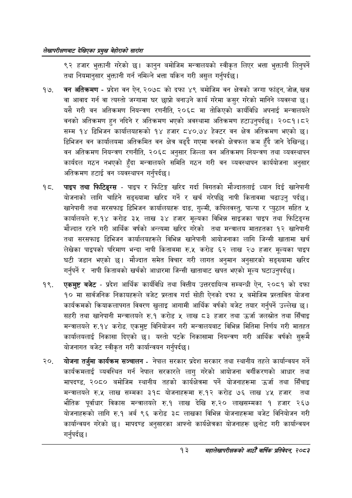

# Page 33 QA

## Rendered page


## Extracted text

```text
लेखापरीक्षणबाट देखिएका प्रमुख बेहोराको सारांश
९२ हजार भुक्तानी गरेको छ। कानुन बमोजिम मन्त्रालयको स्वीकृत लिएर भत्ता भुक्तानी लिनुपर्ने तथा नियमानुसार भुक्तानी गर्न नमिल्ने भत्ता यकिन गरी असुल गर्नुपर्दछ |
वन अतिक्रमण -प्रदेश वन ऐन, २०७८ को दफा ४९ बमोजिम वन क्षेत्रको जग्गा फांड्न, जोलन, खन्न वा आवाद गर्न वा त्यस्तो जग्गामा घर छाप्रो बनाउने कार्य गरेमा कसुर गरेको मानिने व्यवस्था | यसै गरी वन अतिक्रमण नियन्त्रण रणनीति, २०६८ मा तोकिएको कार्यविधि अपनाई मन्त्रालयले वनको अतिक्रमण हुन नदिने र अतिक्रमण भएको अवस्थामा अतिक्रमण हटाउनुपर्दछ। २०८१।८२ सम्म १४ डिभिजन कार्यालयहरूको १४ हजार ८४०.७४ हेक्टर वन क्षेत्र अतिक्रमण भएको छ। डिभिजन वन कार्यालयमा अतिक्रमित वन क्षेत्र बढ्दै गएमा वनको क्षेत्रफल कम हुँदै जाने देखिन्छ। वन अतिक्रमण नियन्त्रण रणनीति, २०६८ अनुसार जिल्ला वन अतिक्रमण नियन्त्रण तथा व्यवस्थापन कार्यदल गठन नभएको हुँदा मन्त्रालयले समिति गठन गरी वन व्यवस्थापन कार्ययोजना अनुसार अतिक्रमण हटाई वन व्यवस्थापन गर्नुपर्दछ |
पाइप तथा फिटिङ्ग्स -पाइप र फिटिङ्ग खरिद गर्दा विगतको मौज्दातलाई ध्यान दिई खानेपानी योजनाको लागि चाहिने सङ्ख्यामा खरिद गर्ने र खर्च गरेपछि नापी कितावमा चढाउनु पर्दछ। खानेपानी तथा सरसफाइ डिभिजन कार्यालयहरू दाङ, गुल्मी, कपिलवस्तु, पाल्पा र प्युठान सहित ५ कार्यालयले रु.१४ करोड ३५ लाख ३४ हजार मूल्यका विभिन्न साइजका पाइप तथा फिटिङ्ग्स मौज्दात रहने गरी आर्थिक वर्षको अन्त्यमा खरिद गरेको तथा मन्त्रालय मातहतका १२ खानेपानी तथा सरसफाइ डिभिजन कार्यालयहरूले विभिन्न खानेपानी आयोजनाका लागि जिन्सी खातामा खर्च लेखेका पाइपको परिमाण भन्दा नापी किताबमा रु.५ करोड ६२ लाख २७ हजार मूल्यका पाइप घटी जडान भएको छ। मौज्दात समेत विचार गरी लागत अनुमान अनुसारको सङ्ख्यामा खरिद गर्नुपर्ने र नापी किताबको खर्चको आधारमा जिन्सी खाताबाट खपत भएको मूल्य घटाउनुपर्दछ।
एकमुष्ट बजेट -प्रदेश आर्थिक कार्यविधि तथा वित्तीय उत्तरदायित्व सम्बन्धी ऐन, २०८१ को दफा १० मा सार्वजनिक निकायहरूले बजेट प्रस्ताव गर्दा सोही ऐनको दफा ५ बमोजिम प्रस्तावित योजना कार्यक्रमको क्रियाकलापगत विवरण खुलाइ आगामी आर्थिक वर्षको बजेट तयार गर्नुपर्ने उल्लेख | सहरी तथा खानेपानी मन्त्रालयले रु.१ करोड लाख ८३ हजार तथा उर्जा जलस्रोत तथा सिँचाइ मन्त्रालयले रु.१४ करोड, एकमुष्ट विनियोजन गरी मन्त्रालयबाट विभिन्न मितिमा निर्णय गरी मातहत कार्यालयलाई निकासा दिएको छ। यस्तो पटके निकासामा नियन्त्रण गरी आर्थिक वर्षको सुरूमै योजनागत बजेट स्वीकृत गरी कार्यान्वयन गर्नुपर्दछ |
योजना तर्जुमा कार्यक्रम सञ्चालन -नेपाल सरकार प्रदेश सरकार तथा स्थानीय तहले कार्यान्वयन गर्ने कार्यक्रमलाई व्यवस्थित गर्न नेपाल सरकारले लागु गरेको आयोजना वर्गीकरणको आधार तथा मापदण्ड, २०८० बमोजिम स्थानीय तहको कार्यक्षेत्रमा पर्ने योजनाहरूमा उर्जा तथा सिँचाइ मन्त्रालयले रु.५ लाख सम्मका ३१८ योजनाहरूमा रु.१२ करोड ७६ लाख ४५ हजार तथा भौतिक पूर्वाधार विकास मन्त्रालयले रु.१ लाख देखि रु.२० लाखसम्मका १ हजार २६७ योजनाहरूको लागि रु.१ अर्ब ९६ करोड ३८ लाखका विभिन्न योजनाहरूमा बजेट विनियोजन गरी कार्यान्वयन गरेको छ। मापदण्ड अनुसारका आफ्नो कार्यक्षेत्रका योजनाहरू छनोट गरी कार्यान्वयन गर्नुपर्दछ |
१३
महालेखापरीक्षकको आठौ वाषिकि प्रतिवेदन २०८२
```

## Flags
- None
