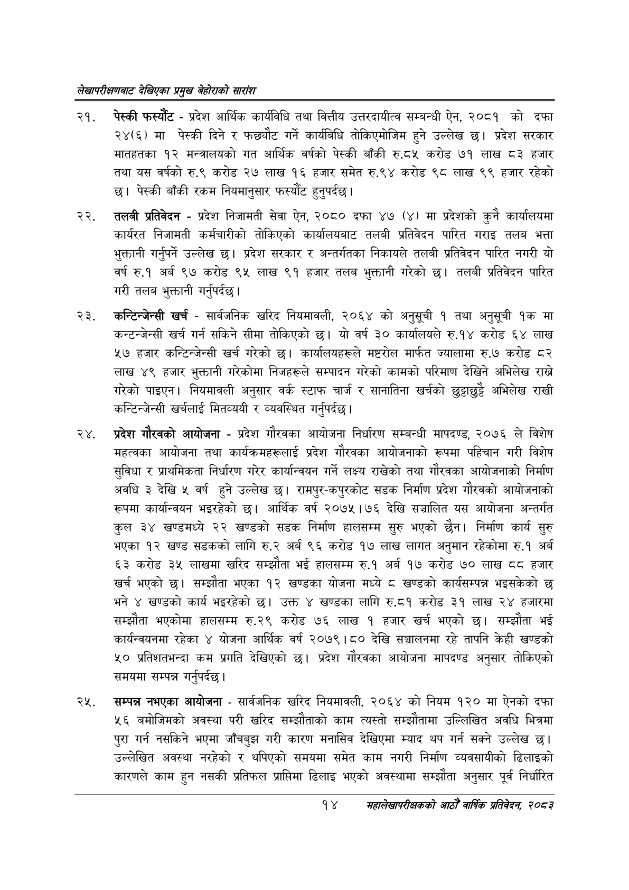

# Page 34 QA

## Rendered page


## Extracted text

```text
लेखापरीक्षणबाट देखिएका प्रमुख बेहोराको सारांश
पेस्की फस्यौट -प्रदेश आर्थिक कार्यविधि तथा वित्तीय उत्तरदायीत्व सम्बन्धी ऐन, २०८१ को दफा २४(६) मा पेस्की दिने र फछ्यौट गर्ने कार्यबिधि तोकिएमोजिम हुने उल्लेख छ। प्रदेश सरकार मातहतका १२ मन्त्रालयको गत आर्थिक वर्षको पेस्की बाँकी रु.द८५ करोड ७१ लाख ८३ हजार तथा यस वर्षको रु.९ करोड २७ लाख १६ हजार समेत रु.९४ करोड ९८ लाख ९९ हजार रहेको छ। पेस्की बाँकी रकम नियमानुसार फस्यौंट हुनुपर्दछ |
तलबी प्रतिवेदन -प्रदेश निजामती सेवा ऐन, २०८० दफा ४७ (४) मा प्रदेशको कुनै कार्यालयमा कार्यरत निजामती कर्मचारीको तोकिएको कार्यालयबाट तलबी प्रतिवेदन पारित गराइ तलब भत्ता भुक्तानी गर्नुपर्ने उल्लेख | प्रदेश सरकार र अन्तर्गतका निकायले तलबी प्रतिवेदन पारित नगरी यो वर्ष रु.१ अर्ब ९७ करोड ९५ लाख ९१ हजार तलब भुक्तानी गरेको छ। तलबी प्रतिवेदन पारित गरी तलब भुक्तानी गर्नुपर्दछ |
कन्टिन्जेन्सी खर्च -सार्वजनिक खरिद नियमावली, २०६४ को अनुसूची १ तथा अनुसूची १क मा कन्टन्जेन्सी खर्च गर्न सकिने सीमा तोकिएको छ। यो वर्ष ३० कार्यालयले रु.१४ करोड ६४ लाख ५७ हजार कन्टिन्जेन्सी खर्च गरेको छ। कार्यालयहरूले मष्टरोल मार्फत ज्यालामा रु.७ करोड ८२ लाख ४९ हजार भुक्तानी गरेकोमा निजहरूले सम्पादन गरेको कामको परिमाण देखिने अभिलेख राखे गरेको पाइएन। नियमावली अनुसार वर्क स्टाफ चार्ज र सानातिना खर्चको छुट्टाछुट्टै अभिलेख राखी कन्टिन्जेन्सी खर्चलाई मितव्ययी र व्यवस्थित गर्नुपर्दछ |
प्रदेश गौरवको आयोजना -प्रदेश गौरवका आयोजना निर्धारण सम्बन्धी मापदण्ड, २०७६ ले विशेष महत्वका आयोजना तथा कार्यक्रमहरूलाई प्रदेश गौरवका आयोजनाको रूपमा पहिचान गरी विशेष सुविधा र प्राथमिकता निर्धारण गरेर कार्यान्वयन गर्ने लक्ष्य राखेको तथा गौरवका आयोजनाको निर्माण अवधि ३ देखि ५ वर्ष हुने उल्लेख छ। रामपुर-कपुरकोट सडक निर्माण प्रदेश गौरवको आयोजनाको रूपमा कार्यान्वयन भइरहेको छ। आर्थिक वर्ष २०७५।७६ देखि सञ्चालित यस आयोजना अन्तर्गत कुल ३४ खण्डमध्ये २२ खण्डको सडक निर्माण हालसम्म सुरु भएको छैन। निर्माण कार्य सुरु भएका १२ खण्ड सडकको लागि रु.२ अर्ब ९६ करोड १७ लाख लागत अनुमान रहेकोमा रु.१ अर्ब ६३ करोड ३५ लाखमा खरिद सम्झौता भई हालसम्म रु.१ अर्ब १७ करोड ७० लाख हजार खर्च भएको छ। सम्झौता भएका १२ खण्डका योजना मध्ये ८ खण्डको कार्यसम्पन्न भइसकेको छ भने ४ खण्डको कार्य भइरहेको छ। उक्त ४ खण्डका लागि रु.द१ करोड ३९ लाख २४ हजारमा सम्झौता भएकोमा हालसम्म रु.२९ करोड ७६ लाख १ हजार खर्च भएको छ। सम्झौता भई कार्यन्वयनमा रहेका ४ योजना आर्थिक वर्ष २०७९।८० देखि सञ्चालनमा रहे तापनि केही खण्डको ५० प्रतिशतभन्दा कम प्रगति देखिएको छ। प्रदेश गौरवका आयोजना मापदण्ड अनुसार तोकिएको समयमा सम्पन्न गर्नुपर्दछ |
सम्पन्न नभएका आयोजना -सार्वजनिक खरिद नियमावली, २०६४ को नियम १२० मा ऐनको दफा ५६ बमोजिमको अवस्था परी खरिद सम्झौताको काम त्यस्तो सम्झौतामा उल्लिखित अवधि भित्रमा पुरा गर्न नसकिने भएमा जाँचबुझ गरी कारण मनासिव देखिएमा म्याद थप गर्न सक्ने उल्लेख छ। उल्लेखित अवस्था नरहेको र थपिएको समयमा समेत काम नगरी निर्माण व्यवसायीको ढिलाइको कारणले काम हुन नसकी प्रतिफल प्राप्तिमा ढिलाइ भएको अवस्थामा सम्झौता अनुसार पूर्व निर्धारित
१४
महालेखापरीक्षकको आठौ वाषिकि प्रतिवेदन २०८२
```

## Flags
- None
