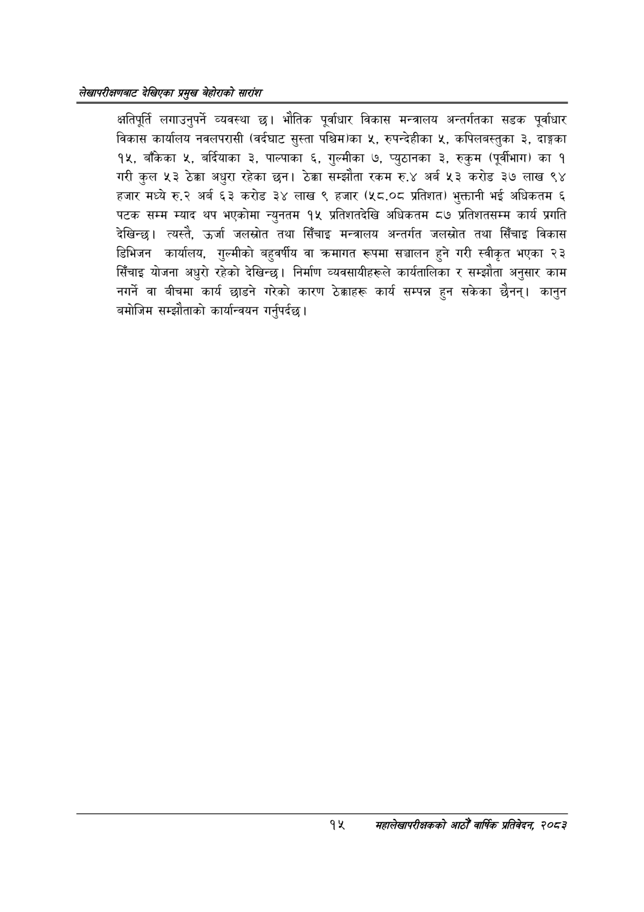

# Page 35 QA

## Rendered page


## Extracted text

```text
लेखापरीक्षणबाट देखिएका प्रमुख बेहोराको सारांश
क्षतिपूर्ति लगाउनुपर्ने व्यवस्था छ। भौतिक पूर्वाधार विकास मन्त्रालय अन्तर्गतका सडक पूर्वाधार विकास कार्यालय नवलपरासी (वर्दघाट सुस्ता पश्चिमका ५, रुपन्देहीका ५, कपिलबस्तुका ३, दाङ्गका १५, बाँकेका ५, बर्दियाका ३, पाल्पाका ६, गुल्मीका ७, प्युठानका ३, रुकुम (पूर्वीभाग) का १ गरी कुल ५३ ठेक्का अधुरा रहेका छन। ठेक्का सम्झौता रकम रु.४ अर्ब ५३ करोड ३७ लाख ९४ हजार मध्ये रु.२ अर्ब €३ करोड ३४ लाख ९ हजार (५८.०८ प्रतिशत) भुक्तानी भई अधिकतम ६ पटक सम्म म्याद थप भएकोमा न्युनतम १५ प्रतिशतदेखि अधिकतम ८७ प्रतिशतसम्म कार्य प्रगति देखिन्छु। त्यस्तै, उर्जा जलस्रोत तथा सिँचाइ मन्त्रालय अन्तर्गत जलस्रोत तथा सिँचाइ विकास डिभिजन कार्यालय, गुल्मीको बहुवर्षीय वा क्रमागत रूपमा सञ्चालन हुने गरी स्वीकृत भएका २३ सिँचाइ योजना अधुरो रहेको देखिन्छ। निर्माण व्यवसायीहरूले कार्यतालिका र सम्झौता अनुसार काम नगर्ने वा बीचमा कार्य छाडने गरेको कारण ठेक्काहरू कार्य सम्पन्न हुन सकेका छैनन्‌। कानुन बमोजिम सम्झौताको कार्यान्वयन गर्नुपर्दछ |
१५ महालेखापरीक्षकको आठौ वाषिकि प्रतिवेदन २०८२
```

## Flags
- None
