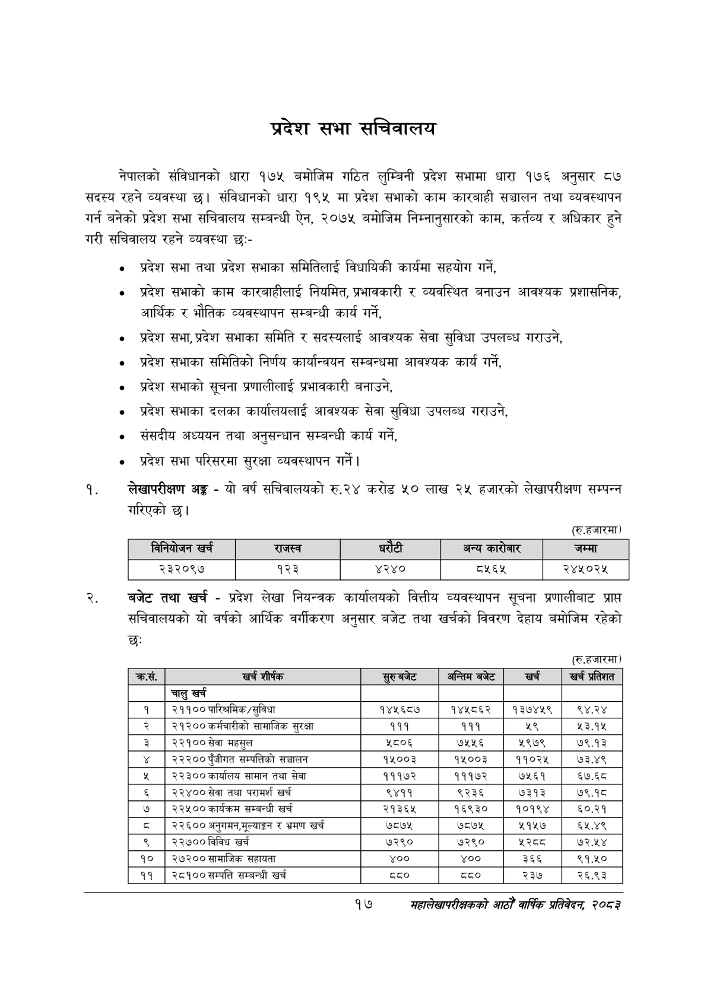

# Page 39 QA

## Rendered page


## Extracted text

```text
प्रदेश सभा सचिवालय
नेपालको संविधानको धारा १७५ बमोजिम गठित लुम्बिनी प्रदेश सभामा धारा १७६ अनुसार ८७ सदस्य रहने व्यवस्था छ। संविधानको धारा १९५ मा प्रदेश सभाको काम कारबाही सञ्चालन तथा व्यवस्थापन गर्न बनेको प्रदेश सभा सचिवालय सम्बन्धी ऐन, २०७५ बमोजिम निम्नानुसारको काम, कर्तव्य र अधिकार हुने गरी सचिवालय रहने व्यवस्था छ:-
प्रदेश सभा तथा प्रदेश सभाका समितिलाई विधायिकी कार्यमा सहयोग गर्ने,
० प्रदेश सभाको काम कारबाहीलाई नियमित, प्रभावकारी र व्यवस्थित बनाउन आवश्यक प्रशासनिक, आर्थिक र भौतिक व्यवस्थापन सम्बन्धी कार्य गर्ने,
० प्रदेश सभा, प्रदेश सभाका समिति र सदस्यलाई आवश्यक सेवा सुविधा उपलब्ध गराउने,
० प्रदेश सभाका समितिको निर्णय कार्यान्वयन सम्बन्धमा आवश्यक कार्य गर्ने,
प्रदेश सभाको सूचना प्रणालीलाई प्रभावकारी बनाउने,
० प्रदेश सभाका दलका कार्यालयलाई आवश्यक सेवा सुविधा उपलब्ध गराउने,
संसदीय अध्ययन तथा अनुसन्धान सम्बन्धी कार्य गर्ने,
प्रदेश सभा परिसरमा सुरक्षा व्यवस्थापन गर्ने |
लेखापरीक्षण अङ्ग -यो वर्ष सचिवालयको रु.२४ करोड ५० लाख २५ हजारको लेखापरीक्षण सम्पन्न गरिएको छ।
(रु.हजारमा)
बजेट तथा खर्च -प्रदेश लेखा नियन्त्रक कार्यालयको वित्तीय व्यवस्थापन सूचना प्रणालीबाट प्राप्त सचिवालयको यो वर्षको आर्थिक वर्गीकरण अनुसार बजेट तथा खर्चको विवरण देहाय बमोजिम रहेको छः
(रु.हजारमा)
१७
सहालेखापरीक्षकको आठौँ वाषिकि प्रतिवेदन २०८२

|  | ननिवोजन खच |  | राजस्व |  |  | अन्य कारोबार | जम्मा |
| --- | --- | --- | --- | --- | --- | --- | --- |
|  | २३२०९७ |  | १२३ | ४२४० |  | १६५ | २४५०२५ |

| कस. | खर्च शीर्षक | छुट बजट | अन्तिम बजेट | खर्च | खर्च प्रतिशत |
| --- | --- | --- | --- | --- | --- |
|  | चालु खर्च |  |  |  |  |
| १ | २११००पारित्रमिक/सुविधा | १४५६८७ | १४५८६२ | १३७४५९ | ९४.२४ |
| २ | २१२०० कर्मचारीको सामाजिक सुरक्षा | १११ | १११ | २९ | %३९४ |
| ३ | २३९०० सेवा महसुल | १८०६ | ७५५६ | २९७९ | ७९.१३ |
| ४ | २२२०० पुँजीगत सम्पतिको सञ्चालन | १५००३ | १५००३ | ११०२५ | ७३.४९ |
| ५ | २२३००कार्बालष सामान तथा सेवा | १११७२ | १११७२ | ७५६१ | ६७.६८ |
| ६ | २२४०० सेवा तथा परामर्श खर्च | ९४११ | ९२३६ | ७३१३ | ७९.१८ |
| ७ | २२५००कार्वक्रम सम्बन्धी खर्च | २१३६४५ | १६९३० | १०१९४ | ५०.२१ |
| ३ | '२२६०० अनुगमन,मूल्याङ्कगन भ्रमण खर्च | ७८७५ | ७८७५ | २१५७ | ६२५.४९ |
| ९ | २२७००विविध खर्च | ७२९० | ७२९० | ४३५८ | ७२.१४ |
| १० | २७२०० कामाजिक सहायता | ४०० | ४०० | ३६६ | ९१.५० |
| ११ | २८१०० सम्पत्ति सम्बन्धी खर्च | ८० |  | २३७ | २६.९३ |
```

## Flags
- table_page
- medium_quality_table
