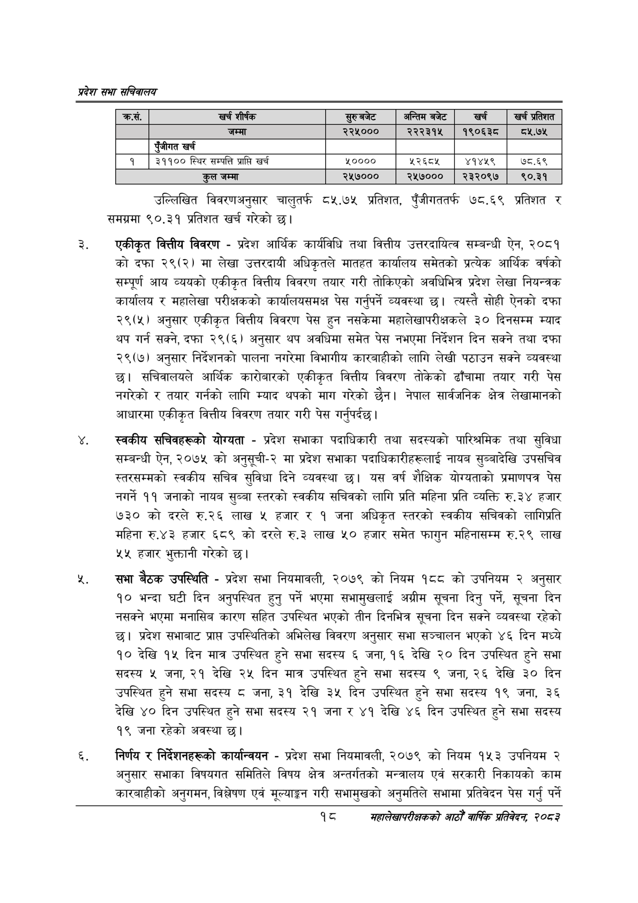

# Page 40 QA

## Rendered page


## Extracted text

```text
प्रदेश सभा सचिवालय
उल्लिखित विवरणअनुसार चालुतर्फ ८५.७५ प्रतिशत, पुँजीगततर्फ ७८.६९ प्रतिशत र समग्रमा ९०.३१ प्रतिशत खर्च गरेको छ।
एकीकृत वित्तीय विवरण -प्रदेश आर्थिक कार्यविधि तथा वित्तीय उत्तरदायित्व सम्बन्धी ऐन, २०८१ को दफा २९(२) मा लेखा उत्तरदायी अधिकृतले मातहत कार्यालय समेतको प्रत्येक आर्थिक वर्षको सम्पूर्ण आय व्ययको एकीकृत वित्तीय विवरण तयार गरी तोकिएको अवधिभित्र प्रदेश लेखा नियन्त्रक कार्यालय र महालेखा परीक्षकको कार्यालयसमक्ष पेस गर्नुपर्ने व्यवस्था | त्यस्तै सोही ऐनको दफा २९(५) अनुसार एकीकृत वित्तीय विवरण पेस हुन नसकेमा महालेखापरीक्षकले ३० दिनसम्म म्याद थप गर्न सक्ने, दफा २९(६) अनुसार थप अवधिमा समेत पेस नभएमा निर्देशन दिन सक्ने तथा दफा २९(७) अनुसार निर्देशनको पालना नगरेमा विभागीय कारबाहीको लागि लेखी पठाउन सक्ने व्यवस्था छ। सचिवालयले आर्थिक कारोबारको एकीकृत वित्तीय विवरण तोकेको ढाँचामा तयार गरी पेस नगरेको र तयार गर्नको लागि म्याद थपको माग गरेको छैन। नेपाल सार्वजनिक क्षेत्र लेखामानको आधारमा एकीकृत वित्तीय विवरण तयार गरी पेस गर्नुपर्दछ।
स्वकीय सचिवहरूको योग्यता -प्रदेश सभाका पदाधिकारी तथा सदस्यको पारिश्रमिक तथा सुविधा सम्बन्धी ऐन, २०७५ को अनुस्ची-२ मा प्रदेश सभाका पदाधिकारीहरूलाई नायब सुब्बादेखि उपसचिव स्तरसम्मको स्वकीय सचिव सुविधा दिने व्यवस्था छ। यस वर्ष शैक्षिक योग्यताको प्रमाणपत्र पेस नगर्ने ११ जनाको नायब सुब्बा स्तरको स्वकीय सचिवको लागि प्रति महिना प्रति व्यक्ति रु.३४ हजार ७३० को दरले लाख ५ हजार र १ जना अधिकृत स्तरको स्वकीय सचिवको लागिप्रति महिना रु.४३ हजार ६८९ को दरले रु.३ लाख ५० हजार समेत फागुन महिनासम्म रु.२९ लाख ५५ हजार भुक्तानी गरेको छ।
सभा बैठक उपस्थिति -प्रदेश सभा नियमावली, २०७९ को नियम १८८ को उपनियम २ अनुसार १० भन्दा घटी दिन अनुपस्थित हुनु पर्ने भएमा सभामुखलाई अग्रीम सूचना दिनु पर्ने, सूचना दिन नसक्ने भएमा मनासिब कारण सहित उपस्थित भएको तीन दिनभित्र सूचना दिन सक्ने व्यवस्था रहेको छ। प्रदेश सभाबाट प्राप्त उपस्थितिको अभिलेख विवरण अनुसार सभा सञ्चालन भएको ४६ दिन मध्ये १० देखि १५ दिन मात्र उपस्थित हुने सभा सदस्य ६ जना, १६ देखि २० दिन उपस्थित हुने सभा सदस्य ५ जना, २१ देखि २५ दिन मात्र उपस्थित हुने सभा सदस्य ९ जना, २६ देखि ३० दिन उपस्थित हुने सभा सदस्य ८ जना, ३१ देखि ३५ दिन उपस्थित हुने सभा सदस्य १९ जना, ३६ देखि ४० दिन उपस्थित हुने सभा सदस्य २१ जना र ४१ देखि ४६ दिन उपस्थित हुने सभा सदस्य १९ जना रहेको अवस्था |
निर्णय र निर्देशनहरूको कार्यान्वयन -प्रदेश सभा नियमावली, २०७९ को नियम १५३ उपनियम २ अनुसार सभाका विषयगत समितिले विषय क्षेत्र अन्तर्गतको मन्त्रालय एवं सरकारी निकायको काम कारबाहीको अनुगमन, विश्लेषण एवं मूल्याङ्गन गरी सभामुखको अनुमतिले सभामा प्रतिवेदन पेस गर्नु पर्ने
१८
सहालेखापरीक्षकको आठौँ वाषिकि प्रतिवेदन २०८२

| कस. |  | खर्च शीर्षक | चुए बजेट | अन्तिम बजेट | खर्च | खर्च प्रतिशत |
| --- | --- | --- | --- | --- | --- | --- |
|  |  |  |  |  |  |  |
|  |  |  | क्र २२१२ | स्२२:१६४ | ० |  |
|  |  | एंजीगत खर्च |  |  |  |  |
| १ |  | ३११०० स्थिर सम्पत्ति प्राप्ति खर्च | १०००० | ५२६८४५ | ४१४५९ | ७८.६९ |
|  |  | कुल जम्मा | २५७००० | २५७००० | २३२०९७ | १९०.३१ |
```

## Flags
- table_page
- medium_quality_table
