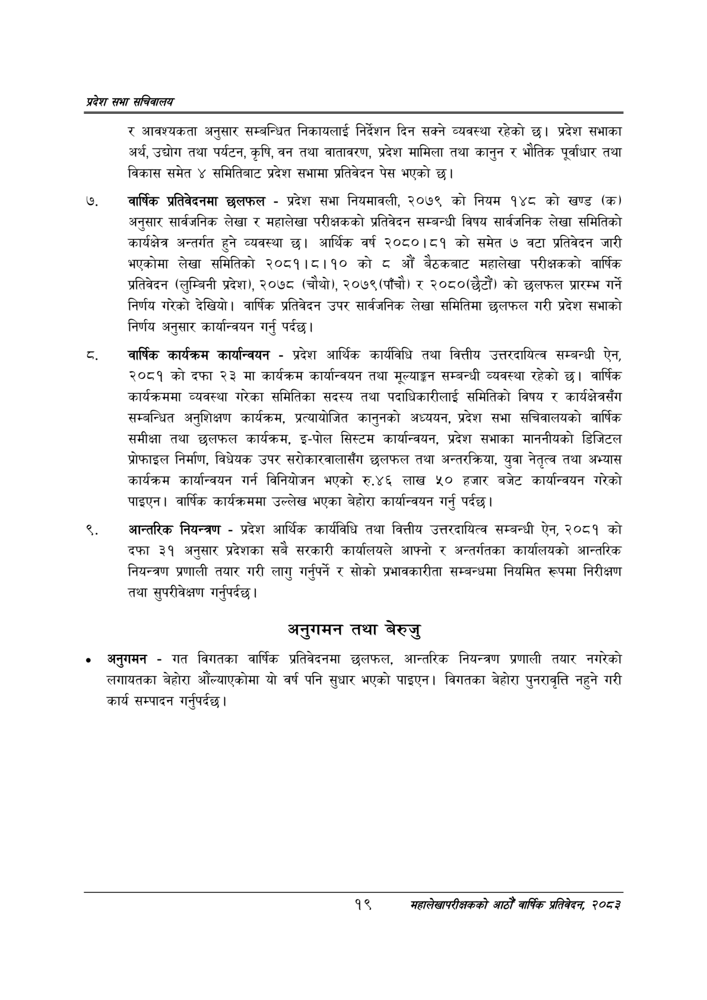

# Page 41 QA

## Rendered page


## Extracted text

```text
प्रदेश सभा सचिवालय
र आवश्यकता अनुसार सम्बन्धित निकायलाई निर्देशन दिन सक्ने व्यवस्था रहेको छ। प्रदेश सभाका अर्थ, उद्योग तथा पर्यटन, कृषि, वन तथा वातावरण, प्रदेश मामिला तथा कानुन र भौतिक पूर्वाधार तथा विकास समेत ४ समितिबाट प्रदेश सभामा प्रतिवेदन पेस भएको छ।
बार्षिक प्रतिवेदनमा छलफल -प्रदेश सभा नियमावली, २०७९ को नियम १४८ को खण्ड (क) अनुसार सार्वजनिक लेखा र महालेखा परीक्षकको प्रतिवेदन सम्बन्धी विषय सार्वजनिक लेखा समितिको कार्यक्षेत्र अन्तर्गत हुने व्यवस्था छ। आर्थिक वर्ष २०८०।८१ को समेत ७ वटा प्रतिवेदन जारी भएकोमा लेखा समितिको २०८१।८।१० को औँ बैठकबाट महालेखा परीक्षकको वार्षिक प्रतिवेदन (लुम्बिनी प्रदेश), २०७८ (चौथो), २०७९ (पाँचौ) र २०८०(छैटौं। को छलफल प्रारम्भ गर्ने निर्णय गरेको देखियो। वार्षिक प्रतिवेदन उपर सार्वजनिक लेखा समितिमा छलफल गरी प्रदेश सभाको निर्णय अनुसार कार्यान्वयन गर्नु पर्दछ।
वार्षिक कार्यक्रम कार्यान्वयन -प्रदेश आर्थिक कार्यविधि तथा वित्तीय उत्तरदायित्व सम्बन्धी ऐन, २०८१ को दफा २३ मा कार्यक्रम कार्यान्वयन तथा मूल्याङ्कन सम्बन्धी व्यवस्था रहेको छ। वार्षिक कार्यक्रममा व्यवस्था गरेका समितिका सदस्य तथा पदाधिकारीलाई समितिको विषय र कार्यक्षेत्रसँग सम्बन्धित अनुशिक्षण कार्यक्रम, प्रत्यायोजित कानुनको अध्ययन, प्रदेश सभा सचिवालयको वार्षिक समीक्षा तथा छलफल कार्यक्रम, इ-पोल सिस्टम कार्यान्वयन, प्रदेश सभाका माननीयको डिजिटल प्रोफाइल निर्माण, विधेयक उपर सरोकारवालासँग छलफल तथा अन्तरक्रिया, युवा नेतृत्व तथा अभ्यास कार्यक्रम कार्यान्वयन गर्न विनियोजन भएको रु.४६ लाख ५० हजार बजेट कार्यान्वयन गरेको पाइएन। वार्षिक कार्यक्रममा उल्लेख भएका बेहोरा कार्यान्वयन गर्नु पर्दछ।
आन्तरिक नियन्त्रण -प्रदेश आर्थिक कार्यविधि तथा वित्तीय उत्तरदायित्व सम्बन्धी ऐन, २०८१ को दफा ३१ अनुसार प्रदेशका सबै सरकारी कार्यालयले आफ्नो र अन्तर्गतका कार्यालयको आन्तरिक नियन्त्रण प्रणाली तयार गरी लागु गर्नुपर्ने र सोको प्रभावकारीता सम्बन्धमा नियमित रूपमा निरीक्षण तथा सुपरीवेक्षण गर्नुपर्दछ |
अनुगमन तथा बेरुजु
अनुगमन -गत विगतका वार्षिक प्रतिवेदनमा छलफल, आन्तरिक नियन्त्रण प्रणाली तयार नगरेको लगायतका बेहोरा औंल्याएकोमा यो वर्ष पनि सुधार भएको पाइएन। विगतका बेहोरा पुनरावृत्ति नहुने गरी कार्य सम्पादन गर्नुपर्दछ |
१९
सहालेखापरीक्षकको आठौँ वाषिकि प्रतिवेदन २०८२
```

## Flags
- None
