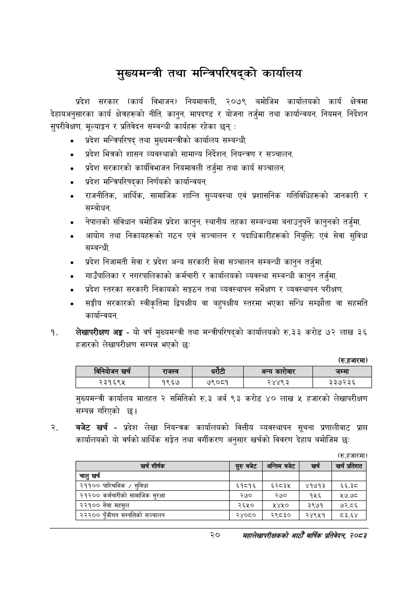

# Page 42 QA

## Rendered page


## Extracted text

```text
मुख्यमन्त्री तथा मन्त्रिपरिषद्को कार्यालय
प्रदेश सरकार (कार्य विभाजन) नियमावली, २०७९ बमोजिम कार्यालयको कार्य क्षेत्रमा देहायअनुसारका कार्य क्षेत्रहरूको नीति, कानुन, मापदण्ड र योजना तर्जुमा तथा कार्यान्वयन, नियमन, निर्देशन सुपरीवेक्षण, मूल्याङ्कन र प्रतिवेदन सम्बन्धी कार्यहरू रहेका छन्‌:
० प्रदेश मन्त्रिपरिषद्‌ तथा मुख्यमन्त्रीको कार्यालय सम्बन्धी,
प्रदेश भित्रको शासन व्यवस्थाको सामान्य निर्देशन, नियन्त्रण र सञ्चालन,
० प्रदेश सरकारको कार्यविभाजन नियमावली तर्जुमा तथा कार्य सञ्चालन,
० प्रदेश मन्त्रिपरिषद्का निर्णयको कार्यान्वयन,
० राजनीतिक, आर्थिक, सामाजिक शान्ति सुव्यवस्था एवं प्रशासनिक गतिविधिहरूको जानकारी र सम्बोधन,
० नेपालको संविधान बमोजिम प्रदेश कानुन, स्थानीय तहका सम्बन्धमा बनाउनुपर्ने कानुनको तर्जुमा,
० आयोग तथा निकायहरूको गठन एवं सञ्चालन र पदाधिकारीहरूको नियुक्ति एवं सेवा सुविधा सम्बन्धी,
० प्रदेश निजामती सेवा र प्रदेश अन्य सरकारी सेवा सञ्चालन सम्बन्धी कानुन तर्जुमा,
गाउँपालिका र नगरपालिकाको कर्मचारी र कार्यालयको व्यवस्था सम्बन्धी कानुन तर्जुमा,
० प्रदेश स्तरका सरकारी निकायको सङ्गठन तथा व्यवस्थापन सर्भेक्षण र व्यवस्थापन परीक्षण,
० सङ्घीय सरकारको स्वीकृतिमा ढ्विपक्षीय वा बहुपक्षीय स्तरमा भएका सन्धि सम्झौता वा सहमति कार्यान्वयन,
लेखापरीक्षण अङ्ग -यो वर्ष मुख्यमन्त्री तथा मन्त्रीपरिषद्को कार्यालयको रु.३३ करोड ७२ लाख ३६ हजारको लेखापरीक्षण सम्पन्न भएको छ:
(रु.हजारमा)
मुख्यमन्त्री कार्यालय मातहत २ समितिको रु.३ अर्ब ९३ करोड ४० लाख ५ हजारको लेखापरीक्षण सम्पन्न गरिएको छ।
बजेट खर्च -प्रदेश लेखा नियन्त्रक कार्यालयको वित्तीय व्यवस्थापन सूचना प्रणालीबाट प्राप्त कार्यालयको यो वर्षको आर्थिक सङ्गेत तथा वर्गीकरण अनुसार खर्चको विवरण देहाय बमोजिम छः:
(रु.हजारमा)
२०
सहालेखापरीक्षकको आठौँ वाषिकि प्रतिवेदन २०८२

|  | खर्च | राजस्व |  | ५ १ १ १ १ ५ ५३१ १२ ३३ १४ ९३.१६८१५९ अन्य ५ १ १ १ १ ६ ५७१ ६ ५७ २० २५.६४४३७९ ५ १ १ १ १ ७ ७४१ १२ ४१ १४ ९४.८३१४२१ जम्मा ४ १ १ १ २ ० ६९ ४२ ७२९ १५ -१ ५ १ १ १ २ १ ६९ ४२ ७४ १५ ८८.१७८८०२ २३१६९५ ५ १ १ १ २ २ २४८ ४२ ४९ १५ ९६.४१४७६४ १९६७ ५ १ १ १ २ ३ ३७६ ४२ ५९ १५ ९१.६५४१६७ ७९०८१ ५ १ १ १ २ ४ ५४८ ४२ ६१ १५ ९२.६१६२४१ २४४९३ ५ १ १ १ २ ५ ७२४ ४२ ७४ १५ ९२.११२८१६ ३३७२३६ |  |  |
| --- | --- | --- | --- | --- | --- | --- |
|  |  |  |  |  |  |  |

| खर्च शीर्षक | सुरु बबेट | अन्तिम बबेट | खर्च | खर्च प्रतिशत |
| --- | --- | --- | --- | --- |
| चालु खर्च |  |  |  |  |
| २११०० पारिश्रमिक / सुविधा | ६१८१६ | ६२८३५ | ४१७१३ | ६६३८ |
| २९३०० कर्मचारीको सामाजिक सुरक्षा | २७० | २७० | १५६ | ५७.७८ |
| २२१०० सेवा महसुल | २६५० | ४१० | ३९७१ | ७२.८६ |
| २३३०० पुँजीगत सम्पतिको सञ्चालन | २४०८० | २९८३० | २४९५१ | ८३.६४ |
```

## Flags
- table_page
- medium_quality_table
