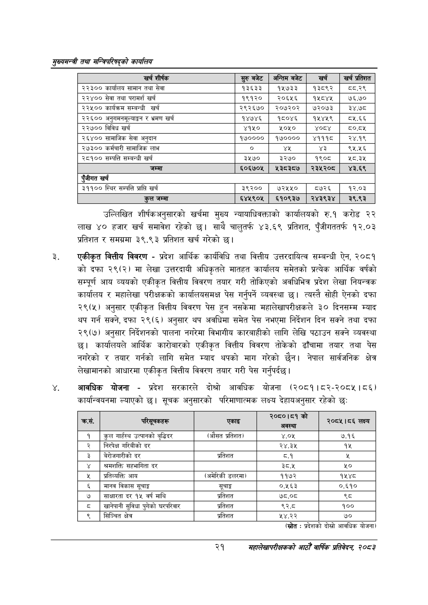

# Page 43 QA

## Rendered page


## Extracted text

```text
सुख्यसन्त्री तथा सन्तिपरिषद्को कायलिय
उल्लिखित शीर्षकअनुसारको खर्चमा मुख्य न्यायाधिवक्ताको कार्यालयको रु.१ करोड २२ लाख ४० हजार खर्च समावेश रहेको साथै चालुतर्फ ४३.६९ प्रतिशत, पुँजीगततर्फ १२.०३ प्रतिशत र समग्रमा ३९.९३ प्रतिशत खर्च गरेको छ।
एकीकृत वित्तीय विवरण -प्रदेश आर्थिक कार्यविधि तथा वित्तीय उत्तरदायित्व सम्बन्धी ऐन, २०८१ को दफा २९(२) मा लेखा उत्तरदायी अधिकृतले मातहत कार्यालय समेतको प्रत्येक आर्थिक वर्षको सम्पूर्ण आय व्ययको एकीकृत वित्तीय विवरण तयार गरी तोकिएको अवधिभित्र प्रदेश लेखा नियन्त्रक कार्यालय र महालेखा परीक्षकको कार्यालयसमक्ष पेस गर्नुपर्ने व्यवस्था छ। त्यस्तै सोही ऐनको दफा २९(५) अनुसार एकीकृत वित्तीय विवरण पेस हुन नसकेमा महालेखापरीक्षकले ३० दिनसम्म म्याद थप गर्न सक्ने, दफा २९(६) अनुसार थप अवधिमा समेत पेस नभएमा निर्देशन दिन सक्ने तथा दफा २९(७) अनुसार निर्देशनको पालना नगरेमा विभागीय कारबाहीको लागि लेखि पठाउन सक्ने व्यवस्था छ। कार्यालयले आर्थिक कारोबारको एकीकृत वित्तीय विवरण तोकेको ढाँचामा तयार तथा पेस नगरेको र तयार गर्नको लागि समेत म्याद थपको माग गरेको छैन। नेपाल सार्वजनिक क्षेत्र लेखामानको आधारमा एकीकृत वित्तीय विवरण तयार गरी पेस गर्नुपर्दछ |
आवधिक योजना -प्रदेश सरकारले दोश्रो आवधिक योजना (२०८१।८२-२०८५।८६) कार्यान्वयनमा ल्याएको छ। सूचक अनुसारको परिमाणात्मक लक्ष्य देहायअनुसार रहेको छ:
(स्रोत
: प्रदेशको दोस्रो आवधिक योजना)
२१
सहालेखापरीक्षकको आठौँ वाषिकि प्रतिवेदन २०८२

| खर्च शीर्षक | सुरु बबेट | अन्तिम बेट | खर्च | खर्च प्रतिशत |
| --- | --- | --- | --- | --- |
| २२३०० कार्यालय सामान तथा सेवा | १३६३३ | १५७३३ | १३८९२ | ८८.२९ |
| '२२४०० सेवा तथा परामर्श खर्च | १९१२० | २०६५६ | १५८४४५ | ७६.७० |
| २२५०० कार्यक्रम सम्बन्धी खर्च | २९२६७० | २०७२०२ | ७२०७३ | ३४.७८ |
| २२६०० अनुषभभनसूल्याङ्गन र भ्रमण खर्च | १४७४६ | १८०४६ | १५४५९ | ८५.६६ |
| २२७०० विविध खर्च | ४१५० | ५०५० |  |  |
| २६४०० सामाजिक सेवा अनुदान | १७०००० | १७०००० | ४१११ | र२४.१९ |
| २७३०० कर्मचारी सामाजिक लाभ | ० | यश | ३ | ९५.५६ |
| २८१०० सम्पत्ति सम्बन्धी खर्च | ३५७० | ३२७० | १९०८ | ५८.३५ |
| जम्मा | ६०६७०५ | ४१३८३८७ | २३५२०८ | ४३.६९ |
| एंजीगत खर्च |  |  |  |  |
| ३११०० स्थिर सम्पत्ति प्राप्ति खर्च | ३९२०० | ७२५५० | ५७२६ | १२.०३ |
| कुल जम्मा | ६४५९०५ | ६१०९३७ | २४३९३४ | ३९.९३ |

| छ क्रस. | पारसूनकहरू | एकाइ | २०८०।१ अवस्था | २०८५।८६ लक्ष्य |
| --- | --- | --- | --- | --- |
| १ | कुल गार्हस्थ उत्पानको वृद्धिदर | (औसत प्रतिशत) | ४.०५ | ७.१६ |
| २ | निरपेक्ष गरिबीको दर |  | २४.३५ | १५ |
| ३ | नेरोजनारीको दर | प्रतिशत | ५.१ | ३ |
| ४ | श्रमशक्ति सहभागिता दर |  | ३८.४५ |  |
| ५ | आय | (अमेरिकी डलरमा) | ११७२ | १५४८ |
| ६ | मानव विकास सूचाङ्ग | सूचाङ्क | ०.१६३ | ०.६१० |
| ७ | दर १५ वर्ष माथि | प्रतिशत | ७८.०८ | थ्व |
| ८ | खानेपानी सुविधा पुगेको घरपरिवार | प्रतिशत | ९२.८ | १०० |
| ९ | सिञ्चित क्षेत्र | प्रतिशत | ५४.२२ | ७० |
```

## Flags
- table_page
- medium_quality_table
