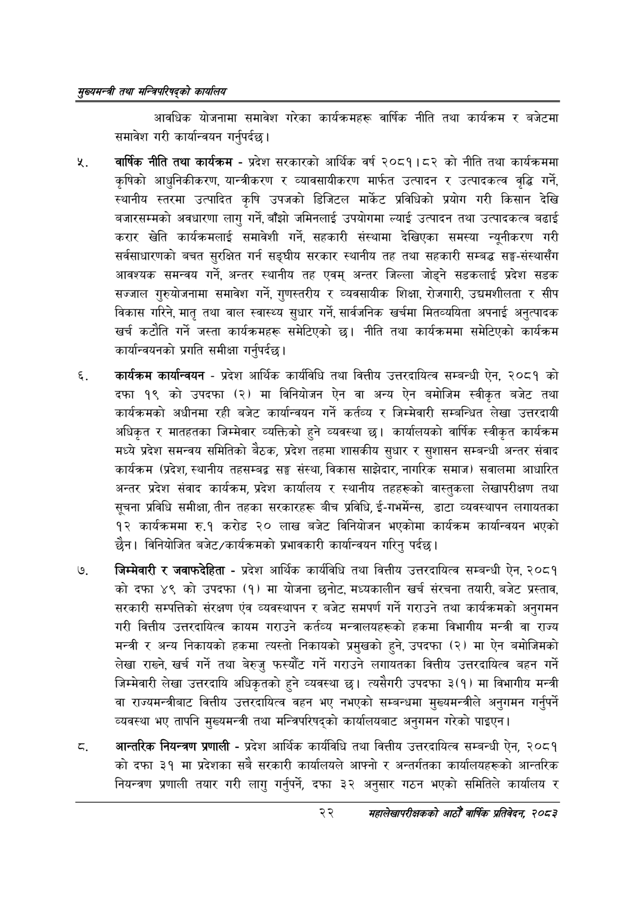

# Page 44 QA

## Rendered page


## Extracted text

```text
सुख्यसन्त्री तथा सन्तिपरिषद्को कायलिय
आवधिक योजनामा समावेश गरेका कार्यक्रमहरू वार्षिक नीति तथा कार्यक्रम र बजेटमा समावेश गरी कार्यान्वयन गर्नुपर्दछ |
वार्षिक नीति तथा कार्यक्रम -प्रदेश सरकारको आर्थिक वर्ष २०८१।८२ को नीति तथा कार्यक्रममा कृषिको आधुनिकीकरण, यान्त्रीकरण र व्यावसायीकरण मार्फत उत्पादन र उत्पादकत्व वृद्धि गर्ने, स्थानीय स्तरमा उत्पादित कृषि उपजको डिजिटल मार्केट प्रविधिको प्रयोग गरी किसान देखि बजारसम्मको अवधारणा लागु गर्ने, बाँझो जमिनलाई उपयोगमा ल्याई उत्पादन तथा उत्पादकत्व बढाई करार खेति कार्यक्रमलाई समावेशी गर्ने, सहकारी संस्थामा देखिएका समस्या न्यूनीकरण गरी सर्वसाधारणको बचत सुरक्षित गर्न सङ्घीय सरकार स्थानीय तह तथा सहकारी सम्बद्ध सङ्घ-संस्थासँग आवश्यक समन्वय गर्ने, अन्तर स्थानीय तह एवम्‌ अन्तर जिल्ला जोड्ने सडकलाई प्रदेश सडक सञ्जाल गुरुयोजनामा समावेश गर्ने, गुणस्तरीय र व्यवसायीक शिक्षा, रोजगारी, उद्यमशीलता र सीप विकास गरिने, मातृ तथा वाल स्वास्थ्य सुधार गर्ने, सार्वजनिक खर्चमा मितव्ययिता अपनाई अनुत्पादक खर्च कटौति गर्ने जस्ता कार्यक्रमहरू समेटिएको | नीति तथा कार्यक्रममा समेटिएको कार्यक्रम कार्यान्वयनको प्रगति समीक्षा गर्नुपर्दछ |
कार्यक्रम कार्यान्वयन -प्रदेश आर्थिक कार्यविधि तथा वित्तीय उत्तरदायित्व सम्बन्धी ऐन, २०८१ को दफा १९ को उपदफा (२) मा विनियोजन ऐन वा अन्य ऐन बमोजिम स्वीकृत बजेट तथा कार्यक्रमको अधीनमा रही बजेट कार्यान्वयन गर्ने कर्तव्य र जिम्मेवारी सम्बन्धित लेखा उत्तरदायी अधिकृत र मातहतका जिम्मेवार व्यक्तिको हुने व्यवस्था छ। कार्यालयको वार्षिक स्वीकृत कार्यक्रम मध्ये प्रदेश समन्वय समितिको बैठक, प्रदेश तहमा शासकीय सुधार र सुशासन सम्बन्धी अन्तर संवाद कार्यक्रम (प्रदेश, स्थानीय तहसम्बद्द सङ्घ संस्था, विकास साझेदार, नागरिक समाज) सवालमा आधारित अन्तर प्रदेश संवाद कार्यक्रम, प्रदेश कार्यालय र स्थानीय तहहरूको वास्तुकला लेखापरीक्षण तथा सूचना प्रविधि समीक्षा, तीन तहका सरकारहरू बीच प्रविधि, ई-गभर्मेन्स, डाटा व्यवस्थापन लगायतका १२ कार्यक्रममा रु.१ करोड २० लाख बजेट विनियोजन भएकोमा कार्यक्रम कार्यान्वयन भएको छैन। विनियोजित बजेट/कार्यक्रमको प्रभावकारी कार्यान्वयन गरिनु पर्दछ।
जिम्मेवारी र जवाफदेहिता -प्रदेश आर्थिक कार्यविधि तथा वित्तीय उत्तरदायित्व सम्बन्धी ऐन, २०८१ कोदफा ४९ को उपदफा (१) मा योजना छनोट, मध्यकालीन खर्च संरचना तयारी, बजेट प्रस्ताव, सरकारी सम्पत्तिको संरक्षण एंव व्यवस्थापन र बजेट समपर्ण गर्ने गराउने तथा कार्यक्रमको अनुगमन गरी वित्तीय उत्तरदायित्व कायम गराउने कर्तव्य मन्त्रालयहरूको हकमा विभागीय मन्त्री वा राज्य मन्त्री र अन्य निकायको हकमा त्यस्तो निकायको प्रमुखको हुने, उपदफा (२) मा ऐन बमोजिमको लेखा राख्ने, खर्च गर्ने तथा बेरुजु फस्यौंट गर्ने गराउने लगायतका वित्तीय उत्तरदायित्व बहन गर्ने जिम्मेवारी लेखा उत्तरदायि अधिकृतको हुने व्यवस्था छ। त्यसैगरी उपदफा ३(१) मा विभागीय मन्त्री वा राज्यमन्त्रीबाट वित्तीय उत्तरदायित्व वहन भए नभएको सम्बन्धमा मुख्यमन्त्रीले अनुगमन गर्नुपर्ने व्यवस्था भए तापनि मुख्यमन्त्री तथा मन्त्रिपरिषद्को कार्यालयबाट अनुगमन गरेको पाइएन |
अन्तरिक नियन्त्रण प्रणाली -प्रदेश आर्थिक कार्यविधि तथा वित्तीय उत्तरदायित्व सम्बन्धी ऐन, २०८१ को दफा ३१ मा प्रदेशका सबै सरकारी कार्यालयले आफ्नो र अन्तर्गतका कार्यालयहरूको आन्तरिक नियन्त्रण प्रणाली तयार गरी लागु गर्नुपर्ने, दफा ३२ अनुसार गठन भएको समितिले कार्यालय र
२२
सहालेखापरीक्षकको आठौँ वाषिकि प्रतिवेदन २०८२
```

## Flags
- None
