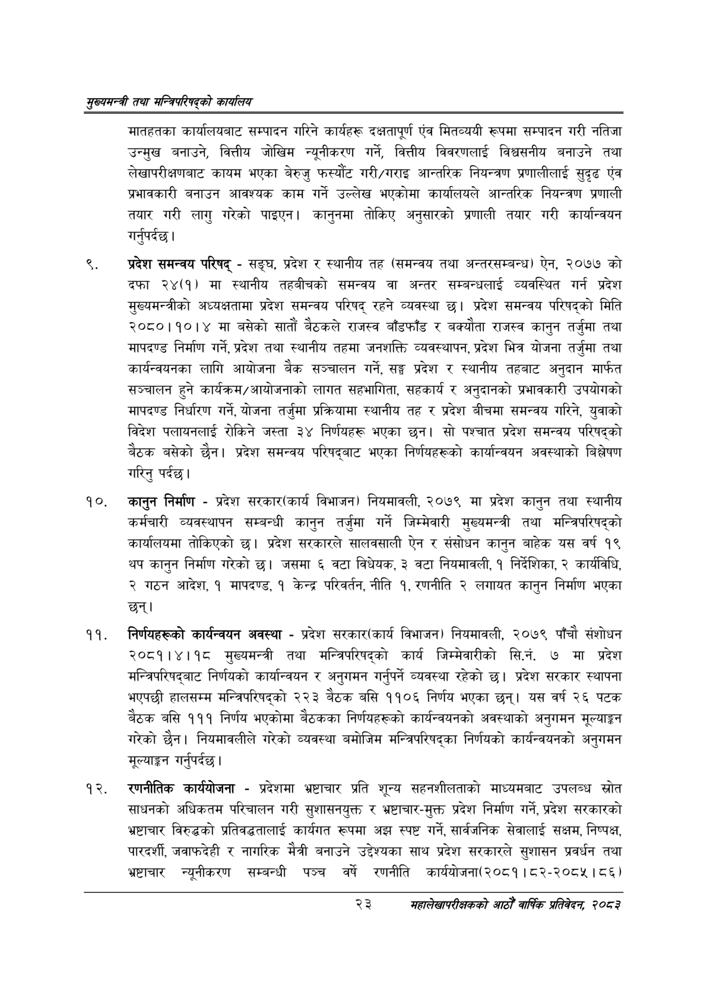

# Page 45 QA

## Rendered page


## Extracted text

```text
सुख्यसन्त्री तथा सन्तिपरिषद्को कायलिय
मातहतका कार्यालयबाट सम्पादन गरिने कार्यहरू दक्षतापूर्ण एंव मितव्ययी रूपमा सम्पादन गरी नतिजा उन्मुख बनाउने, वित्तीय जोखिम न्यूनीकरण गर्ने, वित्तीय विवरणलाई विश्वसनीय बनाउने तथा लेखापरीक्षणबाट कायम भएका बेरुजु फस्यौट गरी/गराइ आन्तरिक नियन्त्रण प्रणालीलाई सुदृढ एंव प्रभावकारी बनाउन आवश्यक काम गर्ने उल्लेख भएकोमा कार्यालयले आन्तरिक नियन्त्रण प्रणाली तयार गरी लागु गरेको पाइएन। कानुनमा तोकिए अनुसारको प्रणाली तयार गरी कार्यान्वयन गर्नुपर्दछ |
प्रदेश समन्वय परिषद्‌ -सङ्घ, प्रदेश र स्थानीय तह (समन्वय तथा अन्तरसम्बन्ध) ऐन, २०७७ को दफा २४(१) मा स्थानीय तहबीचको समन्वय वा अन्तर सम्बन्धलाई व्यवस्थित गर्न प्रदेश मुख्यमन्त्रीको अध्यक्षतामा प्रदेश समन्वय परिषद्‌ रहने व्यवस्था छ। प्रदेश समन्वय परिषद्को मिति २०८०।१०।४ मा बसेको सातौं बैठकले राजस्व बाँडफाँड र बक्यौता राजस्व कानुन तर्जुमा तथा मापदण्ड निर्माण गर्ने, प्रदेश तथा स्थानीय तहमा जनशक्ति व्यवस्थापन, प्रदेश भित्र योजना तर्जुमा तथा कार्यन्वयनका लागि आयोजना बैक सञ्चालन गर्ने, सङ्घ प्रदेश र स्थानीय तहबाट अनुदान मार्फत सञ्चालन हुने कार्यक्रम/आयोजनाको लागत सहभागिता, सहकार्य र अनुदानको प्रभावकारी उपयोगको मापदण्ड निर्धारण गर्ने, योजना तर्जुमा प्रक्रियामा स्थानीय तह र प्रदेश बीचमा समन्वय गरिने, युवाको विदेश पलायनलाई रोकिने जस्ता ३४ निर्णयहरू भएका छन। सो पश्चात प्रदेश समन्वय परिषद्को बैठक बसेको छैन। प्रदेश समन्वय परिषद्बाट भएका निर्णयहरूको कार्यान्वयन अवस्थाको बिश्लेषण गरिनु पर्दछ।
कानुन निर्माण -प्रदेश सरकार(कार्य विभाजन) नियमावली, २०७९ मा प्रदेश कानुन तथा स्थानीय कर्मचारी व्यवस्थापन सम्बन्धी कानुन तर्जुमा गर्ने जिम्मेवारी मुख्यमन्त्री तथा मन्त्रिपरिषद्को कार्यालयमा तोकिएको छ। प्रदेश सरकारले सालवसाली ऐन र संसोधन कानुन बाहेक यस वर्ष १९ थप कानुन निर्माण गरेको छ। जसमा ६ वटा विधेयक, ३ वटा नियमावली, १ निर्देशिका, २ कार्यविधि, २ गठन आदेश, १ मापदण्ड, १ केन्द्र परिवर्तन, नीति १, रणनीति २ लगायत कानुन निर्माण भएका छन्‌।
निर्णयहरूको कार्यन्वयन अवस्था -प्रदेश सरकार(कार्य विभाजन) नियमावली, २०७९ पाँचौ संशोधन २०८१।४।१८ मुख्यमन्त्री तथा मन्त्रिपरिषद्को कार्य जिम्मेवारीको सि.नं. ७ मा प्रदेश मन्त्रिपरिषद्बाट निर्णयको कार्यान्वयन र अनुगमन गर्नुपर्ने व्यवस्था रहेको छ। प्रदेश सरकार स्थापना भएपछी हालसम्म मन्त्रिपरिषद्को २२३ बैठक बसि ११०६ निर्णय भएका छन्‌। यस वर्ष २६ पटक बैठक बसि १११ निर्णय भएकोमा बैठकका निर्णयहरूको कार्यन्वयनको अवस्थाको अनुगमन मूल्याङ्कन गरेको छैन। नियमावलीले गरेको व्यवस्था बमोजिम मन्त्रिपरिषद्का निर्णयको कार्यन्वयनको अनुगमन मूल्याङ्कन गर्नुपर्दछ |
रणनीतिक कार्ययोजना -प्रदेशमा भ्रष्टाचार प्रति शून्य सहनशीलताको माध्यमबाट उपलब्ध स्रोत साधनको अधिकतम परिचालन गरी सुशासनयुक्त र भ्रष्टाचार-मुक्त प्रदेश निर्माण गर्ने, प्रदेश सरकारको भ्रष्टाचार विरुद्धको प्रतिवद्धतालाई कार्यगत रूपमा अझ स्पष्ट गर्ने, सार्वजनिक सेवालाई सक्षम, निष्पक्ष, पारदर्शी, जवाफदेही र नागरिक मैत्री बनाउने उद्देश्यका साथ प्रदेश सरकारले सुशासन प्रवर्धन तथा भ्रष्टाचार न्यूनीकरण सम्बन्धी पञ्च वर्ष रणनीति कार्ययोजना(२०८१।८२-२०८५। ८६)
२३
सहालेखापरीक्षकको आठौँ वाषिकि प्रतिवेदन २०८२
```

## Flags
- None
