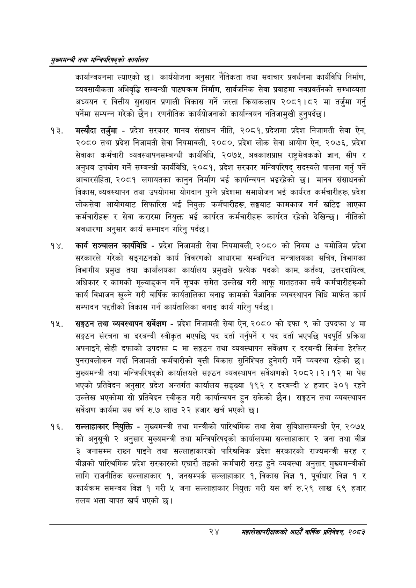

# Page 46 QA

## Rendered page


## Extracted text

```text
सुख्यसन्त्री तथा सन्तिपरिषद्को कायलिय
कार्यान्वयनमा ल्याएको छ। कार्ययोजना अनुसार नैतिकता तथा सदाचार प्रवर्धनमा कार्यविधि निर्माण, व्यवसायीकता अभिवृद्धि सम्बन्धी पाठ्यक्रम निर्माण, सार्वजनिक सेवा प्रवाहमा नवप्रवर्तनको सम्भाव्यता अध्ययन र वित्तीय सुशसान प्रणाली विकास गर्ने जस्ता क्रियाकलाप २०८१।८२ मा तर्जुमा गर्नु पर्नेमा सम्पन्न गरेको छैन। रणनीतिक कार्ययोजनाको कार्यान्वयन नतिजामुखी हुनुपर्दछ।
मस्यौदा तर्जुमा -प्रदेश सरकार मानव संसाधन नीति, २०८१, प्रदेशमा प्रदेश निजामती सेवा ऐन, २०८० तथा प्रदेश निजामती सेवा नियमावली, २०८०, प्रदेश लोक सेवा आयोग ऐन, २०७६, प्रदेश सेवाका कर्मचारी व्यवस्थापनसम्बन्धी कार्यविधि, २०७५, अवकाशप्राप्त राष्ट्रसेवकको ज्ञान, सीप र अनुभव उपयोग गर्ने सम्बन्धी कार्यविधि, २०८१, प्रदेश सरकार मन्त्रिपरिषद्‌ सदस्यले पालना गर्नु पर्ने आचारसंहिता, २०८१ लगायतका कानुन निर्माण भई कार्यान्वयन भइरहेको छ। मानव संसाधनको विकास, व्यवस्थापन तथा उपयोगमा योगदान पुग्ने प्रदेशमा समायोजन भई कार्यरत कर्मचारीहरू, प्रदेश लोकसेवा आयोगबाट सिफारिस भई नियुक्त कर्मचारीहरू, सङ्घबाट कामकाज गर्न खटिइ आएका कर्मचारीहरू र सेवा करारमा नियुक्त भई कार्यरत कर्मचारीहरू कार्यरत रहेको देखिन्छ। नीतिको अवधारणा अनुसार कार्य सम्पादन गरिनु पर्दछ।
कार्य सञ्चालन कार्यविधि -प्रदेश निजामती सेवा नियमावली, २०८० को नियम ७ बमोजिम प्रदेश सरकारले गरेको सङ्गठनको कार्य विवरणको आधारमा सम्बन्धित मन्त्रालयका सचिव, विभागका विभागीय प्रमुख तथा कार्यालयका कार्यालय प्रमुखले प्रत्येक पदको काम, कर्तव्य, उत्तरदायित्व, अधिकार र कामको मूल्याङ्कन गर्ने सूचक समेत उल्लेख गरी आफू मातहतका सबै कर्मचारीहरूको कार्य विभाजन खुल्ने गरी वार्षिक कार्यतालिका बनाइ कामको वैज्ञानिक व्यवस्थापन विधि मार्फत कार्य सम्पादन पद्दतीको विकास गर्न कार्यतालिका बनाइ कार्य गरिनु पर्दछ।
सङ्गठन तथा व्यवस्थापन सर्वेक्षण -प्रदेश निजामती सेवा ऐन, २०८० को दफा ९ को उपदफा ४ मा सङ्गठन संरचना वा दरबन्दी स्वीकृत भएपछि पद दर्ता गर्नुपर्ने र पद दर्ता भएपछि पदपूर्ति प्रक्रिया अपनाइने, सोही दफाको उपदफा ८ मा सङ्गठन तथा व्यवस्थापन सर्वेक्षण र दरबन्दी सिर्जना हेरफेर पुनरावलोकन गर्दा निजामती कर्मचारीको वृत्ती विकास सुनिश्चित हुनेगरी गर्ने व्यवस्था रहेको छ। मुख्यमन्त्री तथा मन्त्रिपरिषद्को कार्यालयले सङ्गठन व्यवस्थापन सर्वेक्षणको २०८२।२।१२ मा पेस भएको प्रतिवेदन अनुसार प्रदेश अन्तर्गत कार्यालय सङ्ख्या १९२ र दरबन्दी ४ हजार ३०१ रहने उल्लेख भएकोमा सो प्रतिवेदन स्वीकृत गरी कार्यान्वयन हुन सकेको छैन। सङ्गठन तथा व्यवस्थापन सर्वेक्षण कार्यमा यस वर्ष रु.७ लाख २२ हजार खर्च भएको |
सल्लाहाकार नियुक्ति -मुख्यमन्त्री तथा मन्त्रीको पारिश्रमिक तथा सेवा सुविधासम्बन्धी ऐन, २०७५ को अनुसूची २ अनुसार मुख्यमन्त्री तथा मन्त्रिपरिषद्को कार्यालयमा सल्लाहाकार २ जना तथा वीज्ञ ३ जनासम्म राख्न पाइने तथा सल्लाहाकारको पारिश्रमिक प्रदेश सरकारको राज्यमन्त्री सरह र वीज्ञको पारिश्रमिक प्रदेश सरकारको एघारी तहको कर्मचारी सरह हुने व्यवस्था अनुसार मुख्यमन्त्रीको लागि राजनीतिक सल्लाहाकार १, जनसम्पर्क सल्लाहाकार १, विकास विज्ञ १, पूर्वाधार विज्ञ १ र कार्यक्रम समन्वय विज्ञ १ गरी ५ जना सल्लाहाकार नियुक्त गरी यस वर्ष रु.२९ लाख ६९ हजार तलब भत्ता वापत खर्च भएको छ।
२४ सहालेखापरीक्षकको आठौँ वाषिकि प्रतिवेदन २०८२
```

## Flags
- None
