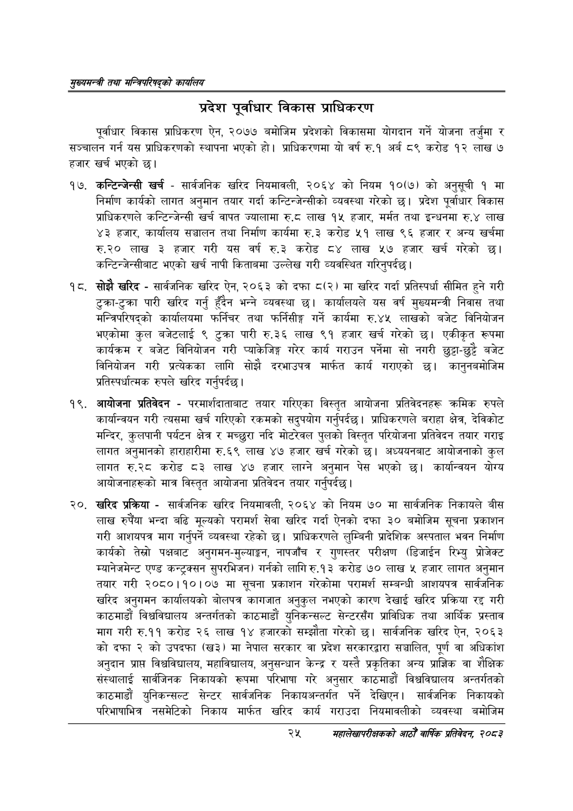

# Page 47 QA

## Rendered page


## Extracted text

```text
सुख्यसन्त्री तथा सन्तिपरिषद्को कायलिय
प्रदेश पूर्वाधार विकास प्राधिकरण
पूर्वाधार विकास प्राधिकरण ऐन, २०७७ बमोजिम प्रदेशको विकासमा योगदान गर्ने योजना तर्जुमा र सञ्चालन गर्न यस प्राधिकरणको स्थापना भएको हो। प्राधिकरणमा यो वर्ष रु.१ अर्ब ८९ करोड १२ लाख ७ हजार खर्च भएको छ।
१७, कन्टिन्जेन्सी खर्च -सार्वजनिक खरिद नियमावली, २०६४ को नियम १०(७) को अनुसूची १ मा निर्माण कार्यको लागत अनुमान तयार गर्दा कन्टिन्जेन्सीको व्यवस्था गरेको छ। प्रदेश पूर्वाधार विकास प्राधिकरणले कन्टिन्जेन्सी खर्च वापत ज्यालामा रु.८ लाख १५ हजार, मर्मत तथा इन्धनमा. लाख ४३ हजार, कार्यालय सञ्चालन तथा निर्माण कार्यमा रु.३ करोड ५१ लाख ९६ हजार र अन्य खर्चमा लाख ३ हजार गरी यस वर्ष रु.३ करोड ८४ लाख ४५७ हजार खर्च गरेको छ। कन्टिन्जेन्सीबाट भएको खर्च नापी किताबमा उल्लेख गरी व्यवस्थित गरिनुपर्दछ |
सोझै खरिद -सार्वजनिक खरिद ऐन, २०६३ को दफा ८(२) मा खरिद गर्दा प्रतिस्पर्धा सीमित हुने गरी टुक्रा-टुक्रा पारी खरिद गर्नु हुँदैन भन्ने व्यवस्था कार्यालयले यस वर्ष मुख्यमन्त्री निवास तथा मन्त्रिपरिषद्को कार्यालयमा फर्निचर तथा फर्निसीङ्ग गर्ने कार्यमा रु.४५ लाखको बजेट विनियोजन भएकोमा कुल बजेटलाई ९ टुक्रा पारी रु.३६ लाख ९१ हजार खर्च गरेको छ। एकीकृत रूपमा कार्यक्रम र बजेट विनियोजन गरी प्याकेजिङ्ग गरेर कार्य गराउन पर्नेमा सो नगरी छुट्टाछुट्टै बजेट विनियोजन गरी प्रत्येकका लागि सोझै दरभाउपत्र मार्फत कार्य गराएको छ। कानुनबमोजिम प्रतिस्पर्धात्मक रुपले खरिद गर्नुपर्दछ।
आयोजना प्रतिवेदन -परमार्शदाताबाट तयार गरिएका विस्तृत आयोजना प्रतिवेदनहरू क्रमिक रुपले कार्यान्वयन गरी त्यसमा खर्च गरिएको रकमको सदुपयोग गर्नुपर्दछ। प्राधिकरणले बराहा क्षेत्र, देविकोट मन्दिर, कुलपानी पर्यटन क्षेत्र र मच्छुरा नदि मोटरेवल पुलको विस्तृत परियोजना प्रतिवेदन तयार गराइ लागत अनुमानको हाराहारीमा रु.६९ लाख ४७ हजार खर्च गरेको | अध्ययनबाट आयोजनाको कुल लागत रु.२८ करोड ८३ लाख ४७ हजार लाग्ने अनुमान पेस भएको छ। कार्यान्वयन योग्य आयोजनाहरूको मात्र विस्तृत आयोजना प्रतिवेदन तयार गर्नुपर्दछ।
खरिद प्रक्रिया -सार्वजनिक खरिद नियमावली, २०६४ को नियम ७० मा सार्वजनिक निकायले बीस लाख रुपैँया भन्दा बढि मूल्यको परामर्श सेवा खरिद गर्दा ऐनको दफा ३० बमोजिम सूचना प्रकाशन गरी आशयपत्र माग गर्नुपर्ने व्यवस्था रहेको | प्राधिकरणले लुम्बिनी प्रादेशिक अस्पताल भवन निर्माण कार्यको तेस्रो पक्षबाट अनुगमन-मुल्याङ्कन, नापजाँच र गुणस्तर परीक्षण (डिजाईन रिभ्यु प्रोजेक्ट म्यानेजमेन्ट एण्ड कन्ट्रक्सन सुपरभिजन) गर्नको लागि रु.१३ करोड ७० लाख ५ हजार लागत अनुमान तयार गरी २०८०।१०।०७ मा सूचना प्रकाशन गरेकोमा परामर्श सम्बन्धी आशयपत्र सार्वजनिक खरिद अनुगमन कार्यालयको बोलपत्र कागजात अनुकुल नभएको कारण देखाई खरिद प्रक्रिया रद्द गरी काठमाडौं विश्वविद्यालय अन्तर्गतको काठमाडौं युनिकन्सल्ट सेन्टरसँग प्राविधिक तथा आर्थिक प्रस्ताव माग गरी रु.११ करोड २६ लाख १४ हजारको सम्झौता गरेको छ। सार्वजनिक खरिद ऐन, २०६३ कोदफा २ को उपदफा (ख३) मा नेपाल सरकार वा प्रदेश सरकारद्वारा सञ्चालित, पूर्ण वा अधिकांश अनुदान प्राप्त विश्वविद्यालय, महाविद्यालय, अनुसन्धान केन्द्र र यस्तै प्रकृतिका अन्य प्राज्ञिक वा शैक्षिक संस्थालाई सार्वजिनक निकायको रूपमा परिभाषा गरे अनुसार काठमाडौं विश्वविद्यालय अन्तर्गतको काठमाडौं युनिकन्सल्ट सेन्टर सार्वजनिक निकायअन्तर्गत पर्ने देखिएन। सार्वजनिक निकायको परिभाषाभित्र नसमेटिको निकाय मार्फत खरिद कार्य गराउदा नियमावलीको व्यवस्था बमोजिम
२५
सहालेखापरीक्षकको आठौँ वाषिकि प्रतिवेदन २०८२
```

## Flags
- None
