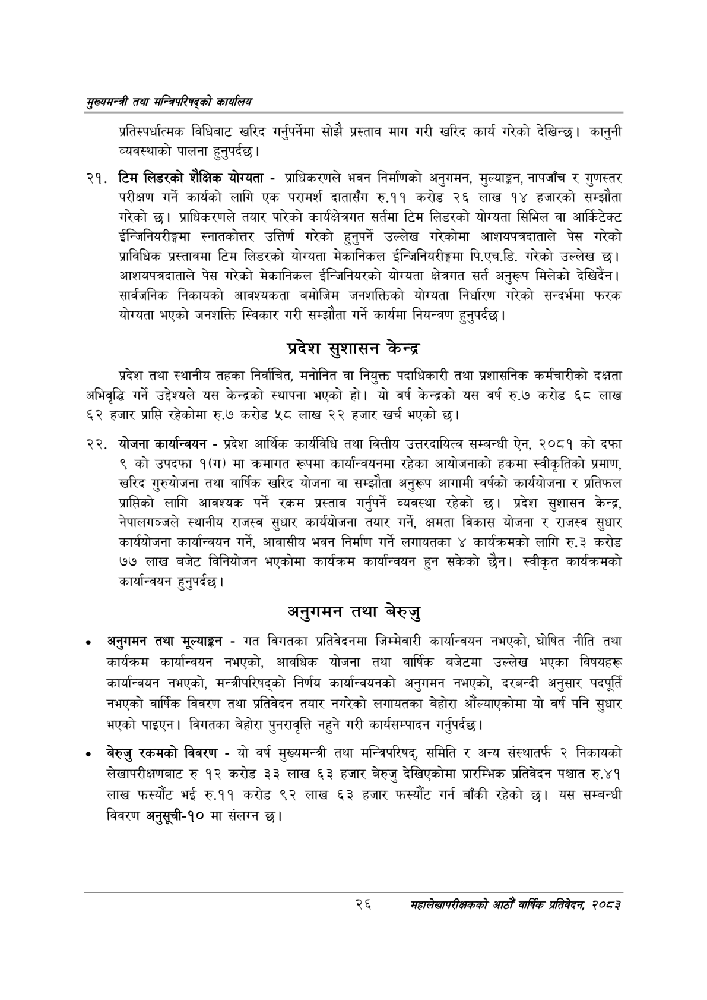

# Page 48 QA

## Rendered page


## Extracted text

```text
सुख्यसन्त्री तथा सन्तिपरिषद्को कायलिय
प्रतिस्पर्धात्मक विधिबाट खरिद गर्नुपर्नेमा सोझै प्रस्ताव माग गरी खरिद कार्य गरेको देखिन्छ। कानुनी व्यवस्थाको पालना हुनुपर्दछ |
टिम लिडरको शैक्षिक योग्यता -प्राधिकरणले भवन निर्माणको अनुगमन, मुल्याङ्कन, नापजाँच र गुणस्तर परीक्षण गर्ने कार्यको लागि एक परामर्श दातासँग रु.११ करोड २६ लाख १४ हजारको सम्झौता गरेको | प्राधिकरणले तयार पारेको कार्यक्षेत्रगत सर्तमा टिम लिडरको योग्यता सिभिल वा आर्किटेक्ट ईन्जिनियरीङ्गमा स्नातकोत्तर उत्तिर्ण गरेको हुनुपर्ने उल्लेख गरेकोमा आशयपत्रदाताले पेस गरेको प्राविधिक प्रस्तावमा टिम लिडरको योग्यता मेकानिकल ईन्जिनियरीङ्गमा पि.एच.डि. गरेको उल्लेख छु। आशयपत्रदाताले पेस गरेको मेकानिकल ईन्जिनियरको योग्यता क्षेत्रगत सर्त अनुरूप मिलेको देखिदैन | सार्वजनिक निकायको आवश्यकता बमोजिम जनशक्तिको योग्यता निर्धारण गरेको सन्दर्भमा फरक योग्यता भएको जनशक्ति स्विकार गरी सम्झौता गर्ने कार्यमा नियन्त्रण हुनुपर्दछ |
प्रदेश सुशासन केन्द्र
प्रदेश तथा स्थानीय तहका निर्वाचित, मनोनित वा नियुक्त पदाधिकारी तथा प्रशासनिक कर्मचारीको दक्षता अभिवृद्धि गर्ने उद्देश्यले यस केन्द्रको स्थापना भएको हो। यो वर्ष केन्द्रको यस वर्ष रु.७ करोड ६८ लाख ६२ हजार प्राप्ति रहेकोमा रु.७ करोड ५८ लाख २२ हजार खर्च भएको छ।
योजना कार्यान्वयन -प्रदेश आर्थिक कार्यविधि तथा वित्तीय उत्तरदायित्व सम्बन्धी ऐन, २०८१ को दफा ९ को उपदफा १(ग) मा क्रमागत रूपमा कार्यान्वयनमा रहेका आयोजनाको हकमा स्वीकृतिको प्रमाण, खरिद गुरुयोजना तथा वार्षिक खरिद योजना वा सम्झौता अनुरूप आगामी वर्षको कार्ययोजना र प्रतिफल प्राप्तिको लागि आवश्यक पर्ने रकम प्रस्ताव गर्नुपर्ने व्यवस्था रहेको छ। प्रदेश सुशासन केन्द्र, नेपालगञ्जले स्थानीय राजस्व सुधार कार्ययोजना तयार गर्ने, क्षमता विकास योजना र राजस्व सुधार कार्ययोजना कार्यान्वयन गर्ने, आवासीय भवन निर्माण गर्ने लगायतका ४ कार्यक्रमको लागि रु.३ करोड ७७ लाख बजेट विनियोजन भएकोमा कार्यक्रम कार्यान्वयन हुन सकेको छैन। स्वीकृत कार्यक्रमको कार्यान्वयन |
अनुगमन तथा बेरुजु
अनुगमन तथा मूल्याङ्कन -गत विगतका प्रतिवेदनमा जिम्मेवारी कार्यान्वयन नभएको, घोषित नीति तथा कार्यक्रम कार्यान्वयन नभएको, आवधिक योजना तथा वार्षिक बजेटमा उल्लेख भएका विषयहरू कार्यान्वयन नभएको, मन्त्रीपरिषद्को निर्णय कार्यान्वयनको अनुगमन नभएको, दरबन्दी अनुसार पदपूर्ति नभएको वार्षिक विवरण तथा प्रतिवेदन तयार नगरेको लगायतका बेहोरा औंल्याएकोमा यो वर्ष पनि सुधार भएको पाइएन। विगतका बेहोरा पुनरावृत्ति नहुने गरी कार्यसम्पादन गर्नुपर्दछ |
बेरुजु रकमको विवरण -यो वर्ष मुख्यमन्त्री तथा मन्त्रिपरिषद्‌, समिति र अन्य संस्थातर्फ २ निकायको लेखापरीक्षणबाट रु १२ करोड ३३ लाख ३ हजार बेरुजु देखिएकोमा प्रारम्भिक प्रतिवेदन पश्चात रु.४१ लाख फस्यौट भई रु.११ करोड ९२ लाख ६३ हजार फस्यौट गर्न बाँकी रहेको छ। यस सम्बन्धी विवरण अनुसूची-१० मा संलग्न छ।
हुनुपर्दछ
२६
सहालेखापरीक्षकको आठौँ वाषिकि प्रतिवेदन २०८२
```

## Flags
- None
