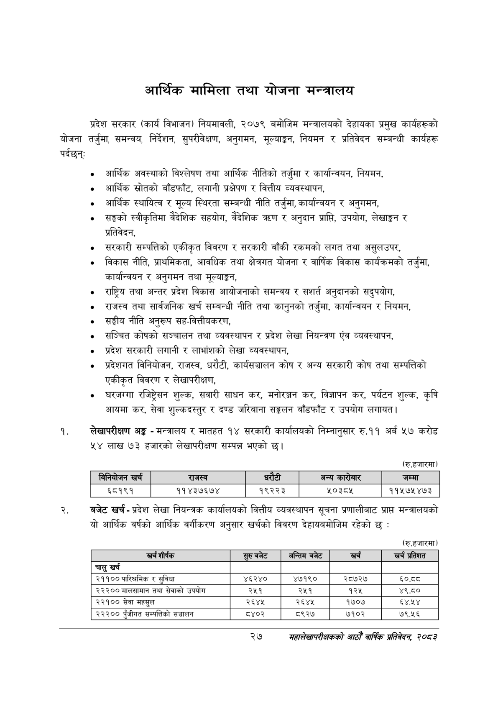

# Page 49 QA

## Rendered page


## Extracted text

```text
आर्थिक मामिला तथा योजना मन्त्रालय
प्रदेश सरकार (कार्य विभाजन) नियमावली, २०७९ बमोजिम मन्त्रालयको देहायका प्रमुख कार्यहरूको योजना तर्जुमा, समन्वय, निर्देशन, सुपरीवेक्षण, अनुगमन, मूल्याङ्कन, नियमन र प्रतिवेदन सम्बन्धी कार्यहरू पर्दछन्‌:
० आर्थिक अवस्थाको विश्लेषण तथा आर्थिक नीतिको तर्जुमा र कार्यान्वयन, नियमन,
० आर्थिक स्रोतको बाँडफाँट, लगानी प्रक्षेपण र वित्तीय व्यवस्थापन,
"० आर्थिक स्थायित्व र मूल्य स्थिरता सम्बन्धी नीति तर्जुमा, कार्यान्वयन र अनुगमन,
० सङ्घको स्वीकृतिमा वैदेशिक सहयोग, वैदेशिक त्रण र अनुदान प्राप्ति, उपयोग, लेखाङ्गन र प्रतिवेदन,
सरकारी सम्पत्तिको एकीकृत विवरण र सरकारी बाँकी रकमको लगत तथा असुलउपर,
विकास नीति, प्राथमिकता, आवधिक तथा क्षेत्रगत योजना र वार्षिक विकास कार्यक्रमको तर्जुमा, कार्यान्वयन र अनुगमन तथा मूल्याङ्कन,
० राष्ट्रिय तथा अन्तर प्रदेश विकास आयोजनाको समन्वय र सशर्त अनुदानको सदुपयोग,
० राजस्व तथा सार्वजनिक खर्च सम्बन्धी नीति तथा कानुनको तर्जुमा, कार्यान्वयन र नियमन,
० सङ्घीय नीति अनुरूप सह-वित्तीयकरण,
«० सञ्चित कोषको सञ्चालन तथा व्यवस्थापन र प्रदेश लेखा नियन्त्रण एंव व्यवस्थापन,
«० प्रदेश सरकारी लगानी र लाभांशको लेखा व्यवस्थापन,
० प्रदेशगत विनियोजन, राजस्व, धरौटी, कार्यसञ्चालन कोष र अन्य सरकारी कोष तथा सम्पत्तिको एकीकृत विवरण र लेखापरीक्षण,
० घरजग्गा रजिष्ट्रेसन शुल्क, सवारी साधन कर, मनोरञ्जन कर, विज्ञापन कर, पर्यटन शुल्क, कृषि आयमा कर, सेवा शुल्कदस्तुर र दण्ड जरिबाना सङ्कलन बाँडफाँट र उपयोग लगायत |
लेखापरीक्षण अङ्ग -मन्त्रालय र मातहत १४ सरकारी कार्यालयको निम्नानुसार रु.११ अर्ब ५७ करोड ५४ लाख ७३ हजारको लेखापरीक्षण सम्पन्न भएको छ।
(रु.हजारमा)
बजेट खर्च -प्रदेश लेखा नियन्त्रक कार्यालयको वित्तीय व्यवस्थापन सूचना प्रणालीबाट प्राप्त मन्त्रालयको यो आर्थिक वर्षको आर्थिक वर्गीकरण अनुसार खर्चको विवरण देहायबमोजिम रहेको छ:
(रु.हजारमा)
२७
सहालेखापरीक्षकको आठौँ वाषिकि प्रतिवेदन २०८२

| िनिवोजन खर्च | राजस्व |  |  | अन्य कारोबार | जम्मा |
| --- | --- | --- | --- | --- | --- |
| ६८१९१ | ११४३७६७४ | १९२२३ |  | २०३८४५ | ११४५७५४७३ |

| खर्च शीर्षक | बजेट | अन्तिम बजेट | खर्च | खर्च प्रतिशत |
| --- | --- | --- | --- | --- |
| चालु खर्च |  |  |  |  |
| २११०० पारिश्रमिक र सुविधा | ४६२४० | ४७१९० | २८७२७ | ६०.दद |
| २२२०० तथा सेवाको उपयोग | २५१ | २५१ | १२४५ | ४९.८० |
| २२१०० सेवा महसुल | २६४५ | २६४५ | १७०७ | ६४,४५४ |
| २३०० पुँजीगत सम्पत्तिको सञ्चालन | ८४०२ | ८९२७ | ७१०२ | ७९.५६ |
```

## Flags
- table_page
- medium_quality_table
