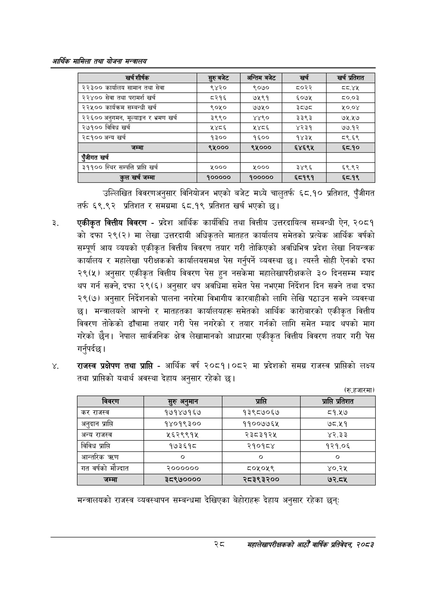

# Page 50 QA

## Rendered page


## Extracted text

```text
आर्थिक मामिला तथा योजना सन्वालय
उल्लिखित विवरणअनुसार विनियोजन भएको बजेट मध्ये चालुतर्फ ६८.१० प्रतिशत, पुँजीगत तर्फ ६९.९२ प्रतिशत र समग्रमा ६८.१९ प्रतिशत खर्च भएको छ।
एकीकृत वित्तीय विवरण -प्रदेश आर्थिक कार्यविधि तथा वित्तीय उत्तरदायित्व सम्बन्धी ऐन, २०८१ को दफा २९(२) मा लेखा उत्तरदायी अधिकृतले मातहत कार्यालय समेतको प्रत्येक आर्थिक वर्षको सम्पूर्ण आय व्ययको एकीकृत वित्तीय विवरण तयार गरी तोकिएको अवधिभित्र प्रदेश लेखा नियन्त्रक कार्यालय र महालेखा परीक्षकको कार्यालयसमक्ष पेस गर्नुपर्ने व्यवस्था छ। त्यस्तै सोही ऐनको दफा २९(५) अनुसार एकीकृत वित्तीय विवरण पेस हुन नसकेमा महालेखापरीक्षकले ३० दिनसम्म म्याद थप गर्न सक्ने, दफा २९(६) अनुसार थप अवधिमा समेत पेस नभएमा निर्देशन दिन सक्ने तथा दफा २९(७) अनुसार निर्देशनको पालना नगरेमा विभागीय कारबाहीको लागि लेखि पठाउन सक्ने व्यवस्था छ। मन्त्रालयले आफ्नो र मातहतका कार्यालयहरू समेतको आर्थिक कारोबारको एकीकृत वित्तीय विवरण तोकेको ढाँचामा तयार गरी पेस नगरेको र तयार गर्नको लागि समेत म्याद थपको माग गरेको छैन। नेपाल सार्वजनिक क्षेत्र लेखामानको आधारमा एकीकृत वित्तीय विवरण तयार गरी पेस गर्नुपर्दछ |
राजस्व प्रक्षेपण तथा प्राप्ति -आर्थिक वर्ष २०८१।०८२ मा प्रदेशको समग्र राजस्व प्राप्तिको लक्ष्य तथा प्राप्तिको यथार्थ अवस्था देहाय अनुसार रहेको |
(रु.हजारमा)
मन्त्रालयको राजस्व व्यवस्थापन सम्बन्धमा देखिएका बेहोराहरू देहाय अनुसार रहेका छन्‌ः
सर्ट
सहालेखापरीक्षकको आठौँ वाषिकि प्रतिवेदन २०८२

| खर्च शीर्षक | सुरु बजेट | अन्तिम बजेट | खर्च | खर्च प्रतिशत |
| --- | --- | --- | --- | --- |
| २२३०० कार्ालष सामान तथा सेवा | ९४२० | ९०७० | ८०२२ |  |
| २२४०० सेवा तथा परामर्श खर्च | ५२१६ | ७५९१ | ६०७५ | ८०.०३ |
| २२५०० कार्यक्रम सम्बन्धी खर्च | ९०५० | ७७५० | ३८७८ | ५०.०४ |
| २२६०० अनुगमन, मूल्याङ्कन र भ्रमण खर्च | ३९९० | ४४९० | ३३९३ | ७५.२७ |
| २७१०० विविध खर्च | ५४८६ | ५४८६ | ४२३१ | ७७.१२ |
| २८१०० अन्य खर्च | १३०० | १६०० | १४३४ | ८९.६९ |
| जम्मा | ९५००० | ९४५००० | ६४६९५ | ६८.१० |
| पुँजीगत खर्च |  |  |  |  |
| ३११०० स्थिर सम्पत्ति प्राप्ति खर्च | ५००० | ५००० | ३४९६ | ६९.९२ |
| कुल खर्च जम्मा | १००००० | १००००० | ६८१९१ | ६८.१९ |

| विवरण | सुरु अनुमान | प्राप्ति | प्राप्ति प्रतेशत |
| --- | --- | --- | --- |
| कर राजस्व | १७१४७१६७ | १३९८७०६७ |  |
| अनुदान प्राप्ति | १४०१९३०० | ११००७७६५ | ७८.५१ |
| अन्य राजस्व | २५६२९९१५ | २३८३१२५ | ४२.३३ |
| विविध प्राप्ति | १७३६१८ | २१०१८४ | १२१.०६ |
| आन्तरिक |  | ० | ० |
| गत वर्षको मौज्दात | २०००००० | ८०५०५९ | ०.३% |
| जम्मा | ३८९७०००० | २८३९३२०० | ७२.८५ |
```

## Flags
- table_page
- medium_quality_table
