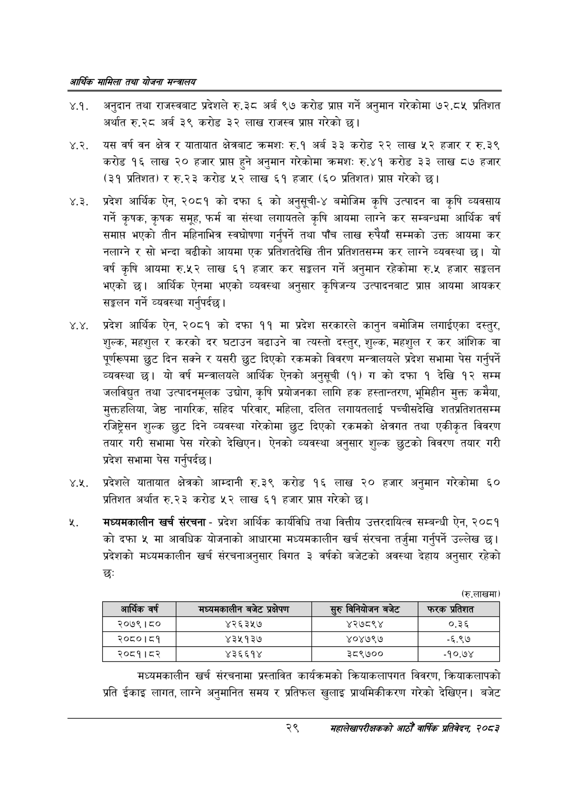

# Page 51 QA

## Rendered page


## Extracted text

```text
आर्थिक मामिला तथा योजना सन्वालय
४.१. अनुदान तथा राजस्वबाट प्रदेशले रु.३८ अर्ब ९७ करोड प्राप्त गर्ने अनुमान गरेकोमा ७२.८५ प्रतिशत अर्थात रु.२८ अर्ब ३९ करोड ३२ लाख राजस्व प्राप्त गरेको |
४.२. यस वर्ष वन क्षेत्र र यातायात क्षेत्रबाट क्रमश: रु.१ अर्ब ३३ करोड लाख ५२ हजार र रु.३९ करोड १६ लाख २० हजार प्राप्त हुने अनुमान गरेकोमा क्रमशः रु.४१ करोड ३३ लाख ८७ हजार (३९ प्रतिशत) र रु.२३ करोड लाख ६१ हजार (६० प्रतिशत) प्रापत गरेको छ।
४.३. प्रदेश आर्थिक ऐन, २०८१ को दफा को अनुसूची-४ बमोजिम कृषि उत्पादन वा कृषि व्यवसाय गर्ने कृषक, कृषक समूह, फर्म वा संस्था लगायतले कृषि आयमा लाग्ने कर सम्बन्धमा आर्थिक वर्ष समाप्त भएको तीन महिनाभित्र स्वघोषणा गर्नुपर्ने तथा पाँच लाख रुपैयाँ सम्मको उक्त आयमा कर नलाग्ने र सो भन्दा बढीको आयमा एक प्रतिशतदेखि तीन प्रतिशतसम्म कर लाग्ने व्यवस्था छ। यो वर्ष कृषि आयमा रु.५२ लाख ६१ हजार कर सङ्कलन गर्ने अनुमान रहेकोमा रु.५ हजार सङ्कलन भएको छ। आर्थिक ऐनमा भएको व्यवस्था अनुसार कृषिजन्य उत्पादनबाट प्राप्त आयमा आयकर सङ्कलन गर्ने व्यवस्था गर्नुपर्दछ |
४.४. प्रदेश आर्थिक ऐन, २०८१ को दफा ११ मा प्रदेश सरकारले कानुन बमोजिम लगाईएका दस्तुर, शुल्क, महशुल र करको दर घटाउन बढाउने वा त्यस्तो दस्तुर, शुल्क, महशुल र कर आंशिक वा पूर्णरूपमा छुट दिन सक्ने र यसरी छुट दिएको रकमको विवरण मन्त्रालयले प्रदेश सभामा पेस गर्नुपर्ने व्यवस्था छ। यो वर्ष मन्त्रालयले आर्थिक ऐनको अनुसूची (१) ग को दफा १ देखि १२ सम्म जलविद्युत तथा उत्पादनमूलक उद्योग, कृषि प्रयोजनका लागि हक हस्तान्तरण, भूमिहीन मुक्त कमैया, मुक्तहलिया, जेष्ठ नागरिक, सहिद परिवार, महिला, दलित लगायतलाई पच्चीसदेखि शतप्रतिशतसम्म रजिष्ट्रेसन शुल्क छुट दिने व्यवस्था गरेकोमा छुट दिएको रकमको क्षेत्रगत तथा एकीकृत विवरण तयार गरी सभामा पेस गरेको देखिएन। ऐनको व्यवस्था अनुसार शुल्क छुटको विवरण तयार गरी प्रदेश सभामा पेस गर्नुपर्दछ।
४.२. प्रदेशले यातायात क्षेत्रको आम्दानी रु.३९ करोड १६ लाख २० हजार अनुमान गरेकोमा ६० प्रतिशत अर्थात रु.२३ करोड २२ लाख ६१ हजार प्राप्त गरेको छ।
मध्यमकालीन खर्च संरचना -प्रदेश आर्थिक कार्यविधि तथा वित्तीय उत्तरदायित्व सम्बन्धी ऐन, २०८१ को दफा ५ मा आवधिक योजनाको आधारमा मध्यमकालीन खर्च संरचना तर्जुमा गर्नुपर्ने उल्लेख | प्रदेशको मध्यमकालीन खर्च संरचनाअनुसार विगत ३ वर्षको बजेटको अवस्था देहाय अनुसार रहेको छः
(रु.लाखमा)
मध्यमकालीन खर्च संरचनामा प्रस्तावित कार्यक्रमको क्रियाकलापगत विवरण, क्रियाकलापको प्रति ईकाइ लागत, लाग्ने अनुमानित समय र प्रतिफल खुलाइ प्राथमिकीकरण गरेको देखिएन। बजेट
२९
सहालेखापरीक्षकको आठौँ वाषिकि प्रतिवेदन २०८२

| आर्थिक वर्ष | मध्यनकालीन बजेट प्रक्षेपण | सुरु विनिबाजन बजेट | फरक प्रतिशत |
| --- | --- | --- | --- |
| २०७९।८० | ४२६३५७ | ४२७८९४ | ०.३६ |
| २०८०।८१ | ४३२१३७ | ४०४७९७ | -६.९७ |
| २०८१।८२ | ४३६६१४ | ३८९७०० | -१०.७४ |
```

## Flags
- table_page
- medium_quality_table
