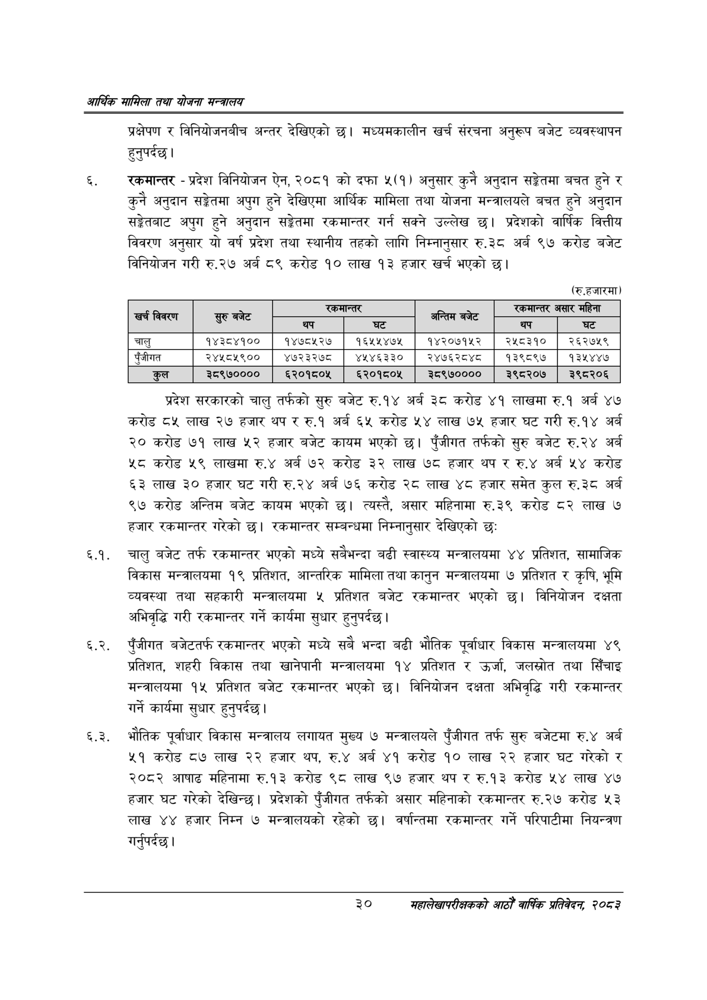

# Page 52 QA

## Rendered page


## Extracted text

```text
आर्थिक मामिला तथा योजना सन्वालय
प्रक्षेपण र विनियोजनबीच अन्तर देखिएको छ। मध्यमकालीन खर्च संरचना अनुरूप बजेट व्यवस्थापन हुनुपर्दछ |
रकमान्तर -प्रदेश विनियोजन ऐन, २०८१ को दफा ५(१) अनुसार कुनै अनुदान सङ्गेतमा बचत हुने र कुनै अनुदान सङ्गेतमा अपुग हुने देखिएमा आर्थिक मामिला तथा योजना मन्त्रालयले बचत हुने अनुदान सङ्केतबाट अपुग हुने अनुदान सङ्गेतमा रकमान्तर गर्न सक्ने उल्लेख | प्रदेशको वार्षिक वित्तीय विवरण अनुसार यो वर्ष प्रदेश तथा स्थानीय तहको लागि निम्नानुसार रु.३८ अर्ब ९७ करोड बजेट विनियोजन गरी रु.२७ अर्ब ८९ करोड १० लाख १३ हजार खर्च भएको छ।
(रु.हजारमा)
प्रदेश सरकारको चालु तर्फको सुरु बजेट रु.१४ अर्ब ३८ करोड ४१ लाखमा रु.१ अर्ब ४७ करोड ८५ लाख २७ हजार थप र रु.१ अर्ब ६५ करोड ५४ लाख ७५ हजार घट गरी रु.१४ अर्ब २० करोड ७१ लाख ५२ हजार बजेट कायम भएको छ। पुँजीगत तर्फको सुरु बजेट रु.२४ अर्ब करोड ५९ लाखमा रु.४ अर्ब ७२ करोड ३ लाख ७८ हजार थप र रु.४ अर्ब ५४ करोड ६३ लाख ३० हजार घट गरी रु.२४ अर्ब ७६ करोड २८ लाख ४८ हजार समेत कुल रु.३८ अर्ब ९७ करोड अन्तिम बजेट कायम भएको छ। त्यस्तै, असार महिनामा रु.३९ करोड ८२ लाख ७ हजार रकमान्तर गरेको | रकमान्तर सम्बन्धमा निम्नानुसार देखिएको छः
६.१. चालु बजेट तर्फ रकमान्तर भएको मध्ये सबैभन्दा बढी स्वास्थ्य मन्त्रालयमा ४४ प्रतिशत, सामाजिक विकास मन्त्रालयमा १९ प्रतिशत, आन्तरिक मामिला तथा कानुन मन्त्रालयमा ७ प्रतिशत र कृषि, भूमि व्यवस्था तथा सहकारी मन्त्रालयमा ५ प्रतिशत बजेट रकमान्तर भएको छ। विनियोजन दक्षता अभिवृद्धि गरी रकमान्तर गर्ने कार्यमा सुधार हुनुपर्दछ |
६.२. पुँजीगत बजेटतर्फ रकमान्तर भएको मध्ये सबै भन्दा बढी भौतिक पूर्वाधार विकास मन्त्रालयमा ४९ प्रतिशत, शहरी विकास तथा खानेपानी मन्त्रालयमा १४ प्रतिशत र उर्जा, जलस्रोत तथा सिँचाइ मन्त्रालयमा १५ प्रतिशत बजेट रकमान्तर भएको छ। विनियोजन दक्षता अभिवृद्धि गरी रकमान्तर गर्ने कार्यमा सुधार हुनुपर्दछ |
६.३. भौतिक पूर्वाधार विकास मन्त्रालय लगायत मुख्य ७ मन्त्रालयले पुँजीगत तर्फ सुरु बजेटमा रु.४ अर्ब ४१ करोड ८७ लाख २२ हजार थप, रु.४ अर्ब ४१ करोड १० लाख २२ हजार घट गरेको र २०८२ आषाढ महिनामा रु.१३ करोड ९८ लाख ९७ हजार थप र रु.१३ करोड ५४ लाख ४७ हजार घट गरेको देखिन्छ। प्रदेशको पुँजीगत तर्फको असार महिनाको रकमान्तर रु.२७ करोड ५३ लाख ४४ हजार निम्न ७ मन्त्रालयको रहेको छ। वर्षान्तमा रकमान्तर गर्ने परिपाटीमा नियन्त्रण गर्नुपर्दछ |
३०
सहालेखापरीक्षकको आठौँ वाषिकि प्रतिवेदन २०८२

| खर्च विवरण | बनेट |  |  | अन्तिम बजेट | २००००९ | असार महिना |
| --- | --- | --- | --- | --- | --- | --- |
|  | सुरु | थप | घट |  | थप | घट |
| चालु | १४३८४१०० | १४७८५२७ | १६५५४७५ | १४२०७१५२ | र२४५८३१० | २६२७५९ |
| पुँजीगत | २४५८१९०० | ४७२३२७८ | ४५४६३३० | २४७६२८४८ | १३९८९७ | १३५४४७ |
| कुल | ३८९७०००० | ६२०१८०५ | ६२०१८०५ | ३८९७०००० | ३९८२०७ | ३९८२०६ |
```

## Flags
- table_page
- medium_quality_table
