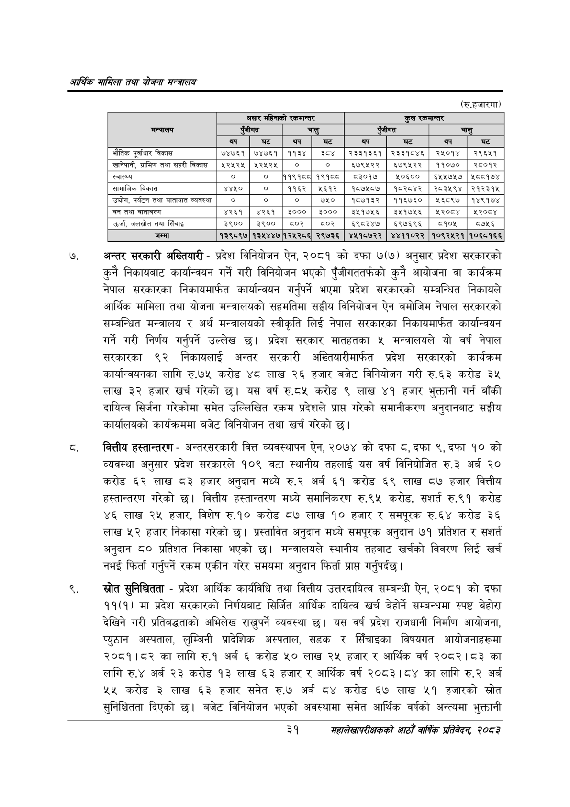

# Page 53 QA

## Rendered page


## Extracted text

```text
आर्थिक मामिला तथा योजना सन्वालय
(रु.हजारमा)
अन्तर सरकारी अख्तियारी -प्रदेश विनियोजन ऐन, २०८१ को दफा ७(७) अनुसार प्रदेश सरकारको कुनै निकायबाट कार्यान्वयन गर्ने गरी विनियोजन भएको पुँजीगततर्फको कुनै आयोजना वा कार्यक्रम नेपाल सरकारका निकायमार्फत कार्यान्वयन गर्नुपर्ने भएमा प्रदेश सरकारको सम्बन्धित निकायले आर्थिक मामिला तथा योजना मन्त्रालयको सहमतिमा सङ्घीय विनियोजन ऐन बमोजिम नेपाल सरकारको सम्बन्धित मन्त्रालय र अर्थ मन्त्रालयको स्वीकृति लिई नेपाल सरकारका निकायमार्फत कार्यान्वयन गर्ने गरी निर्णय गर्नुपर्ने उल्लेख छ। प्रदेश सरकार मातहतका ५ मन्त्रालयले यो वर्ष नेपाल सरकारका ९२ निकायलाई अन्तर सरकारी अख्तियारीमार्फत प्रदेश सरकारको कार्यक्रम कार्यान्वयनका लागि रु.७५ करोड ४८ लाख २६ हजार बजेट विनियोजन गरी रु.६३ करोड ३४ लाख ३२ हजार खर्च गरेको छ। यस वर्ष रु.८५ करोड ९ लाख ४१ हजार भुक्तानी गर्न बाँकी दायित्व सिर्जना गरेकोमा समेत उल्लिखित रकम प्रदेशले प्राप्त गरेको समानीकरण अनुदानबाट सङ्घीय कार्यालयको कार्यक्रममा बजेट विनियोजन तथा खर्च गरेको |
वित्तीय हस्तान्तरण -अन्तरसरकारी वित्त व्यवस्थापन ऐन, २०७४ को दफा , दफा ९, दफा १० को व्यवस्था अनुसार प्रदेश सरकारले १०९ वटा स्थानीय तहलाई यस वर्ष विनियोजित रु.३ अर्ब २० करोड ६२ लाख ८३ हजार अनुदान मध्ये रु.२ अर्ब ६१ करोड ६९ लाख ८७ हजार वित्तीय हस्तान्तरण गरेको छ। वित्तीय हस्तान्तरण मध्ये समानिकरण रु.९५ करोड, रु.९१ करोड ४६ लाख २५ हजार, विशेष रु.१० करोड ८७ लाख १० हजार र समपूरक रु.६४ करोड ३६ लाख ५२ हजार निकासा गरेको छ। प्रस्तावित अनुदान मध्ये समपूरक अनुदान ७१ प्रतिशत र सशर्त अनुदान ८० प्रतिशत निकासा भएको छ। मन्त्रालयले स्थानीय तहबाट खर्चको विवरण लिई खर्च नभई फिर्ता गर्नुपर्ने रकम एकीन गरेर समयमा अनुदान फिर्ता प्राप्त गर्नुपर्दछ।
स्रोत सुनिश्चितता -प्रदेश आर्थिक कार्यविधि तथा वित्तीय उत्तरदायित्व सम्बन्धी ऐन, २०८१ को दफा ११(१) मा प्रदेश सरकारको निर्णयबाट सिर्जित आर्थिक दायित्व खर्च बेहोर्ने सम्बन्धमा स्पष्ट बेहोरा देखिने गरी प्रतिबद्धताको अभिलेख राख्नुपर्ने व्यवस्था छ। यस वर्ष प्रदेश राजधानी निर्माण आयोजना, प्युठान अस्पताल, लुम्बिनी प्रादेशिक अस्पताल, सडक र सिँचाइका विषयगत आयोजनाहरूमा २०८१।८२ का लागि रु.१ अर्ब करोड लाख २५ हजार र आर्थिक वर्ष २०८२।८३ का लागि रु.४ अर्ब २३ करोड १३ लाख ६३ हजार र आर्थिक वर्ष २०८३।८४ का लागि रु.२ अर्ब ५५ करोड ३ लाख ६३ हजार समेत रु.७ अर्ब ८४ करोड ६७ लाख ५१ हजारको स्रोत सुनिश्चितता दिएको छ। बजेट विनियोजन भएको अवस्थामा समेत आर्थिक वर्षको अन्त्यमा भुक्तानी
३१
सहालेखापरीक्षकको आठौँ वाषिकि प्रतिवेदन २०८२

|  |  | असार महिनाको | ₹क:भान्तर, |  |  | कुल | स्कनान्तर, |  |
| --- | --- | --- | --- | --- | --- | --- | --- | --- |
| मन्त्रालय |  | रजीगत |  | चालु |  | जीगत |  | चालु |
|  |  | घट | बप | घट | बप | घट |  | घट |
| भौतिक पूर्वाधार विकास | ७४७६१ | ७४७६१ | ११३४ | इेड४ | २३३१३६१ | २३३१८४६ | २५०१४ | २९६४५१ |
| खानेपानी, ग्रामिण तथा सहरी विकास | ५२५२५ | ५२५२५ | ० | ० | ६७९५२२ | ६७९५२२ | ११०७० | २८०१२ |
| स्वास्थ्य | ० | ० | ११९१८८ | १९१८ | ३०१७ | १४०६०० | ६५५७५७ | १८८१७४ |
| सामाजिक विकास | ४४५० | ० | ११६२ | ५६१२ | १८७५८७ | १८२८४२ | २८३५९४ | २१२३१४५ |
| उद्योग, पर्यटन तथा यातायात व्यवस्था | ० | ० | ० | ७५० | १८७१३२ | ११६७६० | १६८९७ | १४९१७४ |
| बन तथा वातावरण | ४२६१ | ४२६१ | ३००० | ३००० | ३४५१७५६ | ३५१७५१६ | २०८४ | २०८४ |
| उर्जा, जलस्रोत तथा सिँचाइ | ३९०० | ३९०० | ५०२ | ५०२ | ६९८३४७ | ६९७६९६५ | ०१०५ | ८७५६ |
| जम्मा | १३९८९७ | १३५४४७१२५२८६ |  | २९७३६ | ४५१८७२२ | ४४११०२२ | १०९२५२१ | १०६८१६६ |
```

## Flags
- table_page
- medium_quality_table
