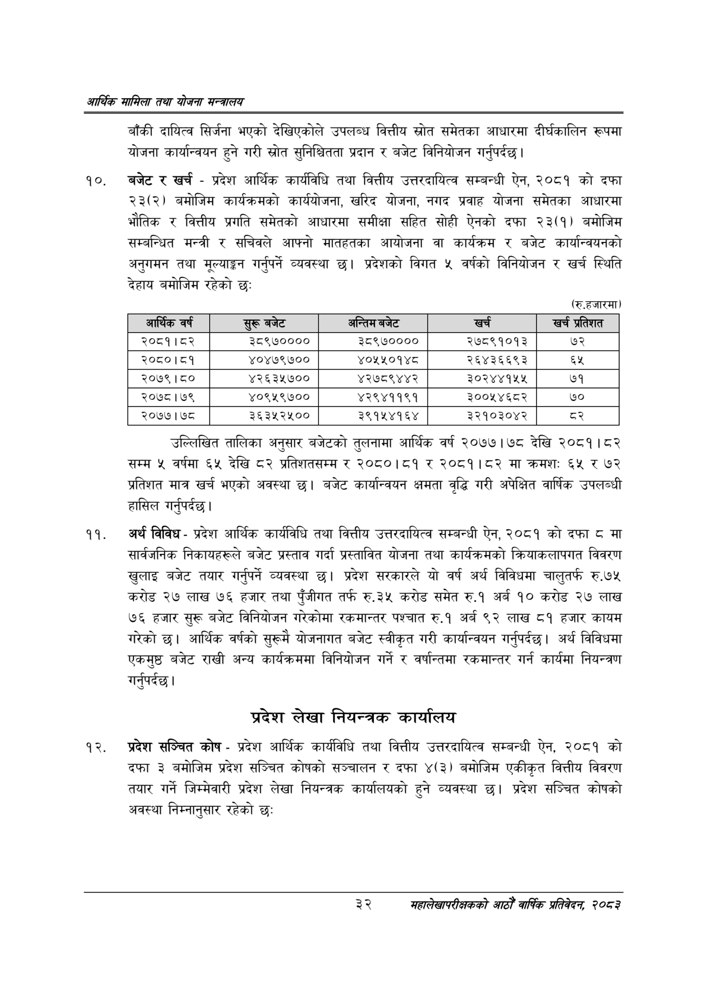

# Page 54 QA

## Rendered page


## Extracted text

```text
आर्थिक मामिला तथा योजना सन्वालय
बाँकी दायित्व सिर्जना भएको देखिएकोले उपलब्ध वित्तीय स्रोत समेतका आधारमा दीर्घकालिन रूपमा योजना कार्यान्वयन हुने गरी स्रोत सुनिश्चितता प्रदान र बजेट विनियोजन गर्नुपर्दछ |
बजेट र खर्च -प्रदेश आर्थिक कार्यविधि तथा वित्तीय उत्तरदायित्व सम्बन्धी ऐन, २०८१ को दफा २३(२) बमोजिम कार्यक्रमको कार्ययोजना, खरिद योजना, नगद प्रवाह योजना समेतका आधारमा भौतिक र वित्तीय प्रगति समेतको आधारमा समीक्षा सहित सोही ऐनको दफा २३(१) बमोजिम सम्बन्धित मन्त्री र सचिवले आफ्नो मातहतका आयोजना वा कार्यक्रम र बजेट कार्यान्वयनको अनुगमन तथा मूल्याङ्कन गर्नुपर्ने व्यवस्था छ। प्रदेशको विगत ५ वर्षको विनियोजन र खर्च स्थिति देहाय बमोजिम रहेको छः
(रु.हजारमा)
उल्लिखित तालिका अनुसार बजेटको तुलनामा आर्थिक वर्ष २०७७। ७८ देखि २०८१।८२ सम्म ५ वर्षमा ६५ देखि ८२ प्रतिशतसम्म र २०८०।८१ र २०८१।८२ मा क्रमशः ६५ र ७२ प्रतिशत मात्र खर्च भएको अवस्था छ। बजेट कार्यान्वयन क्षमता वृद्धि गरी अपेक्षित वार्षिक उपलब्धी हासिल गर्नुपर्दछ |
अर्थ विविध -प्रदेश आर्थिक कार्यविधि तथा वित्तीय उत्तरदायित्व सम्बन्धी ऐन, २०८१ को दफा ८ मा सार्वजनिक निकायहरूले बजेट प्रस्ताव गर्दा प्रस्तावित योजना तथा कार्यक्रमको क्रियाकलापगत विवरण खुलाइ बजेट तयार गर्नुपर्ने व्यवस्था छ। प्रदेश सरकारले यो वर्ष अर्थ विविधमा चालुतर्फ रु.७५ करोड २७ लाख ७६ हजार तथा पुँजीगत तर्फ रु.३५ करोड समेत रु.१ अर्ब १० करोड २७ लाख ७६ हजार सुरू बजेट विनियोजन गरेकोमा रकमान्तर पश्चात रु.१ अर्ब ९२ लाख ८१ हजार कायम गरेको छ। आर्थिक वर्षको सुरूमै योजनागत बजेट स्वीकृत गरी कार्यान्वयन गर्नुपर्दछ। अर्थ विविधमा एकमुष्ठ बजेट राखी अन्य कार्यक्रममा विनियोजन गर्ने र वर्षान्तमा रकमान्तर गर्न कार्यमा नियन्त्रण गर्नुपर्दछ |
प्रदेश लेखा नियन्त्रक कार्यालय
प्रदेश सञ्चित कोष -प्रदेश आर्थिक कार्यविधि तथा वित्तीय उत्तरदायित्व सम्बन्धी ऐन, २०८१ को दफा ३ बमोजिम प्रदेश सञ्चित कोषको सञ्चालन र दफा ४(३) बमोजिम एकीकृत वित्तीय विवरण तयार गर्ने जिम्मेवारी प्रदेश लेखा नियन्त्रक कार्यालयको हुने व्यवस्था छ। प्रदेश सञ्चित कोषको अवस्था निम्नानुसार रहेको छ:
३२
सहालेखापरीक्षकको आठौँ वाषिकि प्रतिवेदन २०८२

| आर्थिक वर्ष | सुरू बजेट | अन्तिम बजेट | खर्च | खच प्रतिशत |
| --- | --- | --- | --- | --- |
| २०८१।८२ | ३८९७०००० | ३८९७०००० | २७८९१०१३ | ७२ |
| २०८०।८१ | ४०४७९७०० | ४०५५०१४८ | २६४३६६९३ | ६५ |
| २०७९।८० | ४२६३५७०० | ४२७८९४४२ | ३०२४४१५५ | ७१ |
| २०७८।७९ | ४०९५९७०० | ४२९४११९१ | ३००५४६८२ | ७० |
| २०७७।७८ | ३६३५२५०० | ३९१५४१६४ | ३२१०३०४२ |  |
```

## Flags
- table_page
- medium_quality_table
