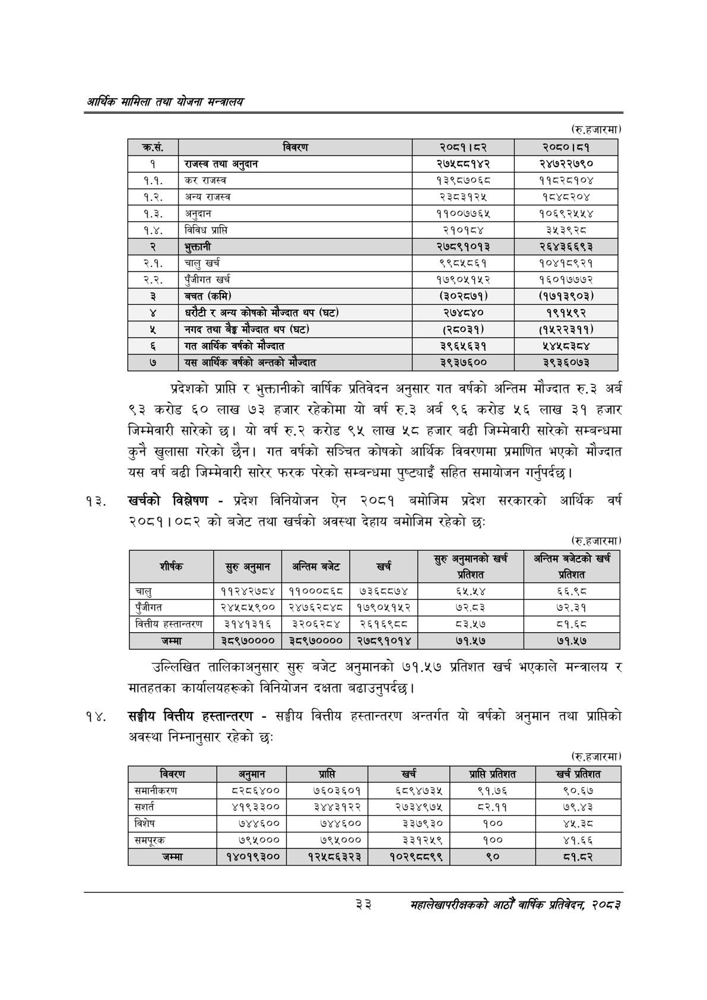

# Page 55 QA

## Rendered page


## Extracted text

```text
आर्थिक मामिला तथा योजना सन्वालय
(रु.हजारमा)
प्रदेशको प्राप्ति र भुक्तानीको वार्षिक प्रतिवेदन अनुसार गत वर्षको अन्तिम मौज्दात रु.३ अर्ब ९३ करोड ६० लाख ७३ हजार रहेकोमा यो वर्ष रु.३ अर्ब ९६ करोड ५६ लाख ३१ हजार जिम्मेवारी सारेको छ। यो वर्ष रु.२ करोड ९५ लाख ५८ हजार बढी जिम्मेवारी सारेको सम्बन्धमा कुनै खुलासा गरेको छैन। गत वर्षको सञ्चित कोषको आर्थिक विवरणमा प्रमाणित भएको मौज्दात यस वर्ष बढी जिम्मेवारी सारेर फरक परेको सम्बन्धमा पुष्ट्याइँ सहित समायोजन गर्नुपर्दछ |
खर्चको विश्लेषण -प्रदेश विनियोजन ऐन २०८१ बमोजिम प्रदेश सरकारको आर्थिक वर्ष २०८१।०८२ को बजेट तथा खर्चको अवस्था देहाय बमोजिम रहेको छः
(रु.हजारमा)
उल्लिखित तालिकाअनुसार सुरु बजेट अनुमानको ७१.५७ प्रतिशत खर्च भएकाले मन्त्रालय र मातहतका कार्यालयहरूको विनियोजन दक्षता बढाउनुपर्दछ।
सङ्घीय वित्तीय हस्तान्तरण -सङ्घीय वित्तीय हस्तान्तरण अन्तर्गत यो वर्षको अनुमान तथा प्राप्तिको अवस्था निम्नानुसार रहेको छः
(रु.हजारमा)
२२
सहालेखापरीक्षकको आठौँ वाषिकि प्रतिवेदन २०८२

| कस. | विवरण | २०८१।८२ | २०८०।८१ |
| --- | --- | --- | --- |
| १ | राजस्व तथा अनुदान | २७५८८१४२ | २४७२२७९० |
| १.१. | कर राजस्व | १३९८७०६८ | ११८२८१०४ |
| १.२. | अन्य राजस्व | २३८३१२५ | १८४८२०४ |
| १.३. | अनुदान | ११००७७६५ | १०६९२४५५४ |
| १.४. | विविध प्राप्ति | २१०१८४ | ३५३९२८ |
|  | भुक्तानी | २७८९१०१३ | २६४३६६९३ |
| २.१. | चालु खर्च | ९९८५८६१ | १०४१८९२१ |
| २.२. | पुँजीगत खर्च | १७९०५१५२ | १६०१७७७२ |
| ३ | बचत (कमि) | (३०२८७१) | (१७१३९०३) |
| ४ | धरौटी र अन्य कोषको मौज्दात थप (घट) | २७४८४० | १९१५९२ |
| ५ | नगद तथा बैङ्ग मौज्दात थप (घट) | (२८०३१) | (१५२२३११) |
| ६ | गत आर्थिक वर्षको मौज्दात | ३९६५६३१ | ५४४५८३८४ |
| ७ | यस आर्थिक वर्षको अन्तको मंज्दात | ३९३७६०० | ३९३६०७३ |

| शीर्षक | सुरु अनुमान | अन्तिम बजेट | खर्च | सुरु भनुनानको खर्च प्रतिशत | अन्तिम बजेटको खर्च प्रतिशत |
| --- | --- | --- | --- | --- | --- |
| चालु | ११२४२७८४ | ११०००८६८ | ७३६८८७४ | ६५.५४ | ६६.९८ |
| पुँजीगत | २४४५८५९०० | २४७६२८४८ | १७९०११५२ | ७२.८३ | ७२.३१ |
| वित्तीय हह्तान्तरण | ३१४१३१६ | ३२०६२८४ | २६१६९८८ | ८३.१७ | ८१.६८ |
| जम्मा | ३८९७०००० | ३८९७०००० | २७८९१०१४ | ७१.५७ | ७१.५७ |

| विवरण | अरमान | प्राप्ति | खर्च | प्राप्ति प्रतिशत | खर्च प्रतिशत |
| --- | --- | --- | --- | --- | --- |
| समानीकरण | ८२८६४०० | ७६०३६०१ | ६८९४७३५ | ९१.७६ | ९०.६७ |
| सशर्त | ४१९३३०० | ३४४३१२२ | २७३४९७४५ | ८२.११ | ७९.४३ |
| विशेष | ७४४६०० | ७४४६०० | ३३७९३० | १०० | ४५.३ठ |
| 'समपूरक | ७९५००० | ७९५००० | ३३१२५९ | १०० | ४१.६६ |
| जम्मा | १४०१९३०० | १२५८६३२३ | १०२९८८९९ | ९० | व१.८२ |
```

## Flags
- table_page
- medium_quality_table
