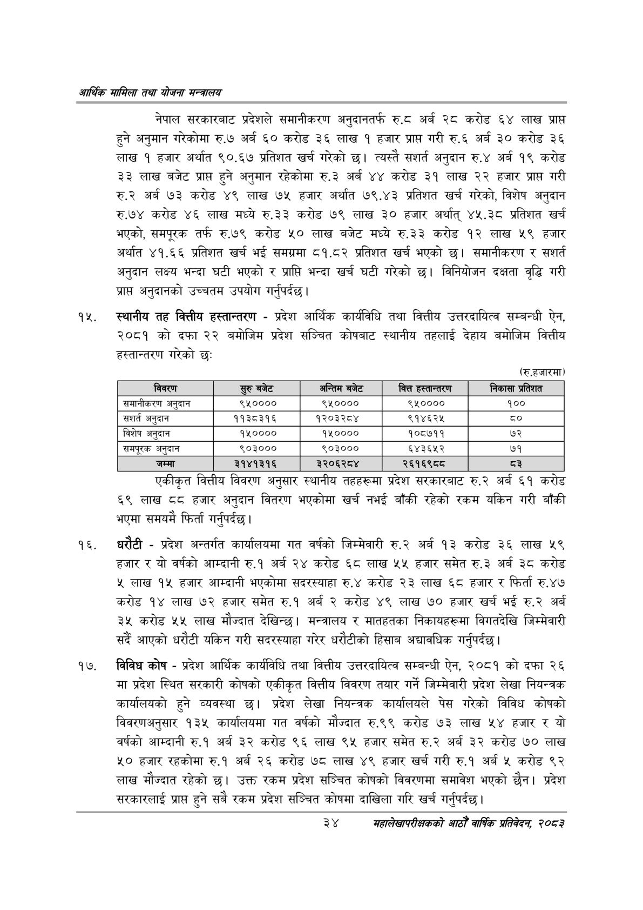

# Page 56 QA

## Rendered page


## Extracted text

```text
आर्थिक मामिला तथा योजना सन्वालय
नेपाल सरकारबाट प्रदेशले समानीकरण अनुदानतर्फ रु.८ अर्ब २८ करोड ६४ लाख प्राप्त हुने अनुमान गरेकोमा रु.७ अर्ब ६० करोड ३६ लाख १ हजार प्राप्त गरी रु.६ अर्ब ३० करोड ३६ लाख १ हजार अर्थात ९०.६७ प्रतिशत खर्च गरेको छ। त्यस्तै सशर्त अनुदान रु.४ अर्ब १९ करोड ३३ लाख बजेट प्राप्त हुने अनुमान रहेकोमा रु.३ अर्ब ४४ करोड ३१ लाख २२ हजार प्राप्त गरी रु.२ अर्ब ७३ करोड ४९ लाख ७५ हजार अर्थात ७९.४३ प्रतिशत खर्च गरेको, विशेष अनुदान रु.७४ करोड ४६ लाख मध्ये रु.३३ करोड ७९ लाख ३० हजार अर्थात्‌ ४५.३८ प्रतिशत खर्च भएको, समपूरक तर्फ रु.७९ करोड ५० लाख बजेट मध्ये रु.३३ करोड १२ लाख ५९ हजार अर्थात ४१.६६ प्रतिशत खर्च भई समग्रमा ८१.८२ प्रतिशत खर्च भएको छ। समानीकरण र अनुदान लक्ष्य भन्दा घटी भएको र प्राप्ति भन्दा खर्च घटी गरेको छ। विनियोजन दक्षता वृद्धि गरी प्रापत अनुदानको उच्चतम उपयोग गर्नुपर्दछ |
स्थानीय तह वित्तीय हस्तान्तरण -प्रदेश आर्थिक कार्यविधि तथा वित्तीय उत्तरदायित्व सम्बन्धी ऐन, २०८१ को दफा २२ बमोजिम प्रदेश सञ्चित कोषबाट स्थानीय तहलाई देहाय बमोजिम वित्तीय हस्तान्तरण गरेको छः
(रु.हजारमा)
एकीकृत वित्तीय विवरण अनुसार स्थानीय तहहरूमा प्रदेश सरकारबाट रु.२ अर्ब ६१ करोड ६९ लाख द८ हजार अनुदान वितरण भएकोमा खर्च नभई बाँकी रहेको रकम यकिन गरी बाँकी भएमा समयमै फिर्ता गर्नुपर्दछ |
धरौटी -प्रदेश अन्तर्गत कार्यालयमा गत वर्षको जिम्मेवारी रु.२ अर्ब १३ करोड ३६ लाख ५९ हजार र यो वर्षको आम्दानी रु.१ अर्ब २४ करोड ६८ लाख ५५ हजार समेत रु.३ अर्ब ३८ करोड ४ लाख १५ हजार आम्दानी भएकोमा सदरस्याहा रु.४ करोड २३ लाख ६८ हजार र फिर्ता रु.४७ करोड १४ लाख ७२ हजार समेत रु.१ अर्ब २ करोड ४९ लाख ७० हजार खर्च भई रु.२ अर्ब ३५ करोड ५५ लाख मौज्दात देखिन्छ। मन्त्रालय र मातहतका निकायहरूमा विगतदेखि जिम्मेवारी सर्दै आएको धरौटी यकिन गरी सदरस्याहा गरेर धरौटीको हिसाब अद्यावधिक गर्नुपर्दछ |
विविध कोष -प्रदेश आर्थिक कार्यविधि तथा वित्तीय उत्तरदायित्व सम्बन्धी ऐन, २०८१ को दफा २६ मा प्रदेश स्थित सरकारी कोषको एकीकृत वित्तीय विवरण तयार गर्ने जिम्मेवारी प्रदेश लेखा नियन्त्रक कार्यालयको हुने व्यवस्था छ। प्रदेश लेखा नियन्त्रक कार्यालयले पेस गरेको विविध कोषको विवरणअनुसार १३५ कार्यालयमा गत वर्षको मौज्दात रु.९९ करोड ७३ लाख ५४ हजार र यो वर्षको आम्दानी रु.१ अर्ब ३२ करोड ९६ लाख ९५ हजार समेत रु.२ अर्ब ३२ करोड ७० लाख ५० हजार रहकोमा रु.१ अर्ब २६ करोड ७८ लाख ४९ हजार खर्च गरी रु.१ अर्ब ५ करोड ९२ लाख मौज्दात रहेको छ। उक्त रकम प्रदेश सञ्चित कोषको विवरणमा समावेश भएको छैन। प्रदेश सरकारलाई प्राप्त हुने सबै रकम प्रदेश सञ्चित कोषमा दाखिला गरि खर्च गर्नुपर्दछ |
३४
सहालेखापरीक्षकको आठौँ वाषिकि प्रतिवेदन २०८२

| विवरण | रुरु बजेट | अन्तिम बजेट | वित्त हस्तान्तरण | निकासा प्रतिशत |
| --- | --- | --- | --- | --- |
| समानीकरण अनुदान | ९५०००० | ९५०००० | ९५०००० | १०० |
| संशर्त अनुदान | ११३८३१६ | १२०३२८४ | ९१४६२५ |  |
| विशेष अनुदान | १५०००० | १५०००० | १०८७११ | ७२ |
| समपूरक अनुदान | ९०३००० | ९०३००० | ६४३६४५२ | ७१ |
| जम्मा | २१४१३१६ | ३२०६२८४ | २६१६९८८ | ३ |
```

## Flags
- table_page
- medium_quality_table
