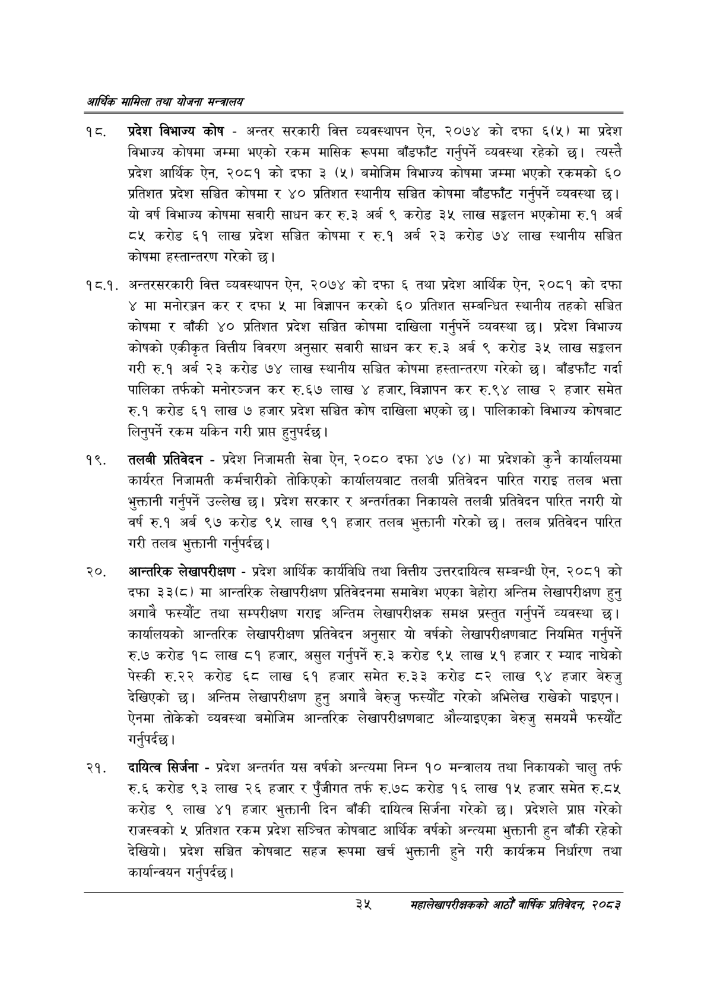

# Page 57 QA

## Rendered page


## Extracted text

```text
आर्थिक मामिला तथा योजना सन्वालय
प्रदेश विभाज्य कोष -अन्तर सरकारी वित्त व्यवस्थापन ऐन, २०७४ को दफा ६८५) मा प्रदेश विभाज्य कोषमा जम्मा भएको रकम मासिक रूपमा बाँडफाँट गर्नुपर्ने व्यवस्था रहेको छ। त्यस्तै प्रदेश आर्थिक ऐन, २०८१ को दफा ३ (५) बमोजिम विभाज्य कोषमा जम्मा भएको रकमको ६० प्रतिशत प्रदेश सञ्चित कोषमा र ४० प्रतिशत स्थानीय सञ्चित कोषमा बाँडफाँट गर्नुपर्ने व्यवस्था छ। यो वर्ष विभाज्य कोषमा सवारी साधन कर रु.३ अर्ब ९ करोड ३५ लाख सङ्गलन भएकोमा रु.१ अर्ब ८५ करोड ६१ लाख प्रदेश सञ्चित कोषमा र रु.१ अर्ब २३ करोड ७४ लाख स्थानीय सञ्चित कोषमा हस्तान्तरण गरेको छ।
१८.१. अन्तरसरकारी वित्त व्यवस्थापन ऐन, २०७४ को दफा ६ तथा प्रदेश आर्थिक ऐन, २०८१ को दफा ४ मा मनोरञ्जन कर र दफा मा विज्ञापन करको ६० प्रतिशत सम्बन्धित स्थानीय तहको सञ्चित कोषमा र बाँकी ४० प्रतिशत प्रदेश सञ्चित कोषमा दाखिला गर्नुपर्ने व्यवस्था छ। प्रदेश विभाज्य कोषको एकीकृत वित्तीय विवरण अनुसार सवारी साधन कर रु.३ अर्ब ९ करोड ३५ लाख सङ्कलन गरी रु.१ अर्ब २३ करोड ७४ लाख स्थानीय सञ्चित कोषमा हस्तान्तरण गरेको छ। बाँडफाँट गर्दा पालिका तर्फको मनोरञ्जन कर रु.६७ लाख ४ हजार, विज्ञापन कर रु.९४ लाख २ हजार समेत रु.१ करोड ६१ लाख ७ हजार प्रदेश सञ्चित कोष दाखिला भएको छ। पालिकाको विभाज्य कोषबाट लिनुपर्ने रकम यकिन गरी प्राप्त हुनुपर्दछ |
तलबी प्रतिवेदन -प्रदेश निजामती सेवा ऐन, २०८० दफा ४७ (४) मा प्रदेशको कुनै कार्यालयमा कार्यरत निजामती कर्मचारीको तोकिएको कार्यालयबाट तलबी प्रतिवेदन पारित गराइ तलब भत्ता भुक्तानी गर्नुपर्ने उल्लेख छ। प्रदेश सरकार र अन्तर्गतका निकायले तलबी प्रतिवेदन पारित नगरी यो वर्ष रु.१ अर्ब ९७ करोड ९५ लाख ९१ हजार तलव भुक्तानी गरेको छ। तलब प्रतिवेदन पारित गरी तलब भुक्तानी गर्नुपर्दछ |
२०, आन्तरिक लेखापरीक्षण -प्रदेश आर्थिक कार्यविधि तथा वित्तीय उत्तरदायित्व सम्बन्धी ऐन, २०८१ को दफा ३३(८) मा आन्तरिक लेखापरीक्षण प्रतिवेदनमा समावेश भएका बेहोरा अन्तिम लेखापरीक्षण हुन्‌ अगावै फस्यौट तथा सम्परीक्षण गराइ अन्तिम लेखापरीक्षक समक्ष प्रस्तुत गर्नुपर्ने व्यवस्था छ। कार्यालयको आन्तरिक लेखापरीक्षण प्रतिवेदन अनुसार यो वर्षको लेखापरीक्षणबाट नियमित गर्नुपर्ने रु.७ करोड १८ लाख ८१ हजार, असुल गर्नुपर्ने रु.३ करोड ९५ लाख ५१ हजार र म्याद नाघेको पेस्की रु.२२ करोड ६८ लाख ६१ हजार समेत रु.३३ करोड ८२ लाख ९४ हजार बेरुजु देखिएको छ। अन्तिम लेखापरीक्षण हुनु अगावै बेरुजु फस्यौट गरेको अभिलेख राखेको पाइएन। ऐनमा तोकेको व्यवस्था बमोजिम आन्तरिक लेखापरीक्षणबाट औल्याइएका बेरुजु समयमै फस्यौट गर्नुपर्दछ।
दायित्व सिर्जना -प्रदेश अन्तर्गत यस वर्षको अन्त्यमा निम्न १० मन्त्रालय तथा निकायको चालु तर्फ रु.६ करोड ९३ लाख २६ हजार र पुँजीगत तर्फ रु.७८ करोड १६ लाख १५ हजार समेत रु.ठ५ करोड ९ लाख ४१ हजार भुक्तानी दिन बाँकी दायित्व सिर्जना गरेको छ। प्रदेशले प्राप्त गरेको राजस्वको ५ प्रतिशत रकम प्रदेश सञ्चित कोषबाट आर्थिक वर्षको अन्त्यमा भुक्तानी हुन बाँकी रहेको देखियो। प्रदेश सञ्चित कोषबाट सहज रूपमा खर्च भुक्तानी हुने गरी कार्यक्रम निर्धारण तथा कार्यान्वयन गर्नुपर्दछ |
३५
सहालेखापरीक्षकको आठौँ वाषिकि प्रतिवेदन २०८२
```

## Flags
- None
