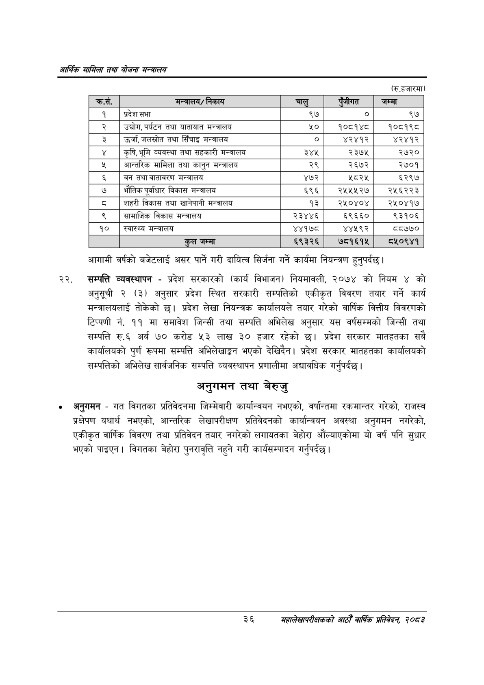

# Page 58 QA

## Rendered page


## Extracted text

```text
आर्थिक मामिला तथा योजना सन्वालय
(रु.हजारमा)
आगामी वर्षको बजेटलाई असर पार्ने गरी दायित्व सिर्जना गर्ने कार्यमा नियन्त्रण हुनुपर्दछ |
सम्पत्ति व्यवस्थापन -प्रदेश सरकारको (कार्य विभाजन) नियमावली, २०७४ को नियम ४ को अनुसूची २ (३) अनुसार प्रदेश स्थित सरकारी सम्पत्तिको एकीकृत विवरण तयार गर्ने कार्य मन्त्रालयलाई तोकेको छ। प्रदेश लेखा नियन्त्रक कार्यालयले तयार गरेको वार्षिक वित्तीय विवरणको टिप्पणी नं. ११ मा समावेश जिन्सी तथा सम्पत्ति अभिलेख अनुसार यस वर्षसम्मको जिन्सी तथा सम्पत्ति रु.६ अर्ब ७० करोड ५३ लाख ३० हजार रहेको छ। प्रदेश सरकार मातहतका सबै कार्यालयको पुर्ण रूपमा सम्पत्ति अभिलेखाङ्कगन भएको देखिदैन। प्रदेश सरकार मातहतका कार्यालयको सम्पत्तिको अभिलेख सार्वजनिक सम्पत्ति व्यवस्थापन प्रणालीमा अद्यावधिक गर्नुपर्दछ |
अनुगमन तथा बेरुजु
अनुगमन -गत विगतका प्रतिवेदनमा जिम्मेवारी कार्यान्वयन नभएको, वर्षान्तमा रकमान्तर गरेको, राजस्व प्रक्षेपण यथार्थ नभएको, आन्तरिक लेखापरीक्षण प्रतिवेदनको कार्यान्वयन अवस्था अनुगमन नगरेको, एकीकृत वार्षिक विवरण तथा प्रतिवेदन तयार नगरेको लगायतका बेहोरा औंल्याएकोमा यो वर्ष पनि सुधार भएको पाइएन। विगतका बेहोरा पुनरावृत्ति नहुने गरी कार्यसम्पादन गर्नुपर्दछ |
२६
सहालेखापरीक्षकको आठौँ वाषिकि प्रतिवेदन २०८२

| क्रस. | सन्नाल१/ निकाय |  | रजीगत | जम्मा |
| --- | --- | --- | --- | --- |
| १ | प्रदेशसभा | ९७ | ० | ९७ |
| २ | उद्चोग,पर्यटन तथा थाताबात मन्त्रालय | ५० | १०८१४८ | १०८१९८ |
| ३ | उर्जा, जललषोत तथा सिँचाइ मन्त्रालय |  | ४२४१२ | ४२४१२ |
| ४ | कृषि,भूमि व्यवस्था तथा सहकारी मन्त्रालय | ३४४५ | २३७५ | २७२० |
| ५ | आन्तरिक मामिला तथा कानुन भन्त्रालय | २९ | २६७२ | २७०१ |
| ६ | वन तथा वातावरण मन्त्रालय | ४७२ | २८२५ | ६२९७ |
| ७ | भौतिक पूर्वाधार विकास भन्त्रालय | ६९६ | २५५५२७ | २५६२२३ |
| ८ | शहरी विकास तथा खानेपानी सन्त्रालय | १३ | २५०४०४ | २५०४१७४ |
| ९ | सामाजिक विकास मन्त्रालय | २३४४६ | ६९६६० | ९३१०६ |
| १० | स्वास्थ्य अन्त्रालय | ४४१७८ | ४४५९२ | ८७७० |
| ११ | कुल जम्मा | ६९३२६ | ७८१६१५ | ८५०९४१ |
```

## Flags
- table_page
- medium_quality_table
