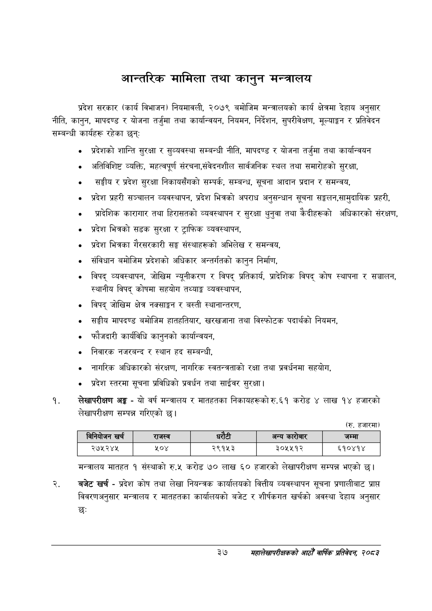

# Page 59 QA

## Rendered page


## Extracted text

```text
आन्तरिक मामिला तथा कानुन मन्त्रालय
प्रदेश सरकार (कार्य विभाजन) नियमावली, २०७९ बमोजिम मन्त्रालयको कार्य क्षेत्रमा देहाय अनुसार नीति, कानुन, मापदण्ड र योजना तर्जुमा तथा कार्यान्वयन, नियमन, निर्देशन, सुपरीवेक्षण, मूल्याङ्कन र प्रतिवेदन सम्बन्धी कार्यहरू रहेका छन्‌
० प्रदेशको शान्ति सुरक्षा र सुव्यवस्था सम्बन्धी नीति, मापदण्ड र योजना तर्जुमा तथा कार्यान्वयन
अतिविशिष्ट व्यक्ति, महत्वपूर्ण संरचना,सेवेदनशील सार्वजनिक स्थल तथा समारोहको सुरक्षा,
० सङ्घीय र प्रदेश सुरक्षा निकायसँगको सम्पर्क, सम्बन्ध, सूचना आदान प्रदान र समन्वय,
प्रदेश प्रहरी सञ्चालन व्यवस्थापन, प्रदेश भित्रको अपराध अनुसन्धान सूचना सङ्लन,सामुदायिक प्रहरी,
० प्रादेशिक कारागार तथा हिरासतको व्यवस्थापन र सुरक्षा थुनुवा तथा कैदीहरूको अधिकारको संरक्षण,
प्रदेश भित्रको सडक सुरक्षा र ट्राफिक व्यवस्थापन,
० प्रदेश भित्रका गैरसरकारी सङ्घ संस्थाहरूको अभिलेख र समन्वय,
० संविधान बमोजिम प्रदेशको अधिकार अन्तर्गतको कानुन निर्माण,
विपद्‌ व्यवस्थापन, जोखिम न्यूनीकरण र विपद्‌ प्रतिकार्य, प्रादेशिक विपद्‌ कोष स्थापना र सञ्चालन, स्थानीय विपद्‌ कोषमा सहयोग तथ्याङ्क व्यवस्थापन,
विपद्‌ जोखिम क्षेत्र नक्साङ्कन र बस्ती स्थानान्तरण,
सङ्घीय मापदण्ड बमोजिम हातहतियार, खरखजाना तथा विस्फोटक पदार्थको नियमन,
फौजदारी कार्यविधि कानुनको कार्यान्वयन,
«० निवारक नजरबन्द र स्थान हद सम्बन्धी,
नागरिक अधिकारको संरक्षण, नागरिक स्वतन्त्रताको रक्षा तथा प्रवर्धनमा सहयोग,
० प्रदेश स्तरमा सूचना प्रविधिको प्रवर्धन तथा साईवर सुरक्षा |
लेखापरीक्षण अङ्ग -यो वर्ष मन्त्रालय र मातहतका निकायहरूको रु.६१ करोड ४ लाख १४ हजारको लेखापरीक्षण सम्पन्न गरिएको छ।
(रु. हजारमा)
मन्त्रालय मातहत १ संस्थाको रु.५ करोड ७० लाख ६० हजारको लेखापरीक्षण सम्पन्न भएको छ।
बजेट खर्च -प्रदेश कोष तथा लेखा नियन्त्रक कार्यालयको वित्तीय व्यवस्थापन सूचना प्रणालीबाट प्राप्त विवरणअनुसार मन्त्रालय र मातहतका कार्यालयको बजेट र शीर्षकगत खर्चको अवस्था देहाय अनुसार छः
३७
सहालेखापरीक्षकको आठौँ वाषिकि प्रतिवेदन २०८२

|  |  | 'ननेवोजन खरी |  | राजस्व |  |  | अन्य कारोबार | जम्मा |
| --- | --- | --- | --- | --- | --- | --- | --- | --- |
|  |  | २७५२४५ |  | २०४ | २९१५३ |  | ३०५५१२ | ६१०४१४ |
```

## Flags
- table_page
- medium_quality_table
